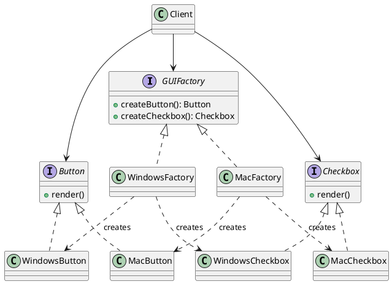

## Definition

The Abstract Factory Pattern provides an interface for creating **families of related or dependent objects** without specifying their concrete classes.

- Factory Method creates *one* product; Abstract Factory creates a *whole family* of products that must be used together.
- The client talks only to abstract product interfaces, so swapping the family means swapping one factory object.

## When to Use?

- Your system must work with several families of products and only one family is used at a time.
- You want to guarantee that products from one family are never mixed with another (a Windows button next to a Mac checkbox).
- Concrete classes should stay hidden behind interfaces.

## Use-case Examples (Real-world Applications)

- Cross-platform UI toolkits (`WindowsFactory`, `MacFactory` producing buttons, checkboxes, menus)
- Database access layers producing a matching `Connection`, `Command` and `Transaction` per vendor
- Theming: a light/dark factory producing matching colors, icons and fonts

## Structure



## Example

A cross-platform UI toolkit: one factory per platform, each producing a matching
button and checkbox. The client never names a concrete widget, so adding a Linux
family means adding one factory plus its products and changing nothing else.

=== "Java"

    ```java
    public interface Button {
        void render();
    }

    public interface Checkbox {
        void render();
    }

    public class WindowsButton implements Button {
        public void render() {
            System.out.println("Rendering a Windows button");
        }
    }

    public class WindowsCheckbox implements Checkbox {
        public void render() {
            System.out.println("Rendering a Windows checkbox");
        }
    }

    public class MacButton implements Button {
        public void render() {
            System.out.println("Rendering a Mac button");
        }
    }

    public class MacCheckbox implements Checkbox {
        public void render() {
            System.out.println("Rendering a Mac checkbox");
        }
    }

    // One creation method per product in the family.
    public interface GUIFactory {
        Button createButton();
        Checkbox createCheckbox();
    }

    public class WindowsFactory implements GUIFactory {
        public Button createButton() {
            return new WindowsButton();
        }

        public Checkbox createCheckbox() {
            return new WindowsCheckbox();
        }
    }

    public class MacFactory implements GUIFactory {
        public Button createButton() {
            return new MacButton();
        }

        public Checkbox createCheckbox() {
            return new MacCheckbox();
        }
    }

    public class Application {
        private final Button button;
        private final Checkbox checkbox;

        public Application(GUIFactory factory) {
            this.button = factory.createButton();
            this.checkbox = factory.createCheckbox();
        }

        public void render() {
            button.render();
            checkbox.render();
        }

        public static void main(String[] args) {
            GUIFactory factory = System.getProperty("os.name").startsWith("Mac")
                    ? new MacFactory()
                    : new WindowsFactory();
            new Application(factory).render();
        }
    }
    ```

=== "C#"

    ```csharp
    public interface IButton
    {
        void Render();
    }

    public interface ICheckbox
    {
        void Render();
    }

    public class WindowsButton : IButton
    {
        public void Render() => Console.WriteLine("Rendering a Windows button");
    }

    public class WindowsCheckbox : ICheckbox
    {
        public void Render() => Console.WriteLine("Rendering a Windows checkbox");
    }

    public class MacButton : IButton
    {
        public void Render() => Console.WriteLine("Rendering a Mac button");
    }

    public class MacCheckbox : ICheckbox
    {
        public void Render() => Console.WriteLine("Rendering a Mac checkbox");
    }

    public interface IGuiFactory
    {
        IButton CreateButton();
        ICheckbox CreateCheckbox();
    }

    public class WindowsFactory : IGuiFactory
    {
        public IButton CreateButton() => new WindowsButton();
        public ICheckbox CreateCheckbox() => new WindowsCheckbox();
    }

    public class MacFactory : IGuiFactory
    {
        public IButton CreateButton() => new MacButton();
        public ICheckbox CreateCheckbox() => new MacCheckbox();
    }

    public class Application
    {
        private readonly IButton _button;
        private readonly ICheckbox _checkbox;

        public Application(IGuiFactory factory)
        {
            _button = factory.CreateButton();
            _checkbox = factory.CreateCheckbox();
        }

        public void Render()
        {
            _button.Render();
            _checkbox.Render();
        }
    }

    IGuiFactory factory = OperatingSystem.IsMacOS()
        ? new MacFactory()
        : new WindowsFactory();
    new Application(factory).Render();
    ```

=== "C++"

    ```cpp
    #include <iostream>
    #include <memory>

    class Button {
    public:
        virtual ~Button() = default;
        virtual void render() = 0;
    };

    class Checkbox {
    public:
        virtual ~Checkbox() = default;
        virtual void render() = 0;
    };

    class WindowsButton : public Button {
    public:
        void render() override { std::cout << "Rendering a Windows button\n"; }
    };

    class WindowsCheckbox : public Checkbox {
    public:
        void render() override { std::cout << "Rendering a Windows checkbox\n"; }
    };

    class MacButton : public Button {
    public:
        void render() override { std::cout << "Rendering a Mac button\n"; }
    };

    class MacCheckbox : public Checkbox {
    public:
        void render() override { std::cout << "Rendering a Mac checkbox\n"; }
    };

    class GuiFactory {
    public:
        virtual ~GuiFactory() = default;
        virtual std::unique_ptr<Button> createButton() const = 0;
        virtual std::unique_ptr<Checkbox> createCheckbox() const = 0;
    };

    class WindowsFactory : public GuiFactory {
    public:
        std::unique_ptr<Button> createButton() const override {
            return std::make_unique<WindowsButton>();
        }
        std::unique_ptr<Checkbox> createCheckbox() const override {
            return std::make_unique<WindowsCheckbox>();
        }
    };

    class MacFactory : public GuiFactory {
    public:
        std::unique_ptr<Button> createButton() const override {
            return std::make_unique<MacButton>();
        }
        std::unique_ptr<Checkbox> createCheckbox() const override {
            return std::make_unique<MacCheckbox>();
        }
    };

    class Application {
    public:
        explicit Application(const GuiFactory& factory)
            : button_(factory.createButton()),
              checkbox_(factory.createCheckbox()) {}

        void render() {
            button_->render();
            checkbox_->render();
        }

    private:
        std::unique_ptr<Button> button_;
        std::unique_ptr<Checkbox> checkbox_;
    };

    int main() {
    #ifdef __APPLE__
        MacFactory factory;
    #else
        WindowsFactory factory;
    #endif
        Application(factory).render();
    }
    ```

=== "Python"

    ```python
    import sys
    from abc import ABC, abstractmethod


    class Button(ABC):
        @abstractmethod
        def render(self) -> None: ...


    class Checkbox(ABC):
        @abstractmethod
        def render(self) -> None: ...


    class WindowsButton(Button):
        def render(self) -> None:
            print("Rendering a Windows button")


    class WindowsCheckbox(Checkbox):
        def render(self) -> None:
            print("Rendering a Windows checkbox")


    class MacButton(Button):
        def render(self) -> None:
            print("Rendering a Mac button")


    class MacCheckbox(Checkbox):
        def render(self) -> None:
            print("Rendering a Mac checkbox")


    class GuiFactory(ABC):
        @abstractmethod
        def create_button(self) -> Button: ...

        @abstractmethod
        def create_checkbox(self) -> Checkbox: ...


    class WindowsFactory(GuiFactory):
        def create_button(self) -> Button:
            return WindowsButton()

        def create_checkbox(self) -> Checkbox:
            return WindowsCheckbox()


    class MacFactory(GuiFactory):
        def create_button(self) -> Button:
            return MacButton()

        def create_checkbox(self) -> Checkbox:
            return MacCheckbox()


    class Application:
        def __init__(self, factory: GuiFactory) -> None:
            self._button = factory.create_button()
            self._checkbox = factory.create_checkbox()

        def render(self) -> None:
            self._button.render()
            self._checkbox.render()


    factory = MacFactory() if sys.platform == "darwin" else WindowsFactory()
    Application(factory).render()
    ```

=== "Rust"

    ```rust
    trait Button {
        fn render(&self);
    }

    trait Checkbox {
        fn render(&self);
    }

    struct WindowsButton;
    struct WindowsCheckbox;
    struct MacButton;
    struct MacCheckbox;

    impl Button for WindowsButton {
        fn render(&self) {
            println!("Rendering a Windows button");
        }
    }

    impl Checkbox for WindowsCheckbox {
        fn render(&self) {
            println!("Rendering a Windows checkbox");
        }
    }

    impl Button for MacButton {
        fn render(&self) {
            println!("Rendering a Mac button");
        }
    }

    impl Checkbox for MacCheckbox {
        fn render(&self) {
            println!("Rendering a Mac checkbox");
        }
    }

    trait GuiFactory {
        fn create_button(&self) -> Box<dyn Button>;
        fn create_checkbox(&self) -> Box<dyn Checkbox>;
    }

    struct WindowsFactory;
    struct MacFactory;

    impl GuiFactory for WindowsFactory {
        fn create_button(&self) -> Box<dyn Button> {
            Box::new(WindowsButton)
        }
        fn create_checkbox(&self) -> Box<dyn Checkbox> {
            Box::new(WindowsCheckbox)
        }
    }

    impl GuiFactory for MacFactory {
        fn create_button(&self) -> Box<dyn Button> {
            Box::new(MacButton)
        }
        fn create_checkbox(&self) -> Box<dyn Checkbox> {
            Box::new(MacCheckbox)
        }
    }

    struct Application {
        button: Box<dyn Button>,
        checkbox: Box<dyn Checkbox>,
    }

    impl Application {
        fn new(factory: &dyn GuiFactory) -> Self {
            Self {
                button: factory.create_button(),
                checkbox: factory.create_checkbox(),
            }
        }

        fn render(&self) {
            self.button.render();
            self.checkbox.render();
        }
    }

    fn main() {
        let factory: Box<dyn GuiFactory> = if cfg!(target_os = "macos") {
            Box::new(MacFactory)
        } else {
            Box::new(WindowsFactory)
        };
        Application::new(factory.as_ref()).render();
    }
    ```

=== "TypeScript"

    ```typescript
    interface Button {
      render(): void;
    }

    interface Checkbox {
      render(): void;
    }

    class WindowsButton implements Button {
      render(): void {
        console.log("Rendering a Windows button");
      }
    }

    class WindowsCheckbox implements Checkbox {
      render(): void {
        console.log("Rendering a Windows checkbox");
      }
    }

    class MacButton implements Button {
      render(): void {
        console.log("Rendering a Mac button");
      }
    }

    class MacCheckbox implements Checkbox {
      render(): void {
        console.log("Rendering a Mac checkbox");
      }
    }

    interface GuiFactory {
      createButton(): Button;
      createCheckbox(): Checkbox;
    }

    class WindowsFactory implements GuiFactory {
      createButton(): Button {
        return new WindowsButton();
      }
      createCheckbox(): Checkbox {
        return new WindowsCheckbox();
      }
    }

    class MacFactory implements GuiFactory {
      createButton(): Button {
        return new MacButton();
      }
      createCheckbox(): Checkbox {
        return new MacCheckbox();
      }
    }

    class Application {
      private readonly button: Button;
      private readonly checkbox: Checkbox;

      constructor(factory: GuiFactory) {
        this.button = factory.createButton();
        this.checkbox = factory.createCheckbox();
      }

      render(): void {
        this.button.render();
        this.checkbox.render();
      }
    }

    const factory: GuiFactory =
      process.platform === "darwin" ? new MacFactory() : new WindowsFactory();
    new Application(factory).render();
    ```
## Trade-offs

- Adding a new *product type* to the family forces every factory to change.
- The number of classes grows quickly; do not reach for it until you actually have two families.

## Check Your Understanding

<quiz>
What distinguishes Abstract Factory from a plain Factory Method?

- [ ] It always returns a cached instance instead of a new one
- [x] It creates whole families of related products that must be used together
> Correct. One factory per family keeps the products consistent, so you never mix a Windows button with a macOS checkbox.
- [ ] It builds one complex object step by step
- [ ] It exposes a simplified interface over a complicated subsystem
</quiz>
