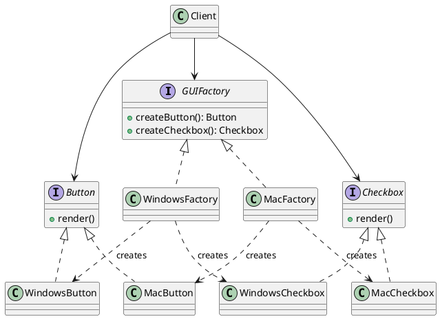

## Definition

The Abstract Factory Pattern provides an interface for creating **families of related or dependent objects** without specifying their concrete classes.

- Factory Method creates *one* product; Abstract Factory creates a *whole family* of products that must be used together.
- The client talks only to abstract product interfaces, so swapping the family means swapping one factory object.

## When to Use?

- Your system must work with several families of products and only one family is used at a time.
- You want to guarantee that products from one family are never mixed with another (a Windows button next to a Mac checkbox).
- Concrete classes should stay hidden behind interfaces.

## Use-case Examples (Real-world Applications)

- Cross-platform UI toolkits (`WindowsFactory`, `MacFactory` producing buttons, checkboxes, menus)
- Database access layers producing a matching `Connection`, `Command` and `Transaction` per vendor
- Theming: a light/dark factory producing matching colors, icons and fonts

## Structure



## Example

```java
public interface Button {
    void render();
}

public interface Checkbox {
    void render();
}
```

```java
public class WindowsButton implements Button {
    public void render() {
        System.out.println("Rendering a Windows button");
    }
}

public class WindowsCheckbox implements Checkbox {
    public void render() {
        System.out.println("Rendering a Windows checkbox");
    }
}

public class MacButton implements Button {
    public void render() {
        System.out.println("Rendering a Mac button");
    }
}

public class MacCheckbox implements Checkbox {
    public void render() {
        System.out.println("Rendering a Mac checkbox");
    }
}
```

The factory interface declares one creation method per product in the family:

```java
public interface GUIFactory {
    Button createButton();
    Checkbox createCheckbox();
}

public class WindowsFactory implements GUIFactory {
    public Button createButton() {
        return new WindowsButton();
    }

    public Checkbox createCheckbox() {
        return new WindowsCheckbox();
    }
}

public class MacFactory implements GUIFactory {
    public Button createButton() {
        return new MacButton();
    }

    public Checkbox createCheckbox() {
        return new MacCheckbox();
    }
}
```

```java
public class Application {
    private final Button button;
    private final Checkbox checkbox;

    public Application(GUIFactory factory) {
        this.button = factory.createButton();
        this.checkbox = factory.createCheckbox();
    }

    public void render() {
        button.render();
        checkbox.render();
    }

    public static void main(String[] args) {
        GUIFactory factory = System.getProperty("os.name").startsWith("Mac")
                ? new MacFactory()
                : new WindowsFactory();
        new Application(factory).render();
    }
}
```

The `Application` class never names a concrete widget. Adding a Linux family means adding one factory plus its products, no existing code changes.

## Trade-offs

- Adding a new *product type* to the family forces every factory to change.
- The number of classes grows quickly; do not reach for it until you actually have two families.
