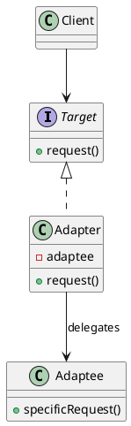

## Definition

The Adapter Pattern converts the interface of a class into another interface the client expects. Adapter lets classes work together that could not otherwise, because of incompatible interfaces.

- It is a **wrapper**: the adapter implements the interface your code wants and translates each call into the interface the other class offers.
- Nothing inside the adapted class changes, which is what makes the pattern useful for third-party and legacy code.

## When to Use?

- You want to use an existing class but its interface does not match what your code needs.
- You are integrating a library you cannot (or should not) modify.
- You want to isolate your code from a vendor API, so replacing the vendor means writing one new adapter.

## Use-case Examples (Real-world Applications)

- Payment gateways: one internal `PaymentProcessor` interface, one adapter per provider
- `java.io.InputStreamReader` adapting a byte stream to a character stream
- Wrapping a legacy XML service so the rest of the system only sees JSON-shaped objects

## Structure



## Example

Three pieces: the `PaymentProcessor` interface our application is written
against, the third-party class we are stuck with (different method name,
different units), and the adapter that bridges them.

=== "Java"

    ```java
    public interface PaymentProcessor {
        void pay(double amountInDollars);
    }

    // Third-party, unmodifiable.
    public class LegacyStripeApi {
        public void makePayment(long amountInCents, String currency) {
            System.out.println("Charging " + amountInCents + " " + currency + " via Stripe");
        }
    }

    public class StripeAdapter implements PaymentProcessor {
        private final LegacyStripeApi stripe;

        public StripeAdapter(LegacyStripeApi stripe) {
            this.stripe = stripe;
        }

        @Override
        public void pay(double amountInDollars) {
            long cents = Math.round(amountInDollars * 100);
            stripe.makePayment(cents, "USD");
        }
    }

    public class Checkout {
        public static void main(String[] args) {
            PaymentProcessor processor = new StripeAdapter(new LegacyStripeApi());
            processor.pay(19.99); // Charging 1999 USD via Stripe
        }
    }
    ```

=== "C#"

    ```csharp
    public interface IPaymentProcessor
    {
        void Pay(decimal amountInDollars);
    }

    // Third-party, unmodifiable.
    public class LegacyStripeApi
    {
        public void MakePayment(long amountInCents, string currency) =>
            Console.WriteLine($"Charging {amountInCents} {currency} via Stripe");
    }

    public class StripeAdapter : IPaymentProcessor
    {
        private readonly LegacyStripeApi _stripe;

        public StripeAdapter(LegacyStripeApi stripe) => _stripe = stripe;

        public void Pay(decimal amountInDollars) =>
            _stripe.MakePayment((long)Math.Round(amountInDollars * 100), "USD");
    }

    IPaymentProcessor processor = new StripeAdapter(new LegacyStripeApi());
    processor.Pay(19.99m); // Charging 1999 USD via Stripe
    ```

=== "C++"

    ```cpp
    #include <cmath>
    #include <iostream>
    #include <string>

    class PaymentProcessor {
    public:
        virtual ~PaymentProcessor() = default;
        virtual void pay(double amountInDollars) = 0;
    };

    // Third-party, unmodifiable.
    class LegacyStripeApi {
    public:
        void makePayment(long amountInCents, const std::string& currency) {
            std::cout << "Charging " << amountInCents << " " << currency
                      << " via Stripe\n";
        }
    };

    class StripeAdapter : public PaymentProcessor {
    public:
        explicit StripeAdapter(LegacyStripeApi& stripe) : stripe_(stripe) {}

        void pay(double amountInDollars) override {
            stripe_.makePayment(std::lround(amountInDollars * 100), "USD");
        }

    private:
        LegacyStripeApi& stripe_;
    };

    int main() {
        LegacyStripeApi stripe;
        StripeAdapter processor(stripe);
        processor.pay(19.99); // Charging 1999 USD via Stripe
    }
    ```

=== "Python"

    ```python
    from typing import Protocol


    # A Protocol expresses "the shape my code needs" without inheritance.
    class PaymentProcessor(Protocol):
        def pay(self, amount_in_dollars: float) -> None: ...


    # Third-party, unmodifiable.
    class LegacyStripeApi:
        def make_payment(self, amount_in_cents: int, currency: str) -> None:
            print(f"Charging {amount_in_cents} {currency} via Stripe")


    class StripeAdapter:
        def __init__(self, stripe: LegacyStripeApi) -> None:
            self._stripe = stripe

        def pay(self, amount_in_dollars: float) -> None:
            self._stripe.make_payment(round(amount_in_dollars * 100), "USD")


    processor: PaymentProcessor = StripeAdapter(LegacyStripeApi())
    processor.pay(19.99)  # Charging 1999 USD via Stripe
    ```

=== "Rust"

    ```rust
    trait PaymentProcessor {
        fn pay(&self, amount_in_dollars: f64);
    }

    // Third-party, unmodifiable.
    struct LegacyStripeApi;

    impl LegacyStripeApi {
        fn make_payment(&self, amount_in_cents: i64, currency: &str) {
            println!("Charging {amount_in_cents} {currency} via Stripe");
        }
    }

    struct StripeAdapter {
        stripe: LegacyStripeApi,
    }

    impl PaymentProcessor for StripeAdapter {
        fn pay(&self, amount_in_dollars: f64) {
            let cents = (amount_in_dollars * 100.0).round() as i64;
            self.stripe.make_payment(cents, "USD");
        }
    }

    fn main() {
        let processor = StripeAdapter { stripe: LegacyStripeApi };
        processor.pay(19.99); // Charging 1999 USD via Stripe
    }
    ```

=== "TypeScript"

    ```typescript
    interface PaymentProcessor {
      pay(amountInDollars: number): void;
    }

    // Third-party, unmodifiable.
    class LegacyStripeApi {
      makePayment(amountInCents: number, currency: string): void {
        console.log(`Charging ${amountInCents} ${currency} via Stripe`);
      }
    }

    class StripeAdapter implements PaymentProcessor {
      constructor(private readonly stripe: LegacyStripeApi) {}

      pay(amountInDollars: number): void {
        this.stripe.makePayment(Math.round(amountInDollars * 100), "USD");
      }
    }

    const processor: PaymentProcessor = new StripeAdapter(new LegacyStripeApi());
    processor.pay(19.99); // Charging 1999 USD via Stripe
    ```

## Adapter vs. Decorator vs. Facade

All three wrap something, which is why they get confused:

| Pattern | Intent | Interface after wrapping |
|---|---|---|
| Adapter | Make an incompatible interface usable | **Different** from the wrapped object |
| Decorator | Add behaviour at runtime | **Same** as the wrapped object |
| Facade | Simplify a whole subsystem | **New, smaller** interface over many objects |

## Check Your Understanding

<quiz>
What is the purpose of the Adapter Pattern?

- [x] To let two classes with incompatible interfaces work together without changing either one
> Correct. The adapter translates calls from the interface the client expects into the one the existing class offers.
- [ ] To add responsibilities to an object dynamically
- [ ] To decouple an abstraction from its implementation
- [ ] To give a subsystem a single, simpler entry point
</quiz>
