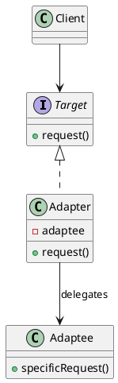

## Definition

The Adapter Pattern converts the interface of a class into another interface the client expects. Adapter lets classes work together that could not otherwise, because of incompatible interfaces.

- It is a **wrapper**: the adapter implements the interface your code wants and translates each call into the interface the other class offers.
- Nothing inside the adapted class changes, which is what makes the pattern useful for third-party and legacy code.

## When to Use?

- You want to use an existing class but its interface does not match what your code needs.
- You are integrating a library you cannot (or should not) modify.
- You want to isolate your code from a vendor API, so replacing the vendor means writing one new adapter.

## Use-case Examples (Real-world Applications)

- Payment gateways: one internal `PaymentProcessor` interface, one adapter per provider
- `java.io.InputStreamReader` adapting a byte stream to a character stream
- Wrapping a legacy XML service so the rest of the system only sees JSON-shaped objects

## Structure



## Example

The interface our application is written against:

```java
public interface PaymentProcessor {
    void pay(double amountInDollars);
}
```

The third-party class we are stuck with, different method name, different units:

```java
public class LegacyStripeApi {
    public void makePayment(long amountInCents, String currency) {
        System.out.println("Charging " + amountInCents + " " + currency + " via Stripe");
    }
}
```

The adapter bridges the two:

```java
public class StripeAdapter implements PaymentProcessor {
    private final LegacyStripeApi stripe;

    public StripeAdapter(LegacyStripeApi stripe) {
        this.stripe = stripe;
    }

    @Override
    public void pay(double amountInDollars) {
        long cents = Math.round(amountInDollars * 100);
        stripe.makePayment(cents, "USD");
    }
}
```

```java
public class Checkout {
    public static void main(String[] args) {
        PaymentProcessor processor = new StripeAdapter(new LegacyStripeApi());
        processor.pay(19.99); // Charging 1999 USD via Stripe
    }
}
```

## Adapter vs. Decorator vs. Facade

All three wrap something, which is why they get confused:

| Pattern | Intent | Interface after wrapping |
|---|---|---|
| Adapter | Make an incompatible interface usable | **Different** from the wrapped object |
| Decorator | Add behaviour at runtime | **Same** as the wrapped object |
| Facade | Simplify a whole subsystem | **New, smaller** interface over many objects |

## Check Your Understanding

<quiz>
What is the purpose of the Adapter Pattern?

- [x] To let two classes with incompatible interfaces work together without changing either one
> Correct. The adapter translates calls from the interface the client expects into the one the existing class offers.
- [ ] To add responsibilities to an object dynamically
- [ ] To decouple an abstraction from its implementation
- [ ] To give a subsystem a single, simpler entry point
</quiz>
