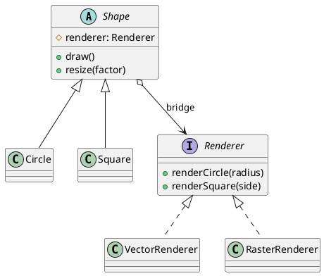

## Definition

The Bridge Pattern decouples an abstraction from its implementation so that the two can vary independently.

- It replaces a class hierarchy that multiplies (`RedCircle`, `BlueCircle`, `RedSquare`, `BlueSquare`…) with two hierarchies joined by composition.
- Instead of *m × n* classes you maintain *m + n*.

## When to Use?

- You have two independent dimensions of variation, shape and rendering API, notification type and delivery channel, device and remote control.
- The implementation must be selectable or swappable at runtime.
- Subclass explosion has already started.

## Use-case Examples (Real-world Applications)

- Graphics: shapes drawn through OpenGL, Vulkan or SVG renderers
- JDBC: one `Connection` abstraction, one driver implementation per database
- Cross-platform widgets whose look is delegated to a platform-specific implementor

## Structure



Note the single association labelled *bridge*: the abstraction **has an** implementor, it does not **inherit from** one.

## Example

The implementation side is the renderer; the abstraction side is the shape,
which *holds* a renderer instead of inheriting from one.

=== "Java"

    ```java
    public interface Renderer {
        void renderCircle(double radius);
        void renderSquare(double side);
    }

    public class VectorRenderer implements Renderer {
        public void renderCircle(double radius) {
            System.out.println("Drawing a circle of radius " + radius + " as vectors");
        }

        public void renderSquare(double side) {
            System.out.println("Drawing a square of side " + side + " as vectors");
        }
    }

    public class RasterRenderer implements Renderer {
        public void renderCircle(double radius) {
            System.out.println("Drawing a circle of radius " + radius + " pixel by pixel");
        }

        public void renderSquare(double side) {
            System.out.println("Drawing a square of side " + side + " pixel by pixel");
        }
    }

    public abstract class Shape {
        protected final Renderer renderer; // the bridge

        protected Shape(Renderer renderer) {
            this.renderer = renderer;
        }

        public abstract void draw();
        public abstract void resize(double factor);
    }

    public class Circle extends Shape {
        private double radius;

        public Circle(Renderer renderer, double radius) {
            super(renderer);
            this.radius = radius;
        }

        @Override
        public void draw() {
            renderer.renderCircle(radius);
        }

        @Override
        public void resize(double factor) {
            radius *= factor;
        }
    }

    public class Main {
        public static void main(String[] args) {
            Shape circle = new Circle(new VectorRenderer(), 5);
            circle.draw();

            Shape rasterCircle = new Circle(new RasterRenderer(), 5);
            rasterCircle.resize(2);
            rasterCircle.draw();
        }
    }
    ```

=== "C#"

    ```csharp
    public interface IRenderer
    {
        void RenderCircle(double radius);
        void RenderSquare(double side);
    }

    public class VectorRenderer : IRenderer
    {
        public void RenderCircle(double radius) =>
            Console.WriteLine($"Drawing a circle of radius {radius} as vectors");

        public void RenderSquare(double side) =>
            Console.WriteLine($"Drawing a square of side {side} as vectors");
    }

    public class RasterRenderer : IRenderer
    {
        public void RenderCircle(double radius) =>
            Console.WriteLine($"Drawing a circle of radius {radius} pixel by pixel");

        public void RenderSquare(double side) =>
            Console.WriteLine($"Drawing a square of side {side} pixel by pixel");
    }

    public abstract class Shape
    {
        protected readonly IRenderer Renderer; // the bridge

        protected Shape(IRenderer renderer) => Renderer = renderer;

        public abstract void Draw();
        public abstract void Resize(double factor);
    }

    public class Circle : Shape
    {
        private double _radius;

        public Circle(IRenderer renderer, double radius) : base(renderer) =>
            _radius = radius;

        public override void Draw() => Renderer.RenderCircle(_radius);

        public override void Resize(double factor) => _radius *= factor;
    }

    Shape circle = new Circle(new VectorRenderer(), 5);
    circle.Draw();

    Shape rasterCircle = new Circle(new RasterRenderer(), 5);
    rasterCircle.Resize(2);
    rasterCircle.Draw();
    ```

=== "C++"

    ```cpp
    #include <iostream>
    #include <memory>

    class Renderer {
    public:
        virtual ~Renderer() = default;
        virtual void renderCircle(double radius) = 0;
        virtual void renderSquare(double side) = 0;
    };

    class VectorRenderer : public Renderer {
    public:
        void renderCircle(double radius) override {
            std::cout << "Drawing a circle of radius " << radius << " as vectors\n";
        }
        void renderSquare(double side) override {
            std::cout << "Drawing a square of side " << side << " as vectors\n";
        }
    };

    class RasterRenderer : public Renderer {
    public:
        void renderCircle(double radius) override {
            std::cout << "Drawing a circle of radius " << radius
                      << " pixel by pixel\n";
        }
        void renderSquare(double side) override {
            std::cout << "Drawing a square of side " << side << " pixel by pixel\n";
        }
    };

    class Shape {
    public:
        virtual ~Shape() = default;
        virtual void draw() = 0;
        virtual void resize(double factor) = 0;

    protected:
        explicit Shape(Renderer& renderer) : renderer_(renderer) {}
        Renderer& renderer_; // the bridge
    };

    class Circle : public Shape {
    public:
        Circle(Renderer& renderer, double radius)
            : Shape(renderer), radius_(radius) {}

        void draw() override { renderer_.renderCircle(radius_); }
        void resize(double factor) override { radius_ *= factor; }

    private:
        double radius_;
    };

    int main() {
        VectorRenderer vector;
        RasterRenderer raster;

        Circle circle(vector, 5);
        circle.draw();

        Circle rasterCircle(raster, 5);
        rasterCircle.resize(2);
        rasterCircle.draw();
    }
    ```

=== "Python"

    ```python
    from abc import ABC, abstractmethod


    class Renderer(ABC):
        @abstractmethod
        def render_circle(self, radius: float) -> None: ...

        @abstractmethod
        def render_square(self, side: float) -> None: ...


    class VectorRenderer(Renderer):
        def render_circle(self, radius: float) -> None:
            print(f"Drawing a circle of radius {radius} as vectors")

        def render_square(self, side: float) -> None:
            print(f"Drawing a square of side {side} as vectors")


    class RasterRenderer(Renderer):
        def render_circle(self, radius: float) -> None:
            print(f"Drawing a circle of radius {radius} pixel by pixel")

        def render_square(self, side: float) -> None:
            print(f"Drawing a square of side {side} pixel by pixel")


    class Shape(ABC):
        def __init__(self, renderer: Renderer) -> None:
            self.renderer = renderer  # the bridge

        @abstractmethod
        def draw(self) -> None: ...

        @abstractmethod
        def resize(self, factor: float) -> None: ...


    class Circle(Shape):
        def __init__(self, renderer: Renderer, radius: float) -> None:
            super().__init__(renderer)
            self.radius = radius

        def draw(self) -> None:
            self.renderer.render_circle(self.radius)

        def resize(self, factor: float) -> None:
            self.radius *= factor


    Circle(VectorRenderer(), 5).draw()

    raster_circle = Circle(RasterRenderer(), 5)
    raster_circle.resize(2)
    raster_circle.draw()
    ```

=== "Rust"

    ```rust
    trait Renderer {
        fn render_circle(&self, radius: f64);
        fn render_square(&self, side: f64);
    }

    struct VectorRenderer;
    struct RasterRenderer;

    impl Renderer for VectorRenderer {
        fn render_circle(&self, radius: f64) {
            println!("Drawing a circle of radius {radius} as vectors");
        }
        fn render_square(&self, side: f64) {
            println!("Drawing a square of side {side} as vectors");
        }
    }

    impl Renderer for RasterRenderer {
        fn render_circle(&self, radius: f64) {
            println!("Drawing a circle of radius {radius} pixel by pixel");
        }
        fn render_square(&self, side: f64) {
            println!("Drawing a square of side {side} pixel by pixel");
        }
    }

    trait Shape {
        fn draw(&self);
        fn resize(&mut self, factor: f64);
    }

    // Rust has no inheritance, so the abstraction side is a struct that owns
    // its implementor. Composition was the point of the pattern anyway.
    struct Circle {
        renderer: Box<dyn Renderer>, // the bridge
        radius: f64,
    }

    impl Shape for Circle {
        fn draw(&self) {
            self.renderer.render_circle(self.radius);
        }

        fn resize(&mut self, factor: f64) {
            self.radius *= factor;
        }
    }

    fn main() {
        let circle = Circle {
            renderer: Box::new(VectorRenderer),
            radius: 5.0,
        };
        circle.draw();

        let mut raster_circle = Circle {
            renderer: Box::new(RasterRenderer),
            radius: 5.0,
        };
        raster_circle.resize(2.0);
        raster_circle.draw();
    }
    ```

=== "TypeScript"

    ```typescript
    interface Renderer {
      renderCircle(radius: number): void;
      renderSquare(side: number): void;
    }

    class VectorRenderer implements Renderer {
      renderCircle(radius: number): void {
        console.log(`Drawing a circle of radius ${radius} as vectors`);
      }
      renderSquare(side: number): void {
        console.log(`Drawing a square of side ${side} as vectors`);
      }
    }

    class RasterRenderer implements Renderer {
      renderCircle(radius: number): void {
        console.log(`Drawing a circle of radius ${radius} pixel by pixel`);
      }
      renderSquare(side: number): void {
        console.log(`Drawing a square of side ${side} pixel by pixel`);
      }
    }

    abstract class Shape {
      // the bridge
      protected constructor(protected readonly renderer: Renderer) {}

      abstract draw(): void;
      abstract resize(factor: number): void;
    }

    class Circle extends Shape {
      constructor(renderer: Renderer, private radius: number) {
        super(renderer);
      }

      draw(): void {
        this.renderer.renderCircle(this.radius);
      }

      resize(factor: number): void {
        this.radius *= factor;
      }
    }

    new Circle(new VectorRenderer(), 5).draw();

    const rasterCircle = new Circle(new RasterRenderer(), 5);
    rasterCircle.resize(2);
    rasterCircle.draw();
    ```

Adding a `Triangle` costs one class. Adding a `WebGLRenderer` costs one class. Neither touches the other hierarchy.

## Bridge vs. Strategy

Structurally they are near-identical. The difference is intent: Strategy swaps an **algorithm** inside one object; Bridge splits an entire **abstraction hierarchy** from an entire **implementation hierarchy**, and is a design decision made up front.

## Check Your Understanding

<quiz>
What does the Bridge Pattern decouple?

- [ ] A client from the concrete class it instantiates
- [x] An abstraction from its implementation, so both can be extended independently
> Correct. Instead of a class per combination, you compose one hierarchy with the other and avoid the combinatorial explosion of subclasses.
- [ ] A request from the object that handles it
- [ ] An object from the state it currently holds
</quiz>
