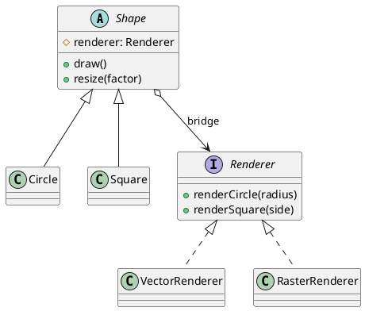

## Definition

The Bridge Pattern decouples an abstraction from its implementation so that the two can vary independently.

- It replaces a class hierarchy that multiplies (`RedCircle`, `BlueCircle`, `RedSquare`, `BlueSquare`…) with two hierarchies joined by composition.
- Instead of *m × n* classes you maintain *m + n*.

## When to Use?

- You have two independent dimensions of variation, shape and rendering API, notification type and delivery channel, device and remote control.
- The implementation must be selectable or swappable at runtime.
- Subclass explosion has already started.

## Use-case Examples (Real-world Applications)

- Graphics: shapes drawn through OpenGL, Vulkan or SVG renderers
- JDBC: one `Connection` abstraction, one driver implementation per database
- Cross-platform widgets whose look is delegated to a platform-specific implementor

## Structure



Note the single association labelled *bridge*: the abstraction **has an** implementor, it does not **inherit from** one.

## Example

The implementation side:

```java
public interface Renderer {
    void renderCircle(double radius);
    void renderSquare(double side);
}

public class VectorRenderer implements Renderer {
    public void renderCircle(double radius) {
        System.out.println("Drawing a circle of radius " + radius + " as vectors");
    }

    public void renderSquare(double side) {
        System.out.println("Drawing a square of side " + side + " as vectors");
    }
}

public class RasterRenderer implements Renderer {
    public void renderCircle(double radius) {
        System.out.println("Drawing a circle of radius " + radius + " pixel by pixel");
    }

    public void renderSquare(double side) {
        System.out.println("Drawing a square of side " + side + " pixel by pixel");
    }
}
```

The abstraction side holds a reference to the implementor:

```java
public abstract class Shape {
    protected final Renderer renderer;

    protected Shape(Renderer renderer) {
        this.renderer = renderer;
    }

    public abstract void draw();
    public abstract void resize(double factor);
}

public class Circle extends Shape {
    private double radius;

    public Circle(Renderer renderer, double radius) {
        super(renderer);
        this.radius = radius;
    }

    @Override
    public void draw() {
        renderer.renderCircle(radius);
    }

    @Override
    public void resize(double factor) {
        radius *= factor;
    }
}
```

```java
public class Main {
    public static void main(String[] args) {
        Shape circle = new Circle(new VectorRenderer(), 5);
        circle.draw();

        Shape rasterCircle = new Circle(new RasterRenderer(), 5);
        rasterCircle.resize(2);
        rasterCircle.draw();
    }
}
```

Adding a `Triangle` costs one class. Adding a `WebGLRenderer` costs one class. Neither touches the other hierarchy.

## Bridge vs. Strategy

Structurally they are near-identical. The difference is intent: Strategy swaps an **algorithm** inside one object; Bridge splits an entire **abstraction hierarchy** from an entire **implementation hierarchy**, and is a design decision made up front.

## Check Your Understanding

<quiz>
What does the Bridge Pattern decouple?

- [ ] A client from the concrete class it instantiates
- [x] An abstraction from its implementation, so both can be extended independently
> Correct. Instead of a class per combination, you compose one hierarchy with the other and avoid the combinatorial explosion of subclasses.
- [ ] A request from the object that handles it
- [ ] An object from the state it currently holds
</quiz>
