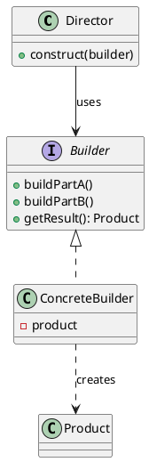

## Definition

The Builder Pattern separates the construction of a complex object from its representation, so that the same construction process can create different representations.

- It replaces telescoping constructors (`new Pizza(true, false, true, 2, null, ...)`) with readable, step-by-step assembly.
- The product is only handed to the client once it is complete and valid.

## When to Use?

- An object needs many optional parameters, and constructor overloads have become unreadable.
- Construction must happen in steps, or in different orders, or produce different variants.
- You want immutable objects with a friendly creation API.

## Use-case Examples (Real-world Applications)

- `StringBuilder`, `java.time` builders, OkHttp's `Request.Builder`
- Query builders in ORMs
- Document exporters that build HTML, PDF or Markdown from the same sequence of steps

## Structure



## Example

The fluent variant, which is what most Java code uses in practice:

```java
public class Pizza {
    private final String size;
    private final boolean cheese;
    private final boolean pepperoni;
    private final boolean mushrooms;

    private Pizza(Builder builder) {
        this.size = builder.size;
        this.cheese = builder.cheese;
        this.pepperoni = builder.pepperoni;
        this.mushrooms = builder.mushrooms;
    }

    @Override
    public String toString() {
        return size + " pizza [cheese=" + cheese
                + ", pepperoni=" + pepperoni
                + ", mushrooms=" + mushrooms + "]";
    }

    public static class Builder {
        private final String size;      // required
        private boolean cheese;         // optional
        private boolean pepperoni;
        private boolean mushrooms;

        public Builder(String size) {
            this.size = size;
        }

        public Builder cheese() {
            this.cheese = true;
            return this;
        }

        public Builder pepperoni() {
            this.pepperoni = true;
            return this;
        }

        public Builder mushrooms() {
            this.mushrooms = true;
            return this;
        }

        public Pizza build() {
            if (size == null || size.isBlank()) {
                throw new IllegalStateException("size is required");
            }
            return new Pizza(this);
        }
    }
}
```

```java
public class Main {
    public static void main(String[] args) {
        Pizza pizza = new Pizza.Builder("large")
                .cheese()
                .mushrooms()
                .build();

        System.out.println(pizza);
    }
}
```

The required argument lives on the builder's constructor, the optional ones on chained methods, and `build()` is the single place where validation happens.

## The Director

The classic GoF form adds a `Director` that knows the *recipe*, the order of the build steps, while the builder knows the *materials*:

```java
public class PizzaDirector {
    public Pizza margherita() {
        return new Pizza.Builder("medium").cheese().build();
    }
}
```

Use a director when the same sequence of steps must be reused with different builders; skip it when the client is happy to chain the calls itself.
