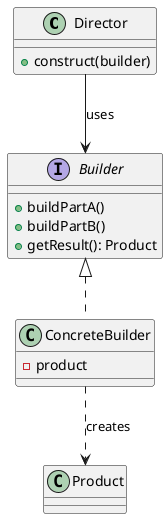

## Definition

The Builder Pattern separates the construction of a complex object from its representation, so that the same construction process can create different representations.

- It replaces telescoping constructors (`new Pizza(true, false, true, 2, null, ...)`) with readable, step-by-step assembly.
- The product is only handed to the client once it is complete and valid.

## When to Use?

- An object needs many optional parameters, and constructor overloads have become unreadable.
- Construction must happen in steps, or in different orders, or produce different variants.
- You want immutable objects with a friendly creation API.

## Use-case Examples (Real-world Applications)

- `StringBuilder`, `java.time` builders, OkHttp's `Request.Builder`
- Query builders in ORMs
- Document exporters that build HTML, PDF or Markdown from the same sequence of steps

## Structure



## Example

The fluent variant, which is what most code uses in practice: the required
argument lives on the builder's constructor, the optional ones on chained
methods, and `build()` is the single place where validation happens.

=== "Java"

    ```java
    public class Pizza {
        private final String size;
        private final boolean cheese;
        private final boolean pepperoni;
        private final boolean mushrooms;

        private Pizza(Builder builder) {
            this.size = builder.size;
            this.cheese = builder.cheese;
            this.pepperoni = builder.pepperoni;
            this.mushrooms = builder.mushrooms;
        }

        @Override
        public String toString() {
            return size + " pizza [cheese=" + cheese
                    + ", pepperoni=" + pepperoni
                    + ", mushrooms=" + mushrooms + "]";
        }

        public static class Builder {
            private final String size;      // required
            private boolean cheese;         // optional
            private boolean pepperoni;
            private boolean mushrooms;

            public Builder(String size) {
                this.size = size;
            }

            public Builder cheese() {
                this.cheese = true;
                return this;
            }

            public Builder pepperoni() {
                this.pepperoni = true;
                return this;
            }

            public Builder mushrooms() {
                this.mushrooms = true;
                return this;
            }

            public Pizza build() {
                if (size == null || size.isBlank()) {
                    throw new IllegalStateException("size is required");
                }
                return new Pizza(this);
            }
        }
    }

    public class Main {
        public static void main(String[] args) {
            Pizza pizza = new Pizza.Builder("large")
                    .cheese()
                    .mushrooms()
                    .build();

            System.out.println(pizza); // large pizza [cheese=true, ...]
        }
    }
    ```

=== "C#"

    ```csharp
    public class Pizza
    {
        internal Pizza(string size, bool cheese, bool pepperoni, bool mushrooms) =>
            (Size, Cheese, Pepperoni, Mushrooms) = (size, cheese, pepperoni, mushrooms);

        public string Size { get; }
        public bool Cheese { get; }
        public bool Pepperoni { get; }
        public bool Mushrooms { get; }

        public override string ToString() =>
            $"{Size} pizza [cheese={Cheese}, pepperoni={Pepperoni}, mushrooms={Mushrooms}]";

        public class Builder
        {
            private readonly string _size; // required
            private bool _cheese;          // optional
            private bool _pepperoni;
            private bool _mushrooms;

            public Builder(string size) => _size = size;

            public Builder Cheese() { _cheese = true; return this; }
            public Builder Pepperoni() { _pepperoni = true; return this; }
            public Builder Mushrooms() { _mushrooms = true; return this; }

            public Pizza Build()
            {
                if (string.IsNullOrWhiteSpace(_size))
                    throw new InvalidOperationException("size is required");

                return new Pizza(_size, _cheese, _pepperoni, _mushrooms);
            }
        }
    }

    var pizza = new Pizza.Builder("large").Cheese().Mushrooms().Build();
    Console.WriteLine(pizza);
    ```

=== "C++"

    ```cpp
    #include <iostream>
    #include <stdexcept>
    #include <string>

    class Pizza {
    public:
        class Builder;

        std::string toString() const {
            return size_ + " pizza [cheese=" + std::to_string(cheese_)
                   + ", pepperoni=" + std::to_string(pepperoni_)
                   + ", mushrooms=" + std::to_string(mushrooms_) + "]";
        }

    private:
        Pizza(std::string size, bool cheese, bool pepperoni, bool mushrooms)
            : size_(std::move(size)),
              cheese_(cheese),
              pepperoni_(pepperoni),
              mushrooms_(mushrooms) {}

        std::string size_;
        bool cheese_;
        bool pepperoni_;
        bool mushrooms_;

        friend class Builder;
    };

    class Pizza::Builder {
    public:
        explicit Builder(std::string size) : size_(std::move(size)) {} // required

        Builder& cheese() { cheese_ = true; return *this; }
        Builder& pepperoni() { pepperoni_ = true; return *this; }
        Builder& mushrooms() { mushrooms_ = true; return *this; }

        Pizza build() const {
            if (size_.empty()) throw std::logic_error("size is required");
            return Pizza(size_, cheese_, pepperoni_, mushrooms_);
        }

    private:
        std::string size_;
        bool cheese_ = false;
        bool pepperoni_ = false;
        bool mushrooms_ = false;
    };

    int main() {
        Pizza pizza = Pizza::Builder("large").cheese().mushrooms().build();
        std::cout << pizza.toString() << '\n';
    }
    ```

=== "Python"

    ```python
    from dataclasses import dataclass
    from typing import Self


    @dataclass(frozen=True)
    class Pizza:
        size: str
        cheese: bool = False
        pepperoni: bool = False
        mushrooms: bool = False


    class PizzaBuilder:
        def __init__(self, size: str) -> None:  # required
            self._size = size
            self._toppings: dict[str, bool] = {}

        def cheese(self) -> Self:
            self._toppings["cheese"] = True
            return self

        def pepperoni(self) -> Self:
            self._toppings["pepperoni"] = True
            return self

        def mushrooms(self) -> Self:
            self._toppings["mushrooms"] = True
            return self

        def build(self) -> Pizza:
            if not self._size.strip():
                raise ValueError("size is required")
            return Pizza(self._size, **self._toppings)


    print(PizzaBuilder("large").cheese().mushrooms().build())

    # Keyword arguments with defaults cover most cases in Python; reach for a
    # builder only when construction is staged or validated as a whole.
    Pizza("large", cheese=True, mushrooms=True)
    ```

=== "Rust"

    ```rust
    #[derive(Debug)]
    pub struct Pizza {
        size: String,
        cheese: bool,
        pepperoni: bool,
        mushrooms: bool,
    }

    pub struct PizzaBuilder {
        size: String, // required
        cheese: bool,
        pepperoni: bool,
        mushrooms: bool,
    }

    impl PizzaBuilder {
        pub fn new(size: &str) -> Self {
            Self {
                size: size.to_string(),
                cheese: false,
                pepperoni: false,
                mushrooms: false,
            }
        }

        // Taking `self` by value lets the calls chain and moves ownership along.
        pub fn cheese(mut self) -> Self {
            self.cheese = true;
            self
        }

        pub fn pepperoni(mut self) -> Self {
            self.pepperoni = true;
            self
        }

        pub fn mushrooms(mut self) -> Self {
            self.mushrooms = true;
            self
        }

        pub fn build(self) -> Result<Pizza, String> {
            if self.size.trim().is_empty() {
                return Err("size is required".to_string());
            }
            Ok(Pizza {
                size: self.size,
                cheese: self.cheese,
                pepperoni: self.pepperoni,
                mushrooms: self.mushrooms,
            })
        }
    }

    fn main() {
        let pizza = PizzaBuilder::new("large").cheese().mushrooms().build().unwrap();
        println!("{pizza:?}");
    }
    ```

=== "TypeScript"

    ```typescript
    class Pizza {
      constructor(
        readonly size: string,
        readonly cheese: boolean,
        readonly pepperoni: boolean,
        readonly mushrooms: boolean,
      ) {}

      toString(): string {
        return `${this.size} pizza [cheese=${this.cheese}, pepperoni=${this.pepperoni}, mushrooms=${this.mushrooms}]`;
      }
    }

    class PizzaBuilder {
      private cheeseOn = false;
      private pepperoniOn = false;
      private mushroomsOn = false;

      constructor(private readonly size: string) {} // required

      cheese(): this {
        this.cheeseOn = true;
        return this;
      }

      pepperoni(): this {
        this.pepperoniOn = true;
        return this;
      }

      mushrooms(): this {
        this.mushroomsOn = true;
        return this;
      }

      build(): Pizza {
        if (!this.size.trim()) throw new Error("size is required");
        return new Pizza(this.size, this.cheeseOn, this.pepperoniOn, this.mushroomsOn);
      }
    }

    console.log(new PizzaBuilder("large").cheese().mushrooms().build().toString());
    ```

## The Director

The classic GoF form adds a `Director` that knows the *recipe*, the order of the build steps, while the builder knows the *materials*:

```java
public class PizzaDirector {
    public Pizza margherita() {
        return new Pizza.Builder("medium").cheese().build();
    }
}
```

Use a director when the same sequence of steps must be reused with different builders; skip it when the client is happy to chain the calls itself.

## Check Your Understanding

<quiz>
When is the Builder Pattern the right choice?

- [x] When an object has many optional parts and a constructor would need a long, confusing parameter list
> Correct. Builder assembles the object step by step, so the construction code stays readable and the object is only exposed once it is complete.
- [ ] When you need exactly one instance of a class
- [ ] When two class hierarchies must vary independently
- [ ] When you want to add behaviour to an object at runtime
</quiz>
