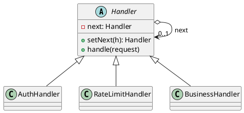
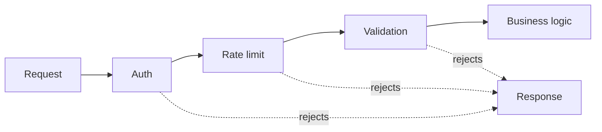

## Definition

The Chain of Responsibility Pattern avoids coupling the sender of a request to its receiver by giving more than one object a chance to handle it. The receiving objects are chained, and the request is passed along the chain until one of them handles it.

- Each handler decides: handle it, pass it on, or both.
- The sender knows only the first link; it has no idea how long the chain is or who answers.

## When to Use?

- More than one object may handle a request and the handler is not known in advance.
- You want to add, remove or reorder processing steps without touching the others.
- A request must pass through a series of checks (auth, rate limit, validation, logging) before the real work.

## Use-case Examples (Real-world Applications)

- HTTP middleware / servlet filter chains
- Logging frameworks passing records up the logger hierarchy by level
- Approval workflows where an amount escalates from team lead to director to CFO
- Event bubbling in the DOM

## Structure





## Example

An expense approval chain: team lead, then director, then CFO as the catch-all.

=== "Java"

    ```java
    public abstract class Handler {
        private Handler next;

        public Handler setNext(Handler next) {
            this.next = next;
            return next; // returning next makes the chain readable to build
        }

        public void handle(Request request) {
            if (canHandle(request)) {
                process(request);
            } else if (next != null) {
                next.handle(request);
            } else {
                throw new IllegalStateException("No handler for " + request);
            }
        }

        protected abstract boolean canHandle(Request request);

        protected abstract void process(Request request);
    }

    public record Request(String type, double amount) {}

    public class TeamLead extends Handler {
        protected boolean canHandle(Request request) {
            return request.amount() <= 1_000;
        }

        protected void process(Request request) {
            System.out.println("Team lead approved $" + request.amount());
        }
    }

    public class Director extends Handler {
        protected boolean canHandle(Request request) {
            return request.amount() <= 50_000;
        }

        protected void process(Request request) {
            System.out.println("Director approved $" + request.amount());
        }
    }

    public class CFO extends Handler {
        protected boolean canHandle(Request request) {
            return true; // the catch-all at the end of the chain
        }

        protected void process(Request request) {
            System.out.println("CFO approved $" + request.amount());
        }
    }

    public class Main {
        public static void main(String[] args) {
            Handler chain = new TeamLead();
            chain.setNext(new Director()).setNext(new CFO());

            chain.handle(new Request("expense", 500));    // Team lead
            chain.handle(new Request("expense", 20_000)); // Director
            chain.handle(new Request("expense", 900_000));// CFO
        }
    }
    ```

=== "C#"

    ```csharp
    public record Request(string Type, decimal Amount);

    public abstract class Handler
    {
        private Handler? _next;

        public Handler SetNext(Handler next)
        {
            _next = next;
            return next; // returning next makes the chain readable to build
        }

        public void Handle(Request request)
        {
            if (CanHandle(request)) Process(request);
            else if (_next is not null) _next.Handle(request);
            else throw new InvalidOperationException($"No handler for {request}");
        }

        protected abstract bool CanHandle(Request request);
        protected abstract void Process(Request request);
    }

    public class TeamLead : Handler
    {
        protected override bool CanHandle(Request request) => request.Amount <= 1_000m;
        protected override void Process(Request request) =>
            Console.WriteLine($"Team lead approved ${request.Amount}");
    }

    public class Director : Handler
    {
        protected override bool CanHandle(Request request) => request.Amount <= 50_000m;
        protected override void Process(Request request) =>
            Console.WriteLine($"Director approved ${request.Amount}");
    }

    public class Cfo : Handler
    {
        protected override bool CanHandle(Request request) => true; // catch-all
        protected override void Process(Request request) =>
            Console.WriteLine($"CFO approved ${request.Amount}");
    }

    Handler chain = new TeamLead();
    chain.SetNext(new Director()).SetNext(new Cfo());

    chain.Handle(new Request("expense", 500m));
    chain.Handle(new Request("expense", 20_000m));
    chain.Handle(new Request("expense", 900_000m));
    ```

=== "C++"

    ```cpp
    #include <iostream>
    #include <stdexcept>
    #include <string>

    struct Request {
        std::string type;
        double amount;
    };

    class Handler {
    public:
        virtual ~Handler() = default;

        Handler* setNext(Handler* next) {
            next_ = next;
            return next; // returning next makes the chain readable to build
        }

        void handle(const Request& request) {
            if (canHandle(request)) {
                process(request);
            } else if (next_ != nullptr) {
                next_->handle(request);
            } else {
                throw std::logic_error("No handler for " + request.type);
            }
        }

    protected:
        virtual bool canHandle(const Request& request) const = 0;
        virtual void process(const Request& request) const = 0;

    private:
        Handler* next_ = nullptr;
    };

    class TeamLead : public Handler {
    protected:
        bool canHandle(const Request& r) const override { return r.amount <= 1000; }
        void process(const Request& r) const override {
            std::cout << "Team lead approved $" << r.amount << '\n';
        }
    };

    class Director : public Handler {
    protected:
        bool canHandle(const Request& r) const override { return r.amount <= 50000; }
        void process(const Request& r) const override {
            std::cout << "Director approved $" << r.amount << '\n';
        }
    };

    class Cfo : public Handler {
    protected:
        bool canHandle(const Request&) const override { return true; } // catch-all
        void process(const Request& r) const override {
            std::cout << "CFO approved $" << r.amount << '\n';
        }
    };

    int main() {
        TeamLead lead;
        Director director;
        Cfo cfo;
        lead.setNext(&director)->setNext(&cfo);

        lead.handle({"expense", 500});
        lead.handle({"expense", 20000});
        lead.handle({"expense", 900000});
    }
    ```

=== "Python"

    ```python
    from abc import ABC, abstractmethod
    from dataclasses import dataclass


    @dataclass(frozen=True)
    class Request:
        type: str
        amount: float


    class Handler(ABC):
        def __init__(self) -> None:
            self._next: "Handler | None" = None

        def set_next(self, handler: "Handler") -> "Handler":
            self._next = handler
            return handler  # returning next makes the chain readable to build

        def handle(self, request: Request) -> None:
            if self.can_handle(request):
                self.process(request)
            elif self._next is not None:
                self._next.handle(request)
            else:
                raise RuntimeError(f"No handler for {request}")

        @abstractmethod
        def can_handle(self, request: Request) -> bool: ...

        @abstractmethod
        def process(self, request: Request) -> None: ...


    class TeamLead(Handler):
        def can_handle(self, request: Request) -> bool:
            return request.amount <= 1_000

        def process(self, request: Request) -> None:
            print(f"Team lead approved ${request.amount}")


    class Director(Handler):
        def can_handle(self, request: Request) -> bool:
            return request.amount <= 50_000

        def process(self, request: Request) -> None:
            print(f"Director approved ${request.amount}")


    class Cfo(Handler):
        def can_handle(self, request: Request) -> bool:
            return True  # the catch-all at the end of the chain

        def process(self, request: Request) -> None:
            print(f"CFO approved ${request.amount}")


    chain = TeamLead()
    chain.set_next(Director()).set_next(Cfo())

    chain.handle(Request("expense", 500))
    chain.handle(Request("expense", 20_000))
    chain.handle(Request("expense", 900_000))
    ```

=== "Rust"

    ```rust
    struct Request {
        kind: String,
        amount: f64,
    }

    trait Handler {
        fn can_handle(&self, request: &Request) -> bool;
        fn process(&self, request: &Request);
    }

    struct TeamLead;
    struct Director;
    struct Cfo;

    impl Handler for TeamLead {
        fn can_handle(&self, request: &Request) -> bool {
            request.amount <= 1_000.0
        }
        fn process(&self, request: &Request) {
            println!("Team lead approved ${}", request.amount);
        }
    }

    impl Handler for Director {
        fn can_handle(&self, request: &Request) -> bool {
            request.amount <= 50_000.0
        }
        fn process(&self, request: &Request) {
            println!("Director approved ${}", request.amount);
        }
    }

    impl Handler for Cfo {
        fn can_handle(&self, _: &Request) -> bool {
            true // the catch-all at the end of the chain
        }
        fn process(&self, request: &Request) {
            println!("CFO approved ${}", request.amount);
        }
    }

    // Linked handlers fight the borrow checker for no gain; a slice walked in
    // order is the same pattern with the wiring visible in one place.
    fn handle(chain: &[Box<dyn Handler>], request: &Request) {
        match chain.iter().find(|h| h.can_handle(request)) {
            Some(handler) => handler.process(request),
            None => panic!("No handler for {}", request.kind),
        }
    }

    fn main() {
        let chain: Vec<Box<dyn Handler>> =
            vec![Box::new(TeamLead), Box::new(Director), Box::new(Cfo)];

        handle(&chain, &Request { kind: "expense".into(), amount: 500.0 });
        handle(&chain, &Request { kind: "expense".into(), amount: 20_000.0 });
        handle(&chain, &Request { kind: "expense".into(), amount: 900_000.0 });
    }
    ```

=== "TypeScript"

    ```typescript
    interface Request {
      type: string;
      amount: number;
    }

    abstract class Handler {
      private next?: Handler;

      setNext(next: Handler): Handler {
        this.next = next;
        return next; // returning next makes the chain readable to build
      }

      handle(request: Request): void {
        if (this.canHandle(request)) this.process(request);
        else if (this.next) this.next.handle(request);
        else throw new Error(`No handler for ${request.type}`);
      }

      protected abstract canHandle(request: Request): boolean;
      protected abstract process(request: Request): void;
    }

    class TeamLead extends Handler {
      protected canHandle(request: Request): boolean {
        return request.amount <= 1_000;
      }
      protected process(request: Request): void {
        console.log(`Team lead approved $${request.amount}`);
      }
    }

    class Director extends Handler {
      protected canHandle(request: Request): boolean {
        return request.amount <= 50_000;
      }
      protected process(request: Request): void {
        console.log(`Director approved $${request.amount}`);
      }
    }

    class Cfo extends Handler {
      protected canHandle(): boolean {
        return true; // the catch-all at the end of the chain
      }
      protected process(request: Request): void {
        console.log(`CFO approved $${request.amount}`);
      }
    }

    const chain = new TeamLead();
    chain.setNext(new Director()).setNext(new Cfo());

    chain.handle({ type: "expense", amount: 500 });
    chain.handle({ type: "expense", amount: 20_000 });
    chain.handle({ type: "expense", amount: 900_000 });
    ```

## Watch out

- Always terminate the chain, either with a catch-all handler or an explicit error, as above. A silently unhandled request is a bug that is painful to find.
- Long chains are hard to debug; keep the wiring in one visible place.

## Check Your Understanding

<quiz>
What happens to a request in a Chain of Responsibility?

- [x] It travels along a chain of handlers until one of them handles it
> Correct. The sender does not know which handler will act, and handlers can be reordered or added without touching the sender.
- [ ] It is broadcast to every registered observer at once
- [ ] It is stored so it can be undone later
- [ ] It is delegated to a single mediator that decides everything
</quiz>
