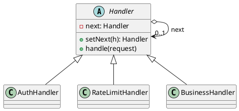
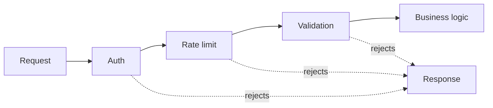

## Definition

The Chain of Responsibility Pattern avoids coupling the sender of a request to its receiver by giving more than one object a chance to handle it. The receiving objects are chained, and the request is passed along the chain until one of them handles it.

- Each handler decides: handle it, pass it on, or both.
- The sender knows only the first link; it has no idea how long the chain is or who answers.

## When to Use?

- More than one object may handle a request and the handler is not known in advance.
- You want to add, remove or reorder processing steps without touching the others.
- A request must pass through a series of checks (auth, rate limit, validation, logging) before the real work.

## Use-case Examples (Real-world Applications)

- HTTP middleware / servlet filter chains
- Logging frameworks passing records up the logger hierarchy by level
- Approval workflows where an amount escalates from team lead to director to CFO
- Event bubbling in the DOM

## Structure





## Example

```java
public abstract class Handler {
    private Handler next;

    public Handler setNext(Handler next) {
        this.next = next;
        return next; // returning next makes the chain readable to build
    }

    public void handle(Request request) {
        if (canHandle(request)) {
            process(request);
        } else if (next != null) {
            next.handle(request);
        } else {
            throw new IllegalStateException("No handler for " + request);
        }
    }

    protected abstract boolean canHandle(Request request);

    protected abstract void process(Request request);
}
```

```java
public record Request(String type, double amount) {}

public class TeamLead extends Handler {
    protected boolean canHandle(Request request) {
        return request.amount() <= 1_000;
    }

    protected void process(Request request) {
        System.out.println("Team lead approved $" + request.amount());
    }
}

public class Director extends Handler {
    protected boolean canHandle(Request request) {
        return request.amount() <= 50_000;
    }

    protected void process(Request request) {
        System.out.println("Director approved $" + request.amount());
    }
}

public class CFO extends Handler {
    protected boolean canHandle(Request request) {
        return true; // the catch-all at the end of the chain
    }

    protected void process(Request request) {
        System.out.println("CFO approved $" + request.amount());
    }
}
```

```java
public class Main {
    public static void main(String[] args) {
        Handler chain = new TeamLead();
        chain.setNext(new Director()).setNext(new CFO());

        chain.handle(new Request("expense", 500));    // Team lead
        chain.handle(new Request("expense", 20_000)); // Director
        chain.handle(new Request("expense", 900_000));// CFO
    }
}
```

## Watch out

- Always terminate the chain, either with a catch-all handler or an explicit error, as above. A silently unhandled request is a bug that is painful to find.
- Long chains are hard to debug; keep the wiring in one visible place.

## Check Your Understanding

<quiz>
What happens to a request in a Chain of Responsibility?

- [x] It travels along a chain of handlers until one of them handles it
> Correct. The sender does not know which handler will act, and handlers can be reordered or added without touching the sender.
- [ ] It is broadcast to every registered observer at once
- [ ] It is stored so it can be undone later
- [ ] It is delegated to a single mediator that decides everything
</quiz>
