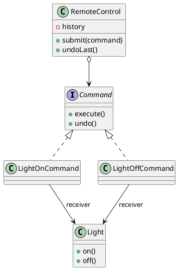

## Definition

The Command Pattern encapsulates a request as an object, thereby letting you parameterize clients with different requests, queue or log requests, and support undoable operations.

- A method call becomes a **first-class object**: it can be stored, passed around, delayed, retried, serialized, and reversed.
- The invoker (a button, a scheduler, a queue consumer) knows only `execute()`; it has no idea what the command does.

## When to Use?

- You need undo/redo, macros, or a history of actions.
- Requests must be queued, scheduled, or sent across a boundary.
- The thing that triggers an action should not be coupled to the thing that performs it.

## Use-case Examples (Real-world Applications)

- Editor undo stacks
- Menu items and toolbar buttons bound to the same action
- Job queues, task runners, transactional outboxes
- `java.lang.Runnable`, the smallest possible command interface

## Structure



## Example

The receiver knows how to do the actual work:

```java
public class Light {
    private final String room;

    public Light(String room) {
        this.room = room;
    }

    public void on() {
        System.out.println(room + " light on");
    }

    public void off() {
        System.out.println(room + " light off");
    }
}
```

The command wraps a receiver plus the arguments needed to invoke it:

```java
public interface Command {
    void execute();
    void undo();
}

public class LightOnCommand implements Command {
    private final Light light;

    public LightOnCommand(Light light) {
        this.light = light;
    }

    @Override
    public void execute() {
        light.on();
    }

    @Override
    public void undo() {
        light.off();
    }
}
```

The invoker only stores and triggers commands:

```java
import java.util.ArrayDeque;
import java.util.Deque;

public class RemoteControl {
    private final Deque<Command> history = new ArrayDeque<>();

    public void submit(Command command) {
        command.execute();
        history.push(command);
    }

    public void undoLast() {
        if (!history.isEmpty()) {
            history.pop().undo();
        }
    }
}
```

```java
public class Main {
    public static void main(String[] args) {
        RemoteControl remote = new RemoteControl();

        remote.submit(new LightOnCommand(new Light("Kitchen"))); // Kitchen light on
        remote.undoLast();                                       // Kitchen light off
    }
}
```

## Macro commands

Because a command is an object, a list of commands is also a command, the [Composite Pattern](Composite%20Pattern.md) applied to behaviour:

```java
public record MacroCommand(java.util.List<Command> commands) implements Command {
    @Override
    public void execute() {
        commands.forEach(Command::execute);
    }

    @Override
    public void undo() {
        commands.reversed().forEach(Command::undo); // reverse order matters
    }
}
```
