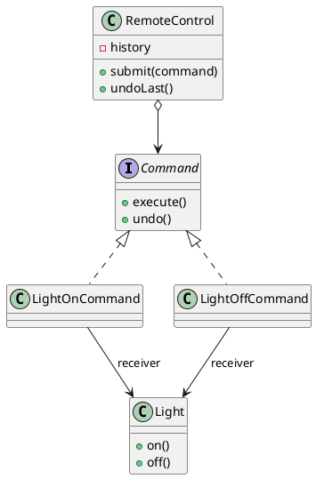

## Definition

The Command Pattern encapsulates a request as an object, thereby letting you parameterize clients with different requests, queue or log requests, and support undoable operations.

- A method call becomes a **first-class object**: it can be stored, passed around, delayed, retried, serialized, and reversed.
- The invoker (a button, a scheduler, a queue consumer) knows only `execute()`; it has no idea what the command does.

## When to Use?

- You need undo/redo, macros, or a history of actions.
- Requests must be queued, scheduled, or sent across a boundary.
- The thing that triggers an action should not be coupled to the thing that performs it.

## Use-case Examples (Real-world Applications)

- Editor undo stacks
- Menu items and toolbar buttons bound to the same action
- Job queues, task runners, transactional outboxes
- `java.lang.Runnable`, the smallest possible command interface

## Structure



## Example

Three roles: the receiver (`Light`) knows how to do the work, the command wraps
a receiver plus the arguments needed to invoke it, and the invoker only stores
and triggers commands.

=== "Java"

    ```java
    import java.util.ArrayDeque;
    import java.util.Deque;

    public class Light {
        private final String room;

        public Light(String room) {
            this.room = room;
        }

        public void on() {
            System.out.println(room + " light on");
        }

        public void off() {
            System.out.println(room + " light off");
        }
    }

    public interface Command {
        void execute();
        void undo();
    }

    public class LightOnCommand implements Command {
        private final Light light;

        public LightOnCommand(Light light) {
            this.light = light;
        }

        @Override
        public void execute() {
            light.on();
        }

        @Override
        public void undo() {
            light.off();
        }
    }

    public class RemoteControl {
        private final Deque<Command> history = new ArrayDeque<>();

        public void submit(Command command) {
            command.execute();
            history.push(command);
        }

        public void undoLast() {
            if (!history.isEmpty()) {
                history.pop().undo();
            }
        }
    }

    public class Main {
        public static void main(String[] args) {
            RemoteControl remote = new RemoteControl();

            remote.submit(new LightOnCommand(new Light("Kitchen"))); // Kitchen light on
            remote.undoLast();                                       // Kitchen light off
        }
    }
    ```

=== "C#"

    ```csharp
    public class Light
    {
        private readonly string _room;

        public Light(string room) => _room = room;

        public void On() => Console.WriteLine($"{_room} light on");
        public void Off() => Console.WriteLine($"{_room} light off");
    }

    public interface ICommand
    {
        void Execute();
        void Undo();
    }

    public class LightOnCommand : ICommand
    {
        private readonly Light _light;

        public LightOnCommand(Light light) => _light = light;

        public void Execute() => _light.On();
        public void Undo() => _light.Off();
    }

    public class RemoteControl
    {
        private readonly Stack<ICommand> _history = new();

        public void Submit(ICommand command)
        {
            command.Execute();
            _history.Push(command);
        }

        public void UndoLast()
        {
            if (_history.Count > 0) _history.Pop().Undo();
        }
    }

    var remote = new RemoteControl();
    remote.Submit(new LightOnCommand(new Light("Kitchen"))); // Kitchen light on
    remote.UndoLast();                                       // Kitchen light off
    ```

=== "C++"

    ```cpp
    #include <iostream>
    #include <memory>
    #include <stack>
    #include <string>

    class Light {
    public:
        explicit Light(std::string room) : room_(std::move(room)) {}

        void on() { std::cout << room_ << " light on\n"; }
        void off() { std::cout << room_ << " light off\n"; }

    private:
        std::string room_;
    };

    class Command {
    public:
        virtual ~Command() = default;
        virtual void execute() = 0;
        virtual void undo() = 0;
    };

    class LightOnCommand : public Command {
    public:
        explicit LightOnCommand(Light& light) : light_(light) {}

        void execute() override { light_.on(); }
        void undo() override { light_.off(); }

    private:
        Light& light_;
    };

    class RemoteControl {
    public:
        void submit(std::unique_ptr<Command> command) {
            command->execute();
            history_.push(std::move(command));
        }

        void undoLast() {
            if (history_.empty()) return;
            history_.top()->undo();
            history_.pop();
        }

    private:
        std::stack<std::unique_ptr<Command>> history_;
    };

    int main() {
        Light kitchen("Kitchen");
        RemoteControl remote;

        remote.submit(std::make_unique<LightOnCommand>(kitchen)); // Kitchen light on
        remote.undoLast();                                        // Kitchen light off
    }
    ```

=== "Python"

    ```python
    from abc import ABC, abstractmethod


    class Light:
        def __init__(self, room: str) -> None:
            self.room = room

        def on(self) -> None:
            print(f"{self.room} light on")

        def off(self) -> None:
            print(f"{self.room} light off")


    class Command(ABC):
        @abstractmethod
        def execute(self) -> None: ...

        @abstractmethod
        def undo(self) -> None: ...


    class LightOnCommand(Command):
        def __init__(self, light: Light) -> None:
            self._light = light

        def execute(self) -> None:
            self._light.on()

        def undo(self) -> None:
            self._light.off()


    class RemoteControl:
        def __init__(self) -> None:
            self._history: list[Command] = []

        def submit(self, command: Command) -> None:
            command.execute()
            self._history.append(command)

        def undo_last(self) -> None:
            if self._history:
                self._history.pop().undo()


    remote = RemoteControl()
    remote.submit(LightOnCommand(Light("Kitchen")))  # Kitchen light on
    remote.undo_last()                               # Kitchen light off
    ```

=== "Rust"

    ```rust
    use std::cell::RefCell;
    use std::rc::Rc;

    struct Light {
        room: String,
    }

    impl Light {
        fn on(&self) {
            println!("{} light on", self.room);
        }
        fn off(&self) {
            println!("{} light off", self.room);
        }
    }

    trait Command {
        fn execute(&self);
        fn undo(&self);
    }

    struct LightOnCommand {
        light: Rc<RefCell<Light>>,
    }

    impl Command for LightOnCommand {
        fn execute(&self) {
            self.light.borrow().on();
        }
        fn undo(&self) {
            self.light.borrow().off();
        }
    }

    #[derive(Default)]
    struct RemoteControl {
        history: Vec<Box<dyn Command>>,
    }

    impl RemoteControl {
        fn submit(&mut self, command: Box<dyn Command>) {
            command.execute();
            self.history.push(command);
        }

        fn undo_last(&mut self) {
            if let Some(command) = self.history.pop() {
                command.undo();
            }
        }
    }

    fn main() {
        let kitchen = Rc::new(RefCell::new(Light { room: "Kitchen".into() }));
        let mut remote = RemoteControl::default();

        remote.submit(Box::new(LightOnCommand { light: kitchen.clone() }));
        remote.undo_last();
    }
    ```

=== "TypeScript"

    ```typescript
    class Light {
      constructor(private readonly room: string) {}

      on(): void {
        console.log(`${this.room} light on`);
      }

      off(): void {
        console.log(`${this.room} light off`);
      }
    }

    interface Command {
      execute(): void;
      undo(): void;
    }

    class LightOnCommand implements Command {
      constructor(private readonly light: Light) {}

      execute(): void {
        this.light.on();
      }

      undo(): void {
        this.light.off();
      }
    }

    class RemoteControl {
      private readonly history: Command[] = [];

      submit(command: Command): void {
        command.execute();
        this.history.push(command);
      }

      undoLast(): void {
        this.history.pop()?.undo();
      }
    }

    const remote = new RemoteControl();
    remote.submit(new LightOnCommand(new Light("Kitchen"))); // Kitchen light on
    remote.undoLast();                                       // Kitchen light off
    ```

## Macro commands

Because a command is an object, a list of commands is also a command, the [Composite Pattern](Composite%20Pattern.md) applied to behaviour:

```java
public record MacroCommand(java.util.List<Command> commands) implements Command {
    @Override
    public void execute() {
        commands.forEach(Command::execute);
    }

    @Override
    public void undo() {
        commands.reversed().forEach(Command::undo); // reverse order matters
    }
}
```

## Check Your Understanding

<quiz>
What does the Command Pattern encapsulate?

- [ ] The traversal logic of a collection
- [x] A request as an object, with the receiver and the parameters it needs
> Correct. Because the request is an object, it can be queued, logged, replayed, or reversed to support undo.
- [ ] The construction steps of a complex object
- [ ] The interface differences between two classes
</quiz>
