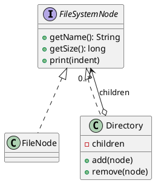

## Definition

The Composite Pattern composes objects into tree structures to represent part-whole hierarchies. Composite lets clients treat individual objects and compositions of objects **uniformly**.

- A leaf and a container implement the same interface, so client code never asks "is this one thing or many things?".
- Recursion lives inside the composite, not in the client.

## When to Use?

- Your data is naturally a tree: files and folders, menus and submenus, UI containers and widgets.
- You want client code free of `if (node instanceof Folder) … else …` branching.
- Operations should apply to a whole subtree as easily as to a single element.

## Use-case Examples (Real-world Applications)

- File systems (`File` and `Directory` both have a `size()`)
- The DOM, and UI toolkits where a panel is itself a component
- Organization charts, and bills of materials where a part may contain sub-parts

## Structure



## Example

A file tree. The shared interface is the whole point: `getSize()` means the same
thing to a file and to a directory, and the recursion lives in the composite.

=== "Java"

    ```java
    import java.util.ArrayList;
    import java.util.List;

    public interface FileSystemNode {
        String getName();
        long getSize();
    }

    // The leaf.
    public class FileNode implements FileSystemNode {
        private final String name;
        private final long size;

        public FileNode(String name, long size) {
            this.name = name;
            this.size = size;
        }

        public String getName() {
            return name;
        }

        public long getSize() {
            return size;
        }
    }

    // The composite, which delegates to its children.
    public class Directory implements FileSystemNode {
        private final String name;
        private final List<FileSystemNode> children = new ArrayList<>();

        public Directory(String name) {
            this.name = name;
        }

        public Directory add(FileSystemNode node) {
            children.add(node);
            return this;
        }

        public void remove(FileSystemNode node) {
            children.remove(node);
        }

        public String getName() {
            return name;
        }

        @Override
        public long getSize() {
            long total = 0;
            for (FileSystemNode child : children) {
                total += child.getSize(); // works for files and directories alike
            }
            return total;
        }
    }

    public class Main {
        public static void main(String[] args) {
            FileSystemNode project = new Directory("project")
                    .add(new FileNode("README.md", 2_000))
                    .add(new Directory("src")
                            .add(new FileNode("Main.java", 5_000))
                            .add(new FileNode("Util.java", 3_000)));

            System.out.println(project.getSize()); // 10000
        }
    }
    ```

=== "C#"

    ```csharp
    public interface IFileSystemNode
    {
        string Name { get; }
        long Size { get; }
    }

    // The leaf.
    public class FileNode : IFileSystemNode
    {
        public FileNode(string name, long size) => (Name, Size) = (name, size);

        public string Name { get; }
        public long Size { get; }
    }

    // The composite, which delegates to its children.
    public class Directory : IFileSystemNode
    {
        private readonly List<IFileSystemNode> _children = new();

        public Directory(string name) => Name = name;

        public string Name { get; }

        // Works for files and directories alike.
        public long Size => _children.Sum(child => child.Size);

        public Directory Add(IFileSystemNode node)
        {
            _children.Add(node);
            return this;
        }

        public void Remove(IFileSystemNode node) => _children.Remove(node);
    }

    IFileSystemNode project = new Directory("project")
        .Add(new FileNode("README.md", 2_000))
        .Add(new Directory("src")
            .Add(new FileNode("Program.cs", 5_000))
            .Add(new FileNode("Util.cs", 3_000)));

    Console.WriteLine(project.Size); // 10000
    ```

=== "C++"

    ```cpp
    #include <iostream>
    #include <memory>
    #include <numeric>
    #include <string>
    #include <vector>

    class FileSystemNode {
    public:
        virtual ~FileSystemNode() = default;
        virtual const std::string& name() const = 0;
        virtual long size() const = 0;
    };

    // The leaf.
    class FileNode : public FileSystemNode {
    public:
        FileNode(std::string name, long size)
            : name_(std::move(name)), size_(size) {}

        const std::string& name() const override { return name_; }
        long size() const override { return size_; }

    private:
        std::string name_;
        long size_;
    };

    // The composite, which delegates to its children.
    class Directory : public FileSystemNode {
    public:
        explicit Directory(std::string name) : name_(std::move(name)) {}

        Directory& add(std::unique_ptr<FileSystemNode> node) {
            children_.push_back(std::move(node));
            return *this;
        }

        const std::string& name() const override { return name_; }

        long size() const override {
            return std::accumulate(
                children_.begin(), children_.end(), 0L,
                [](long total, const auto& child) { return total + child->size(); });
        }

    private:
        std::string name_;
        std::vector<std::unique_ptr<FileSystemNode>> children_;
    };

    int main() {
        auto src = std::make_unique<Directory>("src");
        src->add(std::make_unique<FileNode>("main.cpp", 5000))
            .add(std::make_unique<FileNode>("util.cpp", 3000));

        Directory project("project");
        project.add(std::make_unique<FileNode>("README.md", 2000))
            .add(std::move(src));

        std::cout << project.size() << '\n'; // 10000
    }
    ```

=== "Python"

    ```python
    from abc import ABC, abstractmethod
    from typing import Self


    class FileSystemNode(ABC):
        @property
        @abstractmethod
        def name(self) -> str: ...

        @property
        @abstractmethod
        def size(self) -> int: ...


    # The leaf.
    class FileNode(FileSystemNode):
        def __init__(self, name: str, size: int) -> None:
            self._name = name
            self._size = size

        @property
        def name(self) -> str:
            return self._name

        @property
        def size(self) -> int:
            return self._size


    # The composite, which delegates to its children.
    class Directory(FileSystemNode):
        def __init__(self, name: str) -> None:
            self._name = name
            self._children: list[FileSystemNode] = []

        def add(self, node: FileSystemNode) -> Self:
            self._children.append(node)
            return self

        def remove(self, node: FileSystemNode) -> None:
            self._children.remove(node)

        @property
        def name(self) -> str:
            return self._name

        @property
        def size(self) -> int:
            # Works for files and directories alike.
            return sum(child.size for child in self._children)


    project = Directory("project").add(FileNode("README.md", 2_000)).add(
        Directory("src").add(FileNode("main.py", 5_000)).add(FileNode("util.py", 3_000))
    )

    print(project.size)  # 10000
    ```

=== "Rust"

    ```rust
    // An enum is the natural composite in Rust: the tree shape is in the type,
    // and the match is exhaustive at compile time.
    enum FileSystemNode {
        File { name: String, size: u64 },
        Directory { name: String, children: Vec<FileSystemNode> },
    }

    impl FileSystemNode {
        fn name(&self) -> &str {
            match self {
                FileSystemNode::File { name, .. } => name,
                FileSystemNode::Directory { name, .. } => name,
            }
        }

        fn size(&self) -> u64 {
            match self {
                FileSystemNode::File { size, .. } => *size,
                // Works for files and directories alike.
                FileSystemNode::Directory { children, .. } => {
                    children.iter().map(FileSystemNode::size).sum()
                }
            }
        }
    }

    fn file(name: &str, size: u64) -> FileSystemNode {
        FileSystemNode::File { name: name.into(), size }
    }

    fn main() {
        let project = FileSystemNode::Directory {
            name: "project".into(),
            children: vec![
                file("README.md", 2_000),
                FileSystemNode::Directory {
                    name: "src".into(),
                    children: vec![file("main.rs", 5_000), file("util.rs", 3_000)],
                },
            ],
        };

        println!("{} {}", project.name(), project.size()); // project 10000
    }
    ```

=== "TypeScript"

    ```typescript
    interface FileSystemNode {
      readonly name: string;
      size(): number;
    }

    // The leaf.
    class FileNode implements FileSystemNode {
      constructor(
        readonly name: string,
        private readonly bytes: number,
      ) {}

      size(): number {
        return this.bytes;
      }
    }

    // The composite, which delegates to its children.
    class Directory implements FileSystemNode {
      private readonly children: FileSystemNode[] = [];

      constructor(readonly name: string) {}

      add(node: FileSystemNode): this {
        this.children.push(node);
        return this;
      }

      remove(node: FileSystemNode): void {
        const index = this.children.indexOf(node);
        if (index >= 0) this.children.splice(index, 1);
      }

      size(): number {
        // Works for files and directories alike.
        return this.children.reduce((total, child) => total + child.size(), 0);
      }
    }

    const project: FileSystemNode = new Directory("project")
      .add(new FileNode("README.md", 2_000))
      .add(
        new Directory("src")
          .add(new FileNode("main.ts", 5_000))
          .add(new FileNode("util.ts", 3_000)),
      );

    console.log(project.size()); // 10000
    ```

## The design trade-off

Where do `add()` and `remove()` belong?

- **On the shared interface**, maximum uniformity, but a leaf must implement child operations that make no sense for it (usually by throwing).
- **On the composite only**, type-safe, but the client must know it holds a composite before it can add to it.

GoF favours uniformity; most modern code favours safety. Pick one deliberately, and be consistent.

## Check Your Understanding

<quiz>
What does the Composite Pattern let a client do?

- [x] Treat individual objects and compositions of objects through the same interface
> Correct. Leaves and containers share one interface, so client code walks a tree without asking which kind of node it is holding.
- [ ] Attach extra behaviour to a single object at runtime
- [ ] Traverse a collection without exposing its internals
- [ ] Restore an object to a previously saved state
</quiz>
