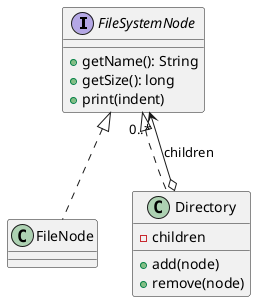

## Definition

The Composite Pattern composes objects into tree structures to represent part-whole hierarchies. Composite lets clients treat individual objects and compositions of objects **uniformly**.

- A leaf and a container implement the same interface, so client code never asks "is this one thing or many things?".
- Recursion lives inside the composite, not in the client.

## When to Use?

- Your data is naturally a tree: files and folders, menus and submenus, UI containers and widgets.
- You want client code free of `if (node instanceof Folder) … else …` branching.
- Operations should apply to a whole subtree as easily as to a single element.

## Use-case Examples (Real-world Applications)

- File systems (`File` and `Directory` both have a `size()`)
- The DOM, and UI toolkits where a panel is itself a component
- Organization charts, and bills of materials where a part may contain sub-parts

## Structure



## Example

The common interface, the whole point of the pattern:

```java
public interface FileSystemNode {
    String getName();
    long getSize();
}
```

The leaf:

```java
public class FileNode implements FileSystemNode {
    private final String name;
    private final long size;

    public FileNode(String name, long size) {
        this.name = name;
        this.size = size;
    }

    public String getName() {
        return name;
    }

    public long getSize() {
        return size;
    }
}
```

The composite, which delegates to its children:

```java
import java.util.ArrayList;
import java.util.List;

public class Directory implements FileSystemNode {
    private final String name;
    private final List<FileSystemNode> children = new ArrayList<>();

    public Directory(String name) {
        this.name = name;
    }

    public Directory add(FileSystemNode node) {
        children.add(node);
        return this;
    }

    public void remove(FileSystemNode node) {
        children.remove(node);
    }

    public String getName() {
        return name;
    }

    @Override
    public long getSize() {
        long total = 0;
        for (FileSystemNode child : children) {
            total += child.getSize(); // works for files and directories alike
        }
        return total;
    }
}
```

```java
public class Main {
    public static void main(String[] args) {
        FileSystemNode project = new Directory("project")
                .add(new FileNode("README.md", 2_000))
                .add(new Directory("src")
                        .add(new FileNode("Main.java", 5_000))
                        .add(new FileNode("Util.java", 3_000)));

        System.out.println(project.getSize()); // 10000
    }
}
```

## The design trade-off

Where do `add()` and `remove()` belong?

- **On the shared interface**, maximum uniformity, but a leaf must implement child operations that make no sense for it (usually by throwing).
- **On the composite only**, type-safe, but the client must know it holds a composite before it can add to it.

GoF favours uniformity; most modern code favours safety. Pick one deliberately, and be consistent.
