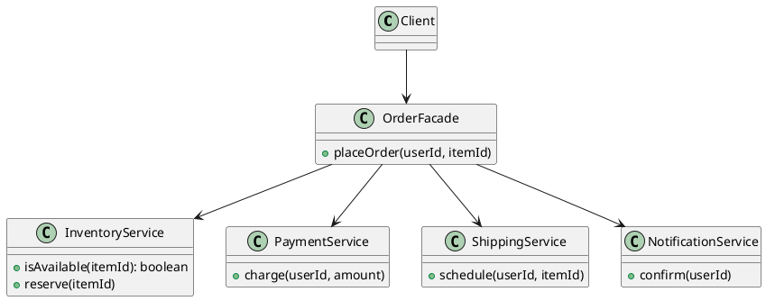

## Definition

The Facade Pattern provides a unified, higher-level interface to a set of interfaces in a subsystem. Facade makes the subsystem easier to use.

- It does not hide the subsystem, advanced clients can still reach past it.
- It encodes the common workflow once, instead of letting every caller re-learn the call order.

## When to Use?

- A subsystem has many moving parts but most clients only need one or two typical flows.
- You want to reduce coupling between client code and a library that is likely to change.
- You are layering a system and want each layer to expose one entry point.

## Use-case Examples (Real-world Applications)

- A `VideoConverter.convert(file, format)` hiding codecs, buffers and muxers
- Service classes wrapping several repositories inside one business operation
- SDK clients that hide HTTP, retries, auth and deserialization behind one method call

## Structure



## Example

The subsystem classes are each fine on their own, but using them correctly takes
knowledge. The facade holds the ordering, the error handling and the business
rule, so no caller can forget the stock check.

=== "Java"

    ```java
    public class InventoryService {
        public boolean isAvailable(String itemId) {
            return true;
        }

        public void reserve(String itemId) {
            System.out.println("Reserved " + itemId);
        }
    }

    public class PaymentService {
        public void charge(String userId, double amount) {
            System.out.println("Charged " + userId + " $" + amount);
        }
    }

    public class ShippingService {
        public void schedule(String userId, String itemId) {
            System.out.println("Shipping " + itemId + " to " + userId);
        }
    }

    public class OrderFacade {
        private final InventoryService inventory = new InventoryService();
        private final PaymentService payments = new PaymentService();
        private final ShippingService shipping = new ShippingService();

        public void placeOrder(String userId, String itemId, double price) {
            if (!inventory.isAvailable(itemId)) {
                throw new IllegalStateException("Out of stock: " + itemId);
            }
            inventory.reserve(itemId);
            payments.charge(userId, price);
            shipping.schedule(userId, itemId);
        }
    }

    public class Main {
        public static void main(String[] args) {
            new OrderFacade().placeOrder("u-1", "book-42", 24.90);
        }
    }
    ```

=== "C#"

    ```csharp
    public class InventoryService
    {
        public bool IsAvailable(string itemId) => true;

        public void Reserve(string itemId) => Console.WriteLine($"Reserved {itemId}");
    }

    public class PaymentService
    {
        public void Charge(string userId, decimal amount) =>
            Console.WriteLine($"Charged {userId} ${amount}");
    }

    public class ShippingService
    {
        public void Schedule(string userId, string itemId) =>
            Console.WriteLine($"Shipping {itemId} to {userId}");
    }

    public class OrderFacade
    {
        private readonly InventoryService _inventory = new();
        private readonly PaymentService _payments = new();
        private readonly ShippingService _shipping = new();

        public void PlaceOrder(string userId, string itemId, decimal price)
        {
            if (!_inventory.IsAvailable(itemId))
                throw new InvalidOperationException($"Out of stock: {itemId}");

            _inventory.Reserve(itemId);
            _payments.Charge(userId, price);
            _shipping.Schedule(userId, itemId);
        }
    }

    new OrderFacade().PlaceOrder("u-1", "book-42", 24.90m);
    ```

=== "C++"

    ```cpp
    #include <iostream>
    #include <stdexcept>
    #include <string>

    class InventoryService {
    public:
        bool isAvailable(const std::string&) const { return true; }
        void reserve(const std::string& itemId) {
            std::cout << "Reserved " << itemId << '\n';
        }
    };

    class PaymentService {
    public:
        void charge(const std::string& userId, double amount) {
            std::cout << "Charged " << userId << " $" << amount << '\n';
        }
    };

    class ShippingService {
    public:
        void schedule(const std::string& userId, const std::string& itemId) {
            std::cout << "Shipping " << itemId << " to " << userId << '\n';
        }
    };

    class OrderFacade {
    public:
        void placeOrder(const std::string& userId, const std::string& itemId,
                        double price) {
            if (!inventory_.isAvailable(itemId)) {
                throw std::runtime_error("Out of stock: " + itemId);
            }
            inventory_.reserve(itemId);
            payments_.charge(userId, price);
            shipping_.schedule(userId, itemId);
        }

    private:
        InventoryService inventory_;
        PaymentService payments_;
        ShippingService shipping_;
    };

    int main() {
        OrderFacade().placeOrder("u-1", "book-42", 24.90);
    }
    ```

=== "Python"

    ```python
    class InventoryService:
        def is_available(self, item_id: str) -> bool:
            return True

        def reserve(self, item_id: str) -> None:
            print(f"Reserved {item_id}")


    class PaymentService:
        def charge(self, user_id: str, amount: float) -> None:
            print(f"Charged {user_id} ${amount}")


    class ShippingService:
        def schedule(self, user_id: str, item_id: str) -> None:
            print(f"Shipping {item_id} to {user_id}")


    class OrderFacade:
        def __init__(self) -> None:
            self._inventory = InventoryService()
            self._payments = PaymentService()
            self._shipping = ShippingService()

        def place_order(self, user_id: str, item_id: str, price: float) -> None:
            if not self._inventory.is_available(item_id):
                raise RuntimeError(f"Out of stock: {item_id}")

            self._inventory.reserve(item_id)
            self._payments.charge(user_id, price)
            self._shipping.schedule(user_id, item_id)


    OrderFacade().place_order("u-1", "book-42", 24.90)
    ```

=== "Rust"

    ```rust
    #[derive(Default)]
    struct InventoryService;
    #[derive(Default)]
    struct PaymentService;
    #[derive(Default)]
    struct ShippingService;

    impl InventoryService {
        fn is_available(&self, _item_id: &str) -> bool {
            true
        }
        fn reserve(&self, item_id: &str) {
            println!("Reserved {item_id}");
        }
    }

    impl PaymentService {
        fn charge(&self, user_id: &str, amount: f64) {
            println!("Charged {user_id} ${amount}");
        }
    }

    impl ShippingService {
        fn schedule(&self, user_id: &str, item_id: &str) {
            println!("Shipping {item_id} to {user_id}");
        }
    }

    #[derive(Default)]
    struct OrderFacade {
        inventory: InventoryService,
        payments: PaymentService,
        shipping: ShippingService,
    }

    impl OrderFacade {
        fn place_order(&self, user_id: &str, item_id: &str, price: f64) -> Result<(), String> {
            if !self.inventory.is_available(item_id) {
                return Err(format!("Out of stock: {item_id}"));
            }
            self.inventory.reserve(item_id);
            self.payments.charge(user_id, price);
            self.shipping.schedule(user_id, item_id);
            Ok(())
        }
    }

    fn main() {
        OrderFacade::default()
            .place_order("u-1", "book-42", 24.90)
            .unwrap();
    }
    ```

=== "TypeScript"

    ```typescript
    class InventoryService {
      isAvailable(itemId: string): boolean {
        return true;
      }

      reserve(itemId: string): void {
        console.log(`Reserved ${itemId}`);
      }
    }

    class PaymentService {
      charge(userId: string, amount: number): void {
        console.log(`Charged ${userId} $${amount}`);
      }
    }

    class ShippingService {
      schedule(userId: string, itemId: string): void {
        console.log(`Shipping ${itemId} to ${userId}`);
      }
    }

    class OrderFacade {
      private readonly inventory = new InventoryService();
      private readonly payments = new PaymentService();
      private readonly shipping = new ShippingService();

      placeOrder(userId: string, itemId: string, price: number): void {
        if (!this.inventory.isAvailable(itemId)) {
          throw new Error(`Out of stock: ${itemId}`);
        }
        this.inventory.reserve(itemId);
        this.payments.charge(userId, price);
        this.shipping.schedule(userId, itemId);
      }
    }

    new OrderFacade().placeOrder("u-1", "book-42", 24.9);
    ```

Without the facade, every caller would repeat those four steps, and eventually one of them would forget the stock check.

## Watch out

A facade that keeps growing becomes a god object. When it does, split it by use case rather than piling more methods onto one class.

## Check Your Understanding

<quiz>
What does a Facade provide?

- [x] A single simplified interface in front of a complex subsystem
> Correct. The facade does not hide the subsystem, it just gives the common use cases one convenient entry point.
- [ ] A placeholder that controls access to another object
- [ ] A way to share the memory of many similar objects
- [ ] A way to undo and redo operations
</quiz>
