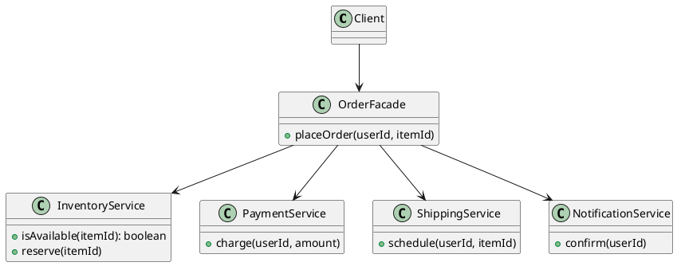

## Definition

The Facade Pattern provides a unified, higher-level interface to a set of interfaces in a subsystem. Facade makes the subsystem easier to use.

- It does not hide the subsystem, advanced clients can still reach past it.
- It encodes the common workflow once, instead of letting every caller re-learn the call order.

## When to Use?

- A subsystem has many moving parts but most clients only need one or two typical flows.
- You want to reduce coupling between client code and a library that is likely to change.
- You are layering a system and want each layer to expose one entry point.

## Use-case Examples (Real-world Applications)

- A `VideoConverter.convert(file, format)` hiding codecs, buffers and muxers
- Service classes wrapping several repositories inside one business operation
- SDK clients that hide HTTP, retries, auth and deserialization behind one method call

## Structure



## Example

The subsystem, each class is fine on its own, but using them correctly takes knowledge:

```java
public class InventoryService {
    public boolean isAvailable(String itemId) {
        return true;
    }

    public void reserve(String itemId) {
        System.out.println("Reserved " + itemId);
    }
}

public class PaymentService {
    public void charge(String userId, double amount) {
        System.out.println("Charged " + userId + " $" + amount);
    }
}

public class ShippingService {
    public void schedule(String userId, String itemId) {
        System.out.println("Shipping " + itemId + " to " + userId);
    }
}
```

The facade holds the ordering, the error handling and the business rule:

```java
public class OrderFacade {
    private final InventoryService inventory = new InventoryService();
    private final PaymentService payments = new PaymentService();
    private final ShippingService shipping = new ShippingService();

    public void placeOrder(String userId, String itemId, double price) {
        if (!inventory.isAvailable(itemId)) {
            throw new IllegalStateException("Out of stock: " + itemId);
        }
        inventory.reserve(itemId);
        payments.charge(userId, price);
        shipping.schedule(userId, itemId);
    }
}
```

```java
public class Main {
    public static void main(String[] args) {
        new OrderFacade().placeOrder("u-1", "book-42", 24.90);
    }
}
```

Without the facade, every caller would repeat those four steps, and eventually one of them would forget the stock check.

## Watch out

A facade that keeps growing becomes a god object. When it does, split it by use case rather than piling more methods onto one class.

## Check Your Understanding

<quiz>
What does a Facade provide?

- [x] A single simplified interface in front of a complex subsystem
> Correct. The facade does not hide the subsystem, it just gives the common use cases one convenient entry point.
- [ ] A placeholder that controls access to another object
- [ ] A way to share the memory of many similar objects
- [ ] A way to undo and redo operations
</quiz>
