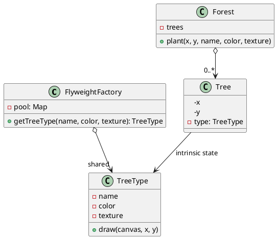

## Definition

The Flyweight Pattern uses sharing to support large numbers of fine-grained objects efficiently.

The trick is splitting an object's state in two:

- **Intrinsic state**, shared, immutable, context-free (a glyph's font and outline, a tree's texture). Stored *inside* the flyweight.
- **Extrinsic state**, unique per use (a glyph's position on the page, a tree's coordinates). Passed *in* by the client at call time.

## When to Use?

- You need an enormous number of similar objects and memory is the bottleneck.
- Most of each object's state can be made extrinsic.
- Object identity does not matter to the client, two "identical" objects being the same instance must be acceptable.

## Use-case Examples (Real-world Applications)

- Text editors sharing one glyph object per character, not per occurrence
- Game engines sharing a mesh/texture across thousands of rendered instances
- Java's `Integer.valueOf()` cache and interned `String` literals

## Structure



## Example

The flyweight (`TreeType`) holds only the heavy, shared data. The factory
guarantees sharing, so clients must never construct a `TreeType` directly. A
million trees end up sharing one instance.

=== "Java"

    ```java
    import java.util.ArrayList;
    import java.util.HashMap;
    import java.util.List;
    import java.util.Map;

    public class TreeType {
        private final String name;
        private final String color;
        private final String texture; // stands in for a few megabytes of pixels

        TreeType(String name, String color, String texture) {
            this.name = name;
            this.color = color;
            this.texture = texture;
        }

        // x and y are extrinsic: supplied per call, never stored.
        public void draw(int x, int y) {
            System.out.println("Drawing " + color + " " + name + " at (" + x + ", " + y + ")");
        }
    }

    public class TreeTypeFactory {
        private static final Map<String, TreeType> pool = new HashMap<>();

        public static TreeType get(String name, String color, String texture) {
            return pool.computeIfAbsent(
                    name + "|" + color + "|" + texture,
                    key -> new TreeType(name, color, texture));
        }

        public static int poolSize() {
            return pool.size();
        }
    }

    public class Forest {
        private record Tree(int x, int y, TreeType type) {}

        private final List<Tree> trees = new ArrayList<>();

        public void plant(int x, int y, String name, String color, String texture) {
            trees.add(new Tree(x, y, TreeTypeFactory.get(name, color, texture)));
        }

        public void draw() {
            for (Tree tree : trees) {
                tree.type().draw(tree.x(), tree.y());
            }
        }

        public static void main(String[] args) {
            Forest forest = new Forest();
            for (int i = 0; i < 1_000_000; i++) {
                forest.plant(i % 800, i % 600, "Oak", "green", "oak.png");
            }
            System.out.println(TreeTypeFactory.poolSize()); // 1
        }
    }
    ```

=== "C#"

    ```csharp
    public class TreeType
    {
        private readonly string _name;
        private readonly string _color;
        private readonly string _texture; // stands in for megabytes of pixels

        internal TreeType(string name, string color, string texture) =>
            (_name, _color, _texture) = (name, color, texture);

        // x and y are extrinsic: supplied per call, never stored.
        public void Draw(int x, int y) =>
            Console.WriteLine($"Drawing {_color} {_name} at ({x}, {y})");
    }

    public static class TreeTypeFactory
    {
        private static readonly Dictionary<string, TreeType> Pool = new();

        public static TreeType Get(string name, string color, string texture)
        {
            var key = $"{name}|{color}|{texture}";
            if (!Pool.TryGetValue(key, out var type))
                Pool[key] = type = new TreeType(name, color, texture);

            return type;
        }

        public static int PoolSize => Pool.Count;
    }

    public class Forest
    {
        private readonly record struct Tree(int X, int Y, TreeType Type);

        private readonly List<Tree> _trees = new();

        public void Plant(int x, int y, string name, string color, string texture) =>
            _trees.Add(new Tree(x, y, TreeTypeFactory.Get(name, color, texture)));

        public void Draw()
        {
            foreach (var tree in _trees) tree.Type.Draw(tree.X, tree.Y);
        }
    }

    var forest = new Forest();
    for (var i = 0; i < 1_000_000; i++)
        forest.Plant(i % 800, i % 600, "Oak", "green", "oak.png");

    Console.WriteLine(TreeTypeFactory.PoolSize); // 1
    ```

=== "C++"

    ```cpp
    #include <iostream>
    #include <memory>
    #include <string>
    #include <unordered_map>
    #include <vector>

    class TreeType {
    public:
        TreeType(std::string name, std::string color, std::string texture)
            : name_(std::move(name)),
              color_(std::move(color)),
              texture_(std::move(texture)) {}

        // x and y are extrinsic: supplied per call, never stored.
        void draw(int x, int y) const {
            std::cout << "Drawing " << color_ << " " << name_ << " at (" << x << ", "
                      << y << ")\n";
        }

    private:
        std::string name_;
        std::string color_;
        std::string texture_; // stands in for a few megabytes of pixels
    };

    class TreeTypeFactory {
    public:
        static const TreeType& get(const std::string& name, const std::string& color,
                                   const std::string& texture) {
            const std::string key = name + "|" + color + "|" + texture;
            auto [it, inserted] = pool().try_emplace(key, nullptr);
            if (inserted) {
                it->second = std::make_unique<TreeType>(name, color, texture);
            }
            return *it->second;
        }

        static std::size_t poolSize() { return pool().size(); }

    private:
        static std::unordered_map<std::string, std::unique_ptr<TreeType>>& pool() {
            static std::unordered_map<std::string, std::unique_ptr<TreeType>> instance;
            return instance;
        }
    };

    struct Tree {
        int x;
        int y;
        const TreeType* type; // shared, non-owning
    };

    int main() {
        std::vector<Tree> forest;
        for (int i = 0; i < 1'000'000; ++i) {
            forest.push_back(
                {i % 800, i % 600, &TreeTypeFactory::get("Oak", "green", "oak.png")});
        }
        std::cout << TreeTypeFactory::poolSize() << '\n'; // 1
    }
    ```

=== "Python"

    ```python
    from dataclasses import dataclass
    from functools import lru_cache


    @dataclass(frozen=True)
    class TreeType:
        name: str
        color: str
        texture: str  # stands in for a few megabytes of pixels

        # x and y are extrinsic: supplied per call, never stored.
        def draw(self, x: int, y: int) -> None:
            print(f"Drawing {self.color} {self.name} at ({x}, {y})")


    # lru_cache is the flyweight factory: same arguments, same object back.
    @lru_cache(maxsize=None)
    def tree_type(name: str, color: str, texture: str) -> TreeType:
        return TreeType(name, color, texture)


    @dataclass(frozen=True)
    class Tree:
        x: int
        y: int
        type: TreeType


    forest = [
        Tree(i % 800, i % 600, tree_type("Oak", "green", "oak.png"))
        for i in range(1_000_000)
    ]

    print(tree_type.cache_info().currsize)  # 1
    ```

=== "Rust"

    ```rust
    use std::collections::HashMap;
    use std::rc::Rc;

    struct TreeType {
        name: String,
        color: String,
        texture: String, // stands in for a few megabytes of pixels
    }

    impl TreeType {
        // x and y are extrinsic: supplied per call, never stored.
        fn draw(&self, x: i32, y: i32) {
            println!("Drawing {} {} at ({x}, {y})", self.color, self.name);
        }
    }

    #[derive(Default)]
    struct TreeTypeFactory {
        pool: HashMap<String, Rc<TreeType>>,
    }

    impl TreeTypeFactory {
        // Rc is the sharing mechanism: every tree holds a cheap handle.
        fn get(&mut self, name: &str, color: &str, texture: &str) -> Rc<TreeType> {
            let key = format!("{name}|{color}|{texture}");
            self.pool
                .entry(key)
                .or_insert_with(|| {
                    Rc::new(TreeType {
                        name: name.to_string(),
                        color: color.to_string(),
                        texture: texture.to_string(),
                    })
                })
                .clone()
        }
    }

    struct Tree {
        x: i32,
        y: i32,
        type_: Rc<TreeType>,
    }

    fn main() {
        let mut factory = TreeTypeFactory::default();
        let forest: Vec<Tree> = (0..1_000_000)
            .map(|i| Tree {
                x: i % 800,
                y: i % 600,
                type_: factory.get("Oak", "green", "oak.png"),
            })
            .collect();

        forest[0].type_.draw(forest[0].x, forest[0].y);
        println!("{}", factory.pool.len()); // 1
    }
    ```

=== "TypeScript"

    ```typescript
    class TreeType {
      constructor(
        private readonly name: string,
        private readonly color: string,
        private readonly texture: string, // stands in for megabytes of pixels
      ) {}

      // x and y are extrinsic: supplied per call, never stored.
      draw(x: number, y: number): void {
        console.log(`Drawing ${this.color} ${this.name} at (${x}, ${y})`);
      }
    }

    class TreeTypeFactory {
      private static readonly pool = new Map<string, TreeType>();

      static get(name: string, color: string, texture: string): TreeType {
        const key = `${name}|${color}|${texture}`;
        let type = this.pool.get(key);
        if (!type) {
          type = new TreeType(name, color, texture);
          this.pool.set(key, type);
        }
        return type;
      }

      static get poolSize(): number {
        return this.pool.size;
      }
    }

    interface Tree {
      x: number;
      y: number;
      type: TreeType;
    }

    const forest: Tree[] = [];
    for (let i = 0; i < 1_000_000; i++) {
      forest.push({
        x: i % 800,
        y: i % 600,
        type: TreeTypeFactory.get("Oak", "green", "oak.png"),
      });
    }

    console.log(TreeTypeFactory.poolSize); // 1
    ```

A million trees, one `TreeType` instance.

## Watch out

- Flyweights **must** be immutable; a shared object that one client mutates corrupts every other client.
- The factory pool is global state, in a multi-threaded program use a `ConcurrentHashMap`.
- This is a memory optimization. Do not apply it before you have measured a memory problem.

## Check Your Understanding

<quiz>
What does the Flyweight Pattern optimise?

- [ ] The number of network calls made by a client
- [x] Memory use, by sharing the state that is common to many similar objects
> Correct. Intrinsic (shared) state lives in the flyweight, and extrinsic (per-use) state is passed in by the caller.
- [ ] The order in which handlers process a request
- [ ] The time taken to construct one very complex object
</quiz>
