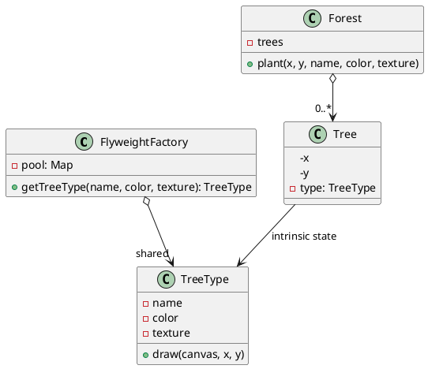

## Definition

The Flyweight Pattern uses sharing to support large numbers of fine-grained objects efficiently.

The trick is splitting an object's state in two:

- **Intrinsic state**, shared, immutable, context-free (a glyph's font and outline, a tree's texture). Stored *inside* the flyweight.
- **Extrinsic state**, unique per use (a glyph's position on the page, a tree's coordinates). Passed *in* by the client at call time.

## When to Use?

- You need an enormous number of similar objects and memory is the bottleneck.
- Most of each object's state can be made extrinsic.
- Object identity does not matter to the client, two "identical" objects being the same instance must be acceptable.

## Use-case Examples (Real-world Applications)

- Text editors sharing one glyph object per character, not per occurrence
- Game engines sharing a mesh/texture across thousands of rendered instances
- Java's `Integer.valueOf()` cache and interned `String` literals

## Structure



## Example

The flyweight holds only the heavy, shared data:

```java
public class TreeType {
    private final String name;
    private final String color;
    private final String texture; // stands in for a few megabytes of pixels

    public TreeType(String name, String color, String texture) {
        this.name = name;
        this.color = color;
        this.texture = texture;
    }

    // x and y are extrinsic: supplied per call, never stored.
    public void draw(int x, int y) {
        System.out.println("Drawing " + color + " " + name + " at (" + x + ", " + y + ")");
    }
}
```

The factory guarantees sharing, clients must never call `new TreeType(...)` directly:

```java
import java.util.HashMap;
import java.util.Map;

public class TreeTypeFactory {
    private static final Map<String, TreeType> pool = new HashMap<>();

    public static TreeType get(String name, String color, String texture) {
        return pool.computeIfAbsent(
                name + "|" + color + "|" + texture,
                key -> new TreeType(name, color, texture));
    }

    public static int poolSize() {
        return pool.size();
    }
}
```

```java
import java.util.ArrayList;
import java.util.List;

public class Forest {
    private record Tree(int x, int y, TreeType type) {}

    private final List<Tree> trees = new ArrayList<>();

    public void plant(int x, int y, String name, String color, String texture) {
        trees.add(new Tree(x, y, TreeTypeFactory.get(name, color, texture)));
    }

    public void draw() {
        for (Tree tree : trees) {
            tree.type().draw(tree.x(), tree.y());
        }
    }

    public static void main(String[] args) {
        Forest forest = new Forest();
        for (int i = 0; i < 1_000_000; i++) {
            forest.plant(i % 800, i % 600, "Oak", "green", "oak.png");
        }
        System.out.println(TreeTypeFactory.poolSize()); // 1
    }
}
```

A million trees, one `TreeType` instance.

## Watch out

- Flyweights **must** be immutable; a shared object that one client mutates corrupts every other client.
- The factory pool is global state, in a multi-threaded program use a `ConcurrentHashMap`.
- This is a memory optimization. Do not apply it before you have measured a memory problem.

## Check Your Understanding

<quiz>
What does the Flyweight Pattern optimise?

- [ ] The number of network calls made by a client
- [x] Memory use, by sharing the state that is common to many similar objects
> Correct. Intrinsic (shared) state lives in the flyweight, and extrinsic (per-use) state is passed in by the caller.
- [ ] The order in which handlers process a request
- [ ] The time taken to construct one very complex object
</quiz>
