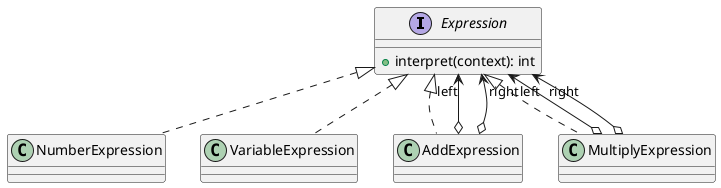
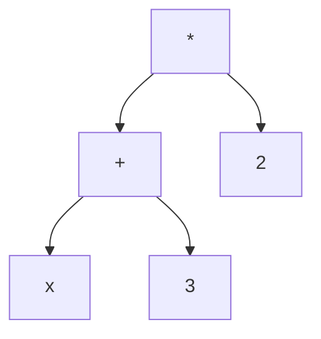

## Definition

The Interpreter Pattern, given a language, defines a representation for its grammar along with an interpreter that uses the representation to interpret sentences in the language.

- Each grammar rule becomes a class; a sentence becomes a tree of those objects (an abstract syntax tree).
- `interpret(context)` is called recursively down the tree.

## When to Use?

- You have a simple, stable grammar, a filter expression, a rule language, a formula field.
- Efficiency is not the main concern; clarity and extensibility are.
- Users need to express rules that would otherwise require a code change and a deployment.

## Use-case Examples (Real-world Applications)

- Regular expressions, SQL `WHERE` fragments, spreadsheet formulas
- Business-rule engines and feature-flag conditions
- Roman-numeral or unit converters, calculators

## Structure



`(x + 3) * 2` becomes this tree:



## Example

```java
import java.util.Map;

public interface Expression {
    int interpret(Map<String, Integer> context);
}
```

Terminal expressions, the leaves:

```java
public record NumberExpression(int value) implements Expression {
    @Override
    public int interpret(Map<String, Integer> context) {
        return value;
    }
}

public record VariableExpression(String name) implements Expression {
    @Override
    public int interpret(Map<String, Integer> context) {
        Integer value = context.get(name);
        if (value == null) {
            throw new IllegalArgumentException("Undefined variable: " + name);
        }
        return value;
    }
}
```

Non-terminal expressions, the internal nodes, which recurse:

```java
public record AddExpression(Expression left, Expression right) implements Expression {
    @Override
    public int interpret(Map<String, Integer> context) {
        return left.interpret(context) + right.interpret(context);
    }
}

public record MultiplyExpression(Expression left, Expression right) implements Expression {
    @Override
    public int interpret(Map<String, Integer> context) {
        return left.interpret(context) * right.interpret(context);
    }
}
```

```java
import java.util.Map;

public class Main {
    public static void main(String[] args) {
        // (x + 3) * 2
        Expression expression = new MultiplyExpression(
                new AddExpression(new VariableExpression("x"), new NumberExpression(3)),
                new NumberExpression(2));

        System.out.println(expression.interpret(Map.of("x", 5))); // 16
    }
}
```

Note that the pattern covers **evaluation**, not parsing. Turning the text `"(x + 3) * 2"` into that tree is a parser's job and is deliberately outside the pattern's scope.

## Watch out

This is the least-used GoF pattern, for good reason: one class per grammar rule stops scaling around a dozen rules. For anything bigger, use a parser generator (ANTLR, JavaCC) or an existing expression library, writing a language is a much larger project than it first looks.
