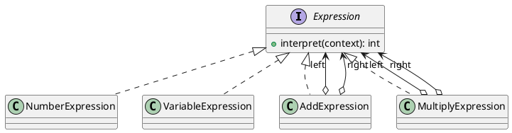
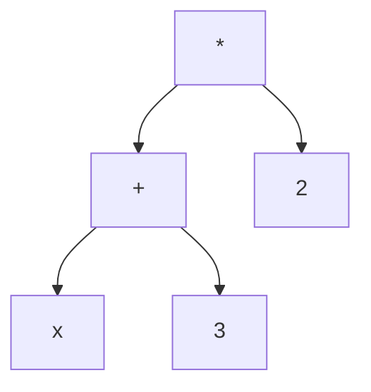

## Definition

The Interpreter Pattern, given a language, defines a representation for its grammar along with an interpreter that uses the representation to interpret sentences in the language.

- Each grammar rule becomes a class; a sentence becomes a tree of those objects (an abstract syntax tree).
- `interpret(context)` is called recursively down the tree.

## When to Use?

- You have a simple, stable grammar, a filter expression, a rule language, a formula field.
- Efficiency is not the main concern; clarity and extensibility are.
- Users need to express rules that would otherwise require a code change and a deployment.

## Use-case Examples (Real-world Applications)

- Regular expressions, SQL `WHERE` fragments, spreadsheet formulas
- Business-rule engines and feature-flag conditions
- Roman-numeral or unit converters, calculators

## Structure



`(x + 3) * 2` becomes this tree:



## Example

An `Expression` interface, terminal expressions for the leaves, and non-terminal
expressions for the internal nodes, which recurse into their children.

=== "Java"

    ```java
    import java.util.Map;

    public interface Expression {
        int interpret(Map<String, Integer> context);
    }

    // Terminals.
    public record NumberExpression(int value) implements Expression {
        @Override
        public int interpret(Map<String, Integer> context) {
            return value;
        }
    }

    public record VariableExpression(String name) implements Expression {
        @Override
        public int interpret(Map<String, Integer> context) {
            Integer value = context.get(name);
            if (value == null) {
                throw new IllegalArgumentException("Undefined variable: " + name);
            }
            return value;
        }
    }

    // Non-terminals.
    public record AddExpression(Expression left, Expression right) implements Expression {
        @Override
        public int interpret(Map<String, Integer> context) {
            return left.interpret(context) + right.interpret(context);
        }
    }

    public record MultiplyExpression(Expression left, Expression right) implements Expression {
        @Override
        public int interpret(Map<String, Integer> context) {
            return left.interpret(context) * right.interpret(context);
        }
    }

    public class Main {
        public static void main(String[] args) {
            // (x + 3) * 2
            Expression expression = new MultiplyExpression(
                    new AddExpression(new VariableExpression("x"), new NumberExpression(3)),
                    new NumberExpression(2));

            System.out.println(expression.interpret(Map.of("x", 5))); // 16
        }
    }
    ```

=== "C#"

    ```csharp
    public interface IExpression
    {
        int Interpret(IReadOnlyDictionary<string, int> context);
    }

    // Terminals.
    public record NumberExpression(int Value) : IExpression
    {
        public int Interpret(IReadOnlyDictionary<string, int> context) => Value;
    }

    public record VariableExpression(string Name) : IExpression
    {
        public int Interpret(IReadOnlyDictionary<string, int> context) =>
            context.TryGetValue(Name, out var value)
                ? value
                : throw new ArgumentException($"Undefined variable: {Name}");
    }

    // Non-terminals.
    public record AddExpression(IExpression Left, IExpression Right) : IExpression
    {
        public int Interpret(IReadOnlyDictionary<string, int> context) =>
            Left.Interpret(context) + Right.Interpret(context);
    }

    public record MultiplyExpression(IExpression Left, IExpression Right) : IExpression
    {
        public int Interpret(IReadOnlyDictionary<string, int> context) =>
            Left.Interpret(context) * Right.Interpret(context);
    }

    // (x + 3) * 2
    IExpression expression = new MultiplyExpression(
        new AddExpression(new VariableExpression("x"), new NumberExpression(3)),
        new NumberExpression(2));

    Console.WriteLine(expression.Interpret(new Dictionary<string, int> { ["x"] = 5 })); // 16
    ```

=== "C++"

    ```cpp
    #include <iostream>
    #include <memory>
    #include <stdexcept>
    #include <string>
    #include <unordered_map>

    using Context = std::unordered_map<std::string, int>;

    class Expression {
    public:
        virtual ~Expression() = default;
        virtual int interpret(const Context& context) const = 0;
    };

    using ExpressionPtr = std::unique_ptr<Expression>;

    // Terminals.
    class NumberExpression : public Expression {
    public:
        explicit NumberExpression(int value) : value_(value) {}
        int interpret(const Context&) const override { return value_; }

    private:
        int value_;
    };

    class VariableExpression : public Expression {
    public:
        explicit VariableExpression(std::string name) : name_(std::move(name)) {}

        int interpret(const Context& context) const override {
            auto it = context.find(name_);
            if (it == context.end()) {
                throw std::invalid_argument("Undefined variable: " + name_);
            }
            return it->second;
        }

    private:
        std::string name_;
    };

    // Non-terminals.
    class AddExpression : public Expression {
    public:
        AddExpression(ExpressionPtr left, ExpressionPtr right)
            : left_(std::move(left)), right_(std::move(right)) {}

        int interpret(const Context& context) const override {
            return left_->interpret(context) + right_->interpret(context);
        }

    private:
        ExpressionPtr left_;
        ExpressionPtr right_;
    };

    class MultiplyExpression : public Expression {
    public:
        MultiplyExpression(ExpressionPtr left, ExpressionPtr right)
            : left_(std::move(left)), right_(std::move(right)) {}

        int interpret(const Context& context) const override {
            return left_->interpret(context) * right_->interpret(context);
        }

    private:
        ExpressionPtr left_;
        ExpressionPtr right_;
    };

    int main() {
        // (x + 3) * 2
        ExpressionPtr expression = std::make_unique<MultiplyExpression>(
            std::make_unique<AddExpression>(
                std::make_unique<VariableExpression>("x"),
                std::make_unique<NumberExpression>(3)),
            std::make_unique<NumberExpression>(2));

        std::cout << expression->interpret({{"x", 5}}) << '\n'; // 16
    }
    ```

=== "Python"

    ```python
    from abc import ABC, abstractmethod
    from dataclasses import dataclass


    class Expression(ABC):
        @abstractmethod
        def interpret(self, context: dict[str, int]) -> int: ...


    # Terminals.
    @dataclass(frozen=True)
    class Number(Expression):
        value: int

        def interpret(self, context: dict[str, int]) -> int:
            return self.value


    @dataclass(frozen=True)
    class Variable(Expression):
        name: str

        def interpret(self, context: dict[str, int]) -> int:
            try:
                return context[self.name]
            except KeyError:
                raise ValueError(f"Undefined variable: {self.name}") from None


    # Non-terminals.
    @dataclass(frozen=True)
    class Add(Expression):
        left: Expression
        right: Expression

        def interpret(self, context: dict[str, int]) -> int:
            return self.left.interpret(context) + self.right.interpret(context)


    @dataclass(frozen=True)
    class Multiply(Expression):
        left: Expression
        right: Expression

        def interpret(self, context: dict[str, int]) -> int:
            return self.left.interpret(context) * self.right.interpret(context)


    # (x + 3) * 2
    expression = Multiply(Add(Variable("x"), Number(3)), Number(2))
    print(expression.interpret({"x": 5}))  # 16
    ```

=== "Rust"

    ```rust
    use std::collections::HashMap;

    // One enum variant per grammar rule; the match below is the interpreter.
    enum Expression {
        Number(i32),
        Variable(String),
        Add(Box<Expression>, Box<Expression>),
        Multiply(Box<Expression>, Box<Expression>),
    }

    impl Expression {
        fn interpret(&self, context: &HashMap<String, i32>) -> Result<i32, String> {
            match self {
                Expression::Number(value) => Ok(*value),
                Expression::Variable(name) => context
                    .get(name)
                    .copied()
                    .ok_or_else(|| format!("Undefined variable: {name}")),
                Expression::Add(left, right) => {
                    Ok(left.interpret(context)? + right.interpret(context)?)
                }
                Expression::Multiply(left, right) => {
                    Ok(left.interpret(context)? * right.interpret(context)?)
                }
            }
        }
    }

    fn main() {
        // (x + 3) * 2
        let expression = Expression::Multiply(
            Box::new(Expression::Add(
                Box::new(Expression::Variable("x".into())),
                Box::new(Expression::Number(3)),
            )),
            Box::new(Expression::Number(2)),
        );

        let context = HashMap::from([("x".to_string(), 5)]);
        println!("{}", expression.interpret(&context).unwrap()); // 16
    }
    ```

=== "TypeScript"

    ```typescript
    type Context = Record<string, number>;

    interface Expression {
      interpret(context: Context): number;
    }

    // Terminals.
    class NumberExpression implements Expression {
      constructor(private readonly value: number) {}

      interpret(): number {
        return this.value;
      }
    }

    class VariableExpression implements Expression {
      constructor(private readonly name: string) {}

      interpret(context: Context): number {
        const value = context[this.name];
        if (value === undefined) throw new Error(`Undefined variable: ${this.name}`);
        return value;
      }
    }

    // Non-terminals.
    class AddExpression implements Expression {
      constructor(
        private readonly left: Expression,
        private readonly right: Expression,
      ) {}

      interpret(context: Context): number {
        return this.left.interpret(context) + this.right.interpret(context);
      }
    }

    class MultiplyExpression implements Expression {
      constructor(
        private readonly left: Expression,
        private readonly right: Expression,
      ) {}

      interpret(context: Context): number {
        return this.left.interpret(context) * this.right.interpret(context);
      }
    }

    // (x + 3) * 2
    const expression = new MultiplyExpression(
      new AddExpression(new VariableExpression("x"), new NumberExpression(3)),
      new NumberExpression(2),
    );

    console.log(expression.interpret({ x: 5 })); // 16
    ```

Note that the pattern covers **evaluation**, not parsing. Turning the text `"(x + 3) * 2"` into that tree is a parser's job and is deliberately outside the pattern's scope.

## Watch out

This is the least-used GoF pattern, for good reason: one class per grammar rule stops scaling around a dozen rules. For anything bigger, use a parser generator (ANTLR, JavaCC) or an existing expression library, writing a language is a much larger project than it first looks.

## Check Your Understanding

<quiz>
What is the Interpreter Pattern for?

- [x] Representing the grammar of a simple language and evaluating sentences written in it
> Correct. Each grammar rule becomes a class, and the expression tree is evaluated by recursively interpreting its nodes.
- [ ] Converting an object into a different interface
- [ ] Iterating over the elements of a composite structure
- [ ] Selecting one of several algorithms at runtime
</quiz>
