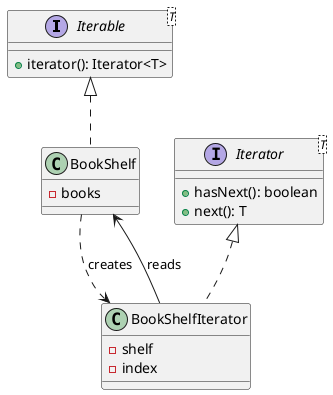

## Definition

The Iterator Pattern provides a way to access the elements of an aggregate object sequentially without exposing its underlying representation.

- The collection keeps its internals private; the client gets a cursor with `hasNext()` / `next()`.
- The same client code walks an array, a linked list, a tree or a database cursor.

## When to Use?

- Clients need to traverse a collection without learning whether it is backed by an array, a map or a file.
- You want several independent traversals of the same collection at once.
- You need alternative traversal orders (depth-first, breadth-first, filtered) over one structure.

## Use-case Examples (Real-world Applications)

- `java.util.Iterator` and the for-each loop
- Paginated API clients that fetch the next page transparently
- Tree and graph walkers

## Structure



## Example

Implementing `Iterable` is what makes an object work with Java's for-each loop:

```java
import java.util.Iterator;
import java.util.NoSuchElementException;

public class BookShelf implements Iterable<String> {
    private final String[] books = new String[10];
    private int count;

    public void add(String book) {
        books[count++] = book;
    }

    @Override
    public Iterator<String> iterator() {
        return new Iterator<>() {
            private int index;

            @Override
            public boolean hasNext() {
                return index < count;
            }

            @Override
            public String next() {
                if (!hasNext()) {
                    throw new NoSuchElementException();
                }
                return books[index++];
            }
        };
    }
}
```

```java
public class Main {
    public static void main(String[] args) {
        BookShelf shelf = new BookShelf();
        shelf.add("Design Patterns");
        shelf.add("Refactoring");

        for (String book : shelf) { // no idea there is an array in there
            System.out.println(book);
        }
    }
}
```

The client never touches `books` or `count`. Swapping the array for a `LinkedList` changes nothing outside the class, that is the encapsulation the pattern buys.

## External vs. internal iterators

- **External** (`Iterator`): the client drives the loop and can stop, skip or pause. This is the GoF form.
- **Internal** (`forEach`, `Stream`): the collection drives the loop and you hand it a function. Less control, less code.

Java gives you both; reach for streams first and write an explicit iterator when you need lazy, resumable or infinite traversal.

## Check Your Understanding

<quiz>
What does an Iterator give a client?

- [x] Sequential access to a collection's elements without exposing how the collection is stored
> Correct. The traversal logic lives in the iterator, so a list, tree, or generator can all be walked the same way.
- [ ] A snapshot of the collection's state for later restore
- [ ] A single point of access to a shared collection
- [ ] A way to add operations to the collection without modifying it
</quiz>
