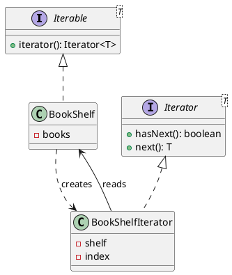

## Definition

The Iterator Pattern provides a way to access the elements of an aggregate object sequentially without exposing its underlying representation.

- The collection keeps its internals private; the client gets a cursor with `hasNext()` / `next()`.
- The same client code walks an array, a linked list, a tree or a database cursor.

## When to Use?

- Clients need to traverse a collection without learning whether it is backed by an array, a map or a file.
- You want several independent traversals of the same collection at once.
- You need alternative traversal orders (depth-first, breadth-first, filtered) over one structure.

## Use-case Examples (Real-world Applications)

- `java.util.Iterator` and the for-each loop
- Paginated API clients that fetch the next page transparently
- Tree and graph walkers

## Structure



## Example

Every one of these languages has a built-in iteration protocol; implementing it
is what makes a custom collection work with the language's own loop syntax.

=== "Java"

    ```java
    import java.util.Iterator;
    import java.util.NoSuchElementException;

    public class BookShelf implements Iterable<String> {
        private final String[] books = new String[10];
        private int count;

        public void add(String book) {
            books[count++] = book;
        }

        @Override
        public Iterator<String> iterator() {
            return new Iterator<>() {
                private int index;

                @Override
                public boolean hasNext() {
                    return index < count;
                }

                @Override
                public String next() {
                    if (!hasNext()) {
                        throw new NoSuchElementException();
                    }
                    return books[index++];
                }
            };
        }
    }

    public class Main {
        public static void main(String[] args) {
            BookShelf shelf = new BookShelf();
            shelf.add("Design Patterns");
            shelf.add("Refactoring");

            for (String book : shelf) { // no idea there is an array in there
                System.out.println(book);
            }
        }
    }
    ```

=== "C#"

    ```csharp
    public class BookShelf : IEnumerable<string>
    {
        private readonly string[] _books = new string[10];
        private int _count;

        public void Add(string book) => _books[_count++] = book;

        // yield return builds the iterator's state machine for you.
        public IEnumerator<string> GetEnumerator()
        {
            for (var i = 0; i < _count; i++) yield return _books[i];
        }

        IEnumerator IEnumerable.GetEnumerator() => GetEnumerator();
    }

    var shelf = new BookShelf();
    shelf.Add("Design Patterns");
    shelf.Add("Refactoring");

    foreach (var book in shelf) // no idea there is an array in there
        Console.WriteLine(book);
    ```

=== "C++"

    ```cpp
    #include <array>
    #include <iostream>
    #include <string>

    class BookShelf {
    public:
        void add(const std::string& book) { books_[count_++] = book; }

        // begin()/end() are the protocol the range-for loop expects.
        const std::string* begin() const { return books_.data(); }
        const std::string* end() const { return books_.data() + count_; }

    private:
        std::array<std::string, 10> books_{};
        std::size_t count_ = 0;
    };

    int main() {
        BookShelf shelf;
        shelf.add("Design Patterns");
        shelf.add("Refactoring");

        for (const auto& book : shelf) { // no idea there is an array in there
            std::cout << book << '\n';
        }
    }
    ```

=== "Python"

    ```python
    from collections.abc import Iterator


    class BookShelf:
        def __init__(self) -> None:
            self._books: list[str] = []

        def add(self, book: str) -> None:
            self._books.append(book)

        # A generator is the shortest possible iterator implementation.
        def __iter__(self) -> Iterator[str]:
            yield from self._books


    shelf = BookShelf()
    shelf.add("Design Patterns")
    shelf.add("Refactoring")

    for book in shelf:  # no idea there is a list in there
        print(book)
    ```

=== "Rust"

    ```rust
    struct BookShelf {
        books: Vec<String>,
    }

    impl BookShelf {
        fn new() -> Self {
            Self { books: Vec::new() }
        }

        fn add(&mut self, book: &str) {
            self.books.push(book.to_string());
        }
    }

    // Implementing IntoIterator is what makes `for book in &shelf` compile.
    impl<'a> IntoIterator for &'a BookShelf {
        type Item = &'a String;
        type IntoIter = std::slice::Iter<'a, String>;

        fn into_iter(self) -> Self::IntoIter {
            self.books.iter()
        }
    }

    fn main() {
        let mut shelf = BookShelf::new();
        shelf.add("Design Patterns");
        shelf.add("Refactoring");

        for book in &shelf {
            println!("{book}");
        }
    }
    ```

=== "TypeScript"

    ```typescript
    class BookShelf implements Iterable<string> {
      private readonly books: string[] = [];

      add(book: string): void {
        this.books.push(book);
      }

      // A generator method satisfies the iterable protocol.
      *[Symbol.iterator](): Iterator<string> {
        yield* this.books;
      }
    }

    const shelf = new BookShelf();
    shelf.add("Design Patterns");
    shelf.add("Refactoring");

    for (const book of shelf) { // no idea there is an array in there
      console.log(book);
    }
    ```

The client never touches the backing array. Swapping it for a linked list changes nothing outside the class, that is the encapsulation the pattern buys.

## External vs. internal iterators

- **External** (`Iterator`): the client drives the loop and can stop, skip or pause. This is the GoF form.
- **Internal** (`forEach`, `Stream`): the collection drives the loop and you hand it a function. Less control, less code.

Java gives you both; reach for streams first and write an explicit iterator when you need lazy, resumable or infinite traversal.

## Check Your Understanding

<quiz>
What does an Iterator give a client?

- [x] Sequential access to a collection's elements without exposing how the collection is stored
> Correct. The traversal logic lives in the iterator, so a list, tree, or generator can all be walked the same way.
- [ ] A snapshot of the collection's state for later restore
- [ ] A single point of access to a shared collection
- [ ] A way to add operations to the collection without modifying it
</quiz>
