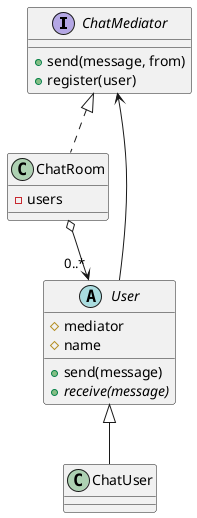
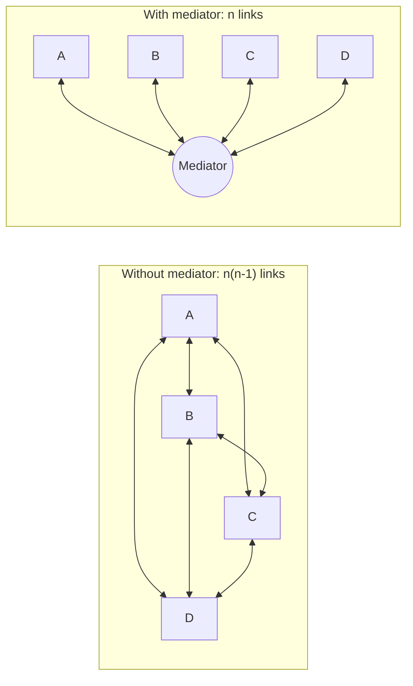

## Definition

The Mediator Pattern defines an object that encapsulates how a set of objects interact. Mediator promotes loose coupling by keeping objects from referring to each other explicitly, and lets you vary their interaction independently.

- It turns a many-to-many web of references into a hub and spokes.
- Colleagues talk to the mediator; the mediator knows the rules of who reacts to what.

## When to Use?

- Components are tangled together with direct references and reusing one drags in the rest.
- The interaction rules change more often than the components themselves.
- A dialog, form or screen has many widgets whose enabled/visible state depends on each other.

## Use-case Examples (Real-world Applications)

- Dialog boxes where checking a box enables three fields and disables a button
- Air-traffic control: planes talk to the tower, not to each other
- Chat rooms
- Message brokers and event buses at the architectural scale

## Structure



Without a mediator every colleague points at every other colleague:



## Example

```java
public interface ChatMediator {
    void register(User user);
    void send(String message, User sender);
}
```

```java
import java.util.ArrayList;
import java.util.List;

public class ChatRoom implements ChatMediator {
    private final List<User> users = new ArrayList<>();

    @Override
    public void register(User user) {
        users.add(user);
    }

    @Override
    public void send(String message, User sender) {
        for (User user : users) {
            if (user != sender) { // the interaction rule lives here, once
                user.receive(sender.getName() + ": " + message);
            }
        }
    }
}
```

```java
public abstract class User {
    protected final ChatMediator mediator;
    protected final String name;

    protected User(ChatMediator mediator, String name) {
        this.mediator = mediator;
        this.name = name;
        mediator.register(this);
    }

    public String getName() {
        return name;
    }

    public void send(String message) {
        mediator.send(message, this);
    }

    public abstract void receive(String message);
}

public class ChatUser extends User {
    public ChatUser(ChatMediator mediator, String name) {
        super(mediator, name);
    }

    @Override
    public void receive(String message) {
        System.out.println("[" + name + "] " + message);
    }
}
```

```java
public class Main {
    public static void main(String[] args) {
        ChatMediator room = new ChatRoom();
        User alice = new ChatUser(room, "Alice");
        new ChatUser(room, "Bob");
        new ChatUser(room, "Carol");

        alice.send("Hello"); // Bob and Carol receive it; Alice does not
    }
}
```

`ChatUser` holds no reference to any other user. Adding a moderation rule or a private-message feature touches only `ChatRoom`.

## Mediator vs. Observer

Both decouple senders from receivers. [Observer](Observer%20Pattern.md) is a broadcast: subscribers register for events and the publisher applies no logic. Mediator is a coordinator: it *decides* what should happen next. A mediator is frequently implemented **using** observers.

## Watch out

The mediator absorbs the complexity it removed from the colleagues. If it grows into an unreadable god object, split it per interaction area.
