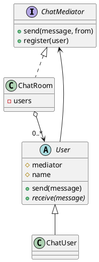
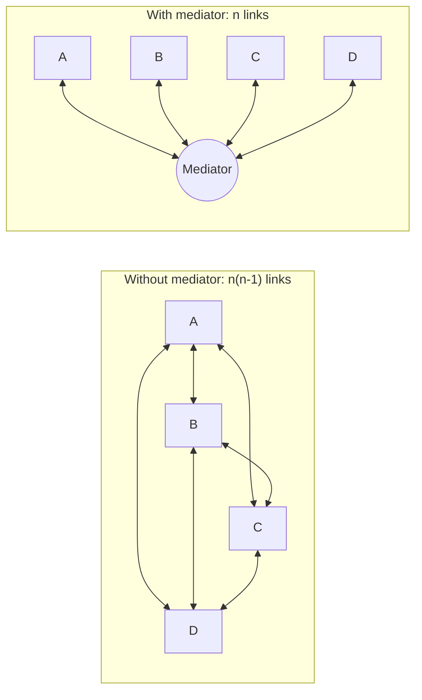

## Definition

The Mediator Pattern defines an object that encapsulates how a set of objects interact. Mediator promotes loose coupling by keeping objects from referring to each other explicitly, and lets you vary their interaction independently.

- It turns a many-to-many web of references into a hub and spokes.
- Colleagues talk to the mediator; the mediator knows the rules of who reacts to what.

## When to Use?

- Components are tangled together with direct references and reusing one drags in the rest.
- The interaction rules change more often than the components themselves.
- A dialog, form or screen has many widgets whose enabled/visible state depends on each other.

## Use-case Examples (Real-world Applications)

- Dialog boxes where checking a box enables three fields and disables a button
- Air-traffic control: planes talk to the tower, not to each other
- Chat rooms
- Message brokers and event buses at the architectural scale

## Structure



Without a mediator every colleague points at every other colleague:



## Example

A chat room. Users send to the mediator, never to each other, so the "who
receives what" rule lives in exactly one place.

=== "Java"

    ```java
    import java.util.ArrayList;
    import java.util.List;

    public interface ChatMediator {
        void register(User user);
        void send(String message, User sender);
    }

    public class ChatRoom implements ChatMediator {
        private final List<User> users = new ArrayList<>();

        @Override
        public void register(User user) {
            users.add(user);
        }

        @Override
        public void send(String message, User sender) {
            for (User user : users) {
                if (user != sender) { // the interaction rule lives here, once
                    user.receive(sender.getName() + ": " + message);
                }
            }
        }
    }

    public abstract class User {
        protected final ChatMediator mediator;
        protected final String name;

        protected User(ChatMediator mediator, String name) {
            this.mediator = mediator;
            this.name = name;
            mediator.register(this);
        }

        public String getName() {
            return name;
        }

        public void send(String message) {
            mediator.send(message, this);
        }

        public abstract void receive(String message);
    }

    public class ChatUser extends User {
        public ChatUser(ChatMediator mediator, String name) {
            super(mediator, name);
        }

        @Override
        public void receive(String message) {
            System.out.println("[" + name + "] " + message);
        }
    }

    public class Main {
        public static void main(String[] args) {
            ChatMediator room = new ChatRoom();
            User alice = new ChatUser(room, "Alice");
            new ChatUser(room, "Bob");
            new ChatUser(room, "Carol");

            alice.send("Hello"); // Bob and Carol receive it; Alice does not
        }
    }
    ```

=== "C#"

    ```csharp
    public interface IChatMediator
    {
        void Register(User user);
        void Send(string message, User sender);
    }

    public class ChatRoom : IChatMediator
    {
        private readonly List<User> _users = new();

        public void Register(User user) => _users.Add(user);

        public void Send(string message, User sender)
        {
            foreach (var user in _users)
                if (user != sender) // the interaction rule lives here, once
                    user.Receive($"{sender.Name}: {message}");
        }
    }

    public abstract class User
    {
        protected readonly IChatMediator Mediator;

        protected User(IChatMediator mediator, string name)
        {
            Mediator = mediator;
            Name = name;
            mediator.Register(this);
        }

        public string Name { get; }

        public void Send(string message) => Mediator.Send(message, this);

        public abstract void Receive(string message);
    }

    public class ChatUser : User
    {
        public ChatUser(IChatMediator mediator, string name) : base(mediator, name) { }

        public override void Receive(string message) =>
            Console.WriteLine($"[{Name}] {message}");
    }

    IChatMediator room = new ChatRoom();
    User alice = new ChatUser(room, "Alice");
    _ = new ChatUser(room, "Bob");
    _ = new ChatUser(room, "Carol");

    alice.Send("Hello"); // Bob and Carol receive it; Alice does not
    ```

=== "C++"

    ```cpp
    #include <iostream>
    #include <string>
    #include <vector>

    class User;

    class ChatMediator {
    public:
        virtual ~ChatMediator() = default;
        virtual void registerUser(User* user) = 0;
        virtual void send(const std::string& message, const User* sender) = 0;
    };

    class User {
    public:
        User(ChatMediator& mediator, std::string name)
            : mediator_(mediator), name_(std::move(name)) {
            mediator.registerUser(this);
        }

        virtual ~User() = default;

        const std::string& name() const { return name_; }

        void send(const std::string& message) { mediator_.send(message, this); }

        virtual void receive(const std::string& message) const = 0;

    protected:
        ChatMediator& mediator_;
        std::string name_;
    };

    class ChatRoom : public ChatMediator {
    public:
        void registerUser(User* user) override { users_.push_back(user); }

        void send(const std::string& message, const User* sender) override {
            for (const User* user : users_) {
                if (user != sender) { // the interaction rule lives here, once
                    user->receive(sender->name() + ": " + message);
                }
            }
        }

    private:
        std::vector<User*> users_;
    };

    class ChatUser : public User {
    public:
        using User::User;

        void receive(const std::string& message) const override {
            std::cout << "[" << name_ << "] " << message << '\n';
        }
    };

    int main() {
        ChatRoom room;
        ChatUser alice(room, "Alice");
        ChatUser bob(room, "Bob");
        ChatUser carol(room, "Carol");

        alice.send("Hello"); // Bob and Carol receive it; Alice does not
    }
    ```

=== "Python"

    ```python
    from abc import ABC, abstractmethod


    class ChatMediator(ABC):
        @abstractmethod
        def register(self, user: "User") -> None: ...

        @abstractmethod
        def send(self, message: str, sender: "User") -> None: ...


    class User(ABC):
        def __init__(self, mediator: ChatMediator, name: str) -> None:
            self._mediator = mediator
            self.name = name
            mediator.register(self)

        def send(self, message: str) -> None:
            self._mediator.send(message, self)

        @abstractmethod
        def receive(self, message: str) -> None: ...


    class ChatRoom(ChatMediator):
        def __init__(self) -> None:
            self._users: list[User] = []

        def register(self, user: User) -> None:
            self._users.append(user)

        def send(self, message: str, sender: User) -> None:
            for user in self._users:
                if user is not sender:  # the interaction rule lives here, once
                    user.receive(f"{sender.name}: {message}")


    class ChatUser(User):
        def receive(self, message: str) -> None:
            print(f"[{self.name}] {message}")


    room = ChatRoom()
    alice = ChatUser(room, "Alice")
    ChatUser(room, "Bob")
    ChatUser(room, "Carol")

    alice.send("Hello")  # Bob and Carol receive it; Alice does not
    ```

=== "Rust"

    ```rust
    trait User {
        fn name(&self) -> &str;
        fn receive(&self, message: &str);
    }

    struct ChatUser {
        name: String,
    }

    impl User for ChatUser {
        fn name(&self) -> &str {
            &self.name
        }

        fn receive(&self, message: &str) {
            println!("[{}] {}", self.name, message);
        }
    }

    // The mediator owns its colleagues; users address each other by index
    // instead of holding references, which keeps the ownership graph a tree.
    #[derive(Default)]
    struct ChatRoom {
        users: Vec<Box<dyn User>>,
    }

    impl ChatRoom {
        fn register(&mut self, user: Box<dyn User>) -> usize {
            self.users.push(user);
            self.users.len() - 1
        }

        fn send(&self, message: &str, sender: usize) {
            let from = self.users[sender].name();
            for (index, user) in self.users.iter().enumerate() {
                if index != sender {
                    // the interaction rule lives here, once
                    user.receive(&format!("{from}: {message}"));
                }
            }
        }
    }

    fn main() {
        let mut room = ChatRoom::default();
        let alice = room.register(Box::new(ChatUser { name: "Alice".into() }));
        room.register(Box::new(ChatUser { name: "Bob".into() }));
        room.register(Box::new(ChatUser { name: "Carol".into() }));

        room.send("Hello", alice); // Bob and Carol receive it; Alice does not
    }
    ```

=== "TypeScript"

    ```typescript
    interface ChatMediator {
      register(user: User): void;
      send(message: string, sender: User): void;
    }

    abstract class User {
      protected constructor(
        protected readonly mediator: ChatMediator,
        readonly name: string,
      ) {
        mediator.register(this);
      }

      send(message: string): void {
        this.mediator.send(message, this);
      }

      abstract receive(message: string): void;
    }

    class ChatRoom implements ChatMediator {
      private readonly users: User[] = [];

      register(user: User): void {
        this.users.push(user);
      }

      send(message: string, sender: User): void {
        for (const user of this.users) {
          if (user !== sender) {
            // the interaction rule lives here, once
            user.receive(`${sender.name}: ${message}`);
          }
        }
      }
    }

    class ChatUser extends User {
      constructor(mediator: ChatMediator, name: string) {
        super(mediator, name);
      }

      receive(message: string): void {
        console.log(`[${this.name}] ${message}`);
      }
    }

    const room = new ChatRoom();
    const alice = new ChatUser(room, "Alice");
    new ChatUser(room, "Bob");
    new ChatUser(room, "Carol");

    alice.send("Hello"); // Bob and Carol receive it; Alice does not
    ```

`ChatUser` holds no reference to any other user. Adding a moderation rule or a private-message feature touches only `ChatRoom`.

## Mediator vs. Observer

Both decouple senders from receivers. [Observer](Observer%20Pattern.md) is a broadcast: subscribers register for events and the publisher applies no logic. Mediator is a coordinator: it *decides* what should happen next. A mediator is frequently implemented **using** observers.

## Watch out

The mediator absorbs the complexity it removed from the colleagues. If it grows into an unreadable god object, split it per interaction area.

## Check Your Understanding

<quiz>
How does a Mediator change how objects communicate?

- [ ] Every object subscribes to every other object's events
- [x] Objects stop referring to each other directly and talk through one mediator instead
> Correct. Many-to-many references collapse into one-to-many with the mediator, which keeps the interaction logic in a single place.
- [ ] Each object handles the request or passes it to the next
- [ ] Requests are wrapped as objects and queued
</quiz>
