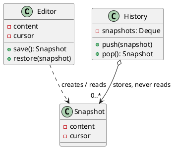

## Definition

The Memento Pattern captures and externalizes an object's internal state, without violating encapsulation, so that the object can be restored to this state later.

Three roles:

- **Originator**, the object whose state is saved and restored.
- **Memento**, an opaque snapshot. Only the originator can read its contents.
- **Caretaker**, keeps mementos (usually on a stack) but never looks inside them.

## When to Use?

- You need undo/rollback, checkpoints or snapshots.
- Saving the state directly would require exposing fields that should stay private.

## Use-case Examples (Real-world Applications)

- Undo in editors and IDEs
- Save games and checkpoints
- Database transaction rollback and savepoints
- Form state restored after a failed submit

## Structure



## Example

```java
public class Editor {
    private String content = "";
    private int cursor;

    public void type(String text) {
        content += text;
        cursor = content.length();
    }

    public String getContent() {
        return content;
    }

    public Snapshot save() {
        return new Snapshot(content, cursor);
    }

    public void restore(Snapshot snapshot) {
        this.content = snapshot.content;
        this.cursor = snapshot.cursor;
    }

    // Nested and private-constructed: only Editor can build or read one.
    public static final class Snapshot {
        private final String content;
        private final int cursor;

        private Snapshot(String content, int cursor) {
            this.content = content;
            this.cursor = cursor;
        }
    }
}
```

The caretaker stores snapshots blindly:

```java
import java.util.ArrayDeque;
import java.util.Deque;

public class History {
    private final Deque<Editor.Snapshot> snapshots = new ArrayDeque<>();

    public void backup(Editor editor) {
        snapshots.push(editor.save());
    }

    public void undo(Editor editor) {
        if (!snapshots.isEmpty()) {
            editor.restore(snapshots.pop());
        }
    }
}
```

```java
public class Main {
    public static void main(String[] args) {
        Editor editor = new Editor();
        History history = new History();

        editor.type("Hello");
        history.backup(editor);

        editor.type(", world");
        System.out.println(editor.getContent()); // Hello, world

        history.undo(editor);
        System.out.println(editor.getContent()); // Hello
    }
}
```

`Snapshot` has no getters. `History` can hold it, pass it and hand it back, but cannot inspect or forge one, that is the "without violating encapsulation" part of the definition.

## Watch out

- Snapshots of large objects cost memory. Cap the history, or store deltas instead of full copies.
- Copy mutable fields when snapshotting (`new ArrayList<>(items)`), or the "snapshot" mutates along with the original.
- [Command](Command%20Pattern.md) offers a lighter alternative to undo: store the *inverse operation* rather than the whole state.
