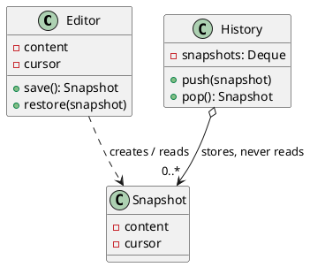

## Definition

The Memento Pattern captures and externalizes an object's internal state, without violating encapsulation, so that the object can be restored to this state later.

Three roles:

- **Originator**, the object whose state is saved and restored.
- **Memento**, an opaque snapshot. Only the originator can read its contents.
- **Caretaker**, keeps mementos (usually on a stack) but never looks inside them.

## When to Use?

- You need undo/rollback, checkpoints or snapshots.
- Saving the state directly would require exposing fields that should stay private.

## Use-case Examples (Real-world Applications)

- Undo in editors and IDEs
- Save games and checkpoints
- Database transaction rollback and savepoints
- Form state restored after a failed submit

## Structure



## Example

The editor is the originator, the snapshot is the memento, and the history is
the caretaker: it stores snapshots blindly and cannot look inside them.

=== "Java"

    ```java
    import java.util.ArrayDeque;
    import java.util.Deque;

    public class Editor {
        private String content = "";
        private int cursor;

        public void type(String text) {
            content += text;
            cursor = content.length();
        }

        public String getContent() {
            return content;
        }

        public Snapshot save() {
            return new Snapshot(content, cursor);
        }

        public void restore(Snapshot snapshot) {
            this.content = snapshot.content;
            this.cursor = snapshot.cursor;
        }

        // Nested and private-constructed: only Editor can build or read one.
        public static final class Snapshot {
            private final String content;
            private final int cursor;

            private Snapshot(String content, int cursor) {
                this.content = content;
                this.cursor = cursor;
            }
        }
    }

    public class History {
        private final Deque<Editor.Snapshot> snapshots = new ArrayDeque<>();

        public void backup(Editor editor) {
            snapshots.push(editor.save());
        }

        public void undo(Editor editor) {
            if (!snapshots.isEmpty()) {
                editor.restore(snapshots.pop());
            }
        }
    }

    public class Main {
        public static void main(String[] args) {
            Editor editor = new Editor();
            History history = new History();

            editor.type("Hello");
            history.backup(editor);

            editor.type(", world");
            System.out.println(editor.getContent()); // Hello, world

            history.undo(editor);
            System.out.println(editor.getContent()); // Hello
        }
    }
    ```

=== "C#"

    ```csharp
    public class Editor
    {
        private string _content = "";
        private int _cursor;

        public void Type(string text)
        {
            _content += text;
            _cursor = _content.Length;
        }

        public string Content => _content;

        public Snapshot Save() => new(_content, _cursor);

        public void Restore(Snapshot snapshot)
        {
            _content = snapshot.Content;
            _cursor = snapshot.Cursor;
        }

        // Nested with private members: only Editor can build or read one.
        public sealed class Snapshot
        {
            internal Snapshot(string content, int cursor) =>
                (Content, Cursor) = (content, cursor);

            internal string Content { get; }
            internal int Cursor { get; }
        }
    }

    public class History
    {
        private readonly Stack<Editor.Snapshot> _snapshots = new();

        public void Backup(Editor editor) => _snapshots.Push(editor.Save());

        public void Undo(Editor editor)
        {
            if (_snapshots.Count > 0) editor.Restore(_snapshots.Pop());
        }
    }

    var editor = new Editor();
    var history = new History();

    editor.Type("Hello");
    history.Backup(editor);

    editor.Type(", world");
    Console.WriteLine(editor.Content); // Hello, world

    history.Undo(editor);
    Console.WriteLine(editor.Content); // Hello
    ```

=== "C++"

    ```cpp
    #include <iostream>
    #include <stack>
    #include <string>

    class Editor {
    public:
        // Only Editor can read a Snapshot's members.
        class Snapshot {
            friend class Editor;

            Snapshot(std::string content, std::size_t cursor)
                : content_(std::move(content)), cursor_(cursor) {}

            std::string content_;
            std::size_t cursor_;
        };

        void type(const std::string& text) {
            content_ += text;
            cursor_ = content_.size();
        }

        const std::string& content() const { return content_; }

        Snapshot save() const { return Snapshot(content_, cursor_); }

        void restore(const Snapshot& snapshot) {
            content_ = snapshot.content_;
            cursor_ = snapshot.cursor_;
        }

    private:
        std::string content_;
        std::size_t cursor_ = 0;
    };

    class History {
    public:
        void backup(const Editor& editor) { snapshots_.push(editor.save()); }

        void undo(Editor& editor) {
            if (snapshots_.empty()) return;
            editor.restore(snapshots_.top());
            snapshots_.pop();
        }

    private:
        std::stack<Editor::Snapshot> snapshots_;
    };

    int main() {
        Editor editor;
        History history;

        editor.type("Hello");
        history.backup(editor);

        editor.type(", world");
        std::cout << editor.content() << '\n'; // Hello, world

        history.undo(editor);
        std::cout << editor.content() << '\n'; // Hello
    }
    ```

=== "Python"

    ```python
    from dataclasses import dataclass


    # Python has no true privacy; the convention is that only Editor touches it.
    @dataclass(frozen=True)
    class Snapshot:
        _content: str
        _cursor: int


    class Editor:
        def __init__(self) -> None:
            self._content = ""
            self._cursor = 0

        def type(self, text: str) -> None:
            self._content += text
            self._cursor = len(self._content)

        @property
        def content(self) -> str:
            return self._content

        def save(self) -> Snapshot:
            return Snapshot(self._content, self._cursor)

        def restore(self, snapshot: Snapshot) -> None:
            self._content = snapshot._content
            self._cursor = snapshot._cursor


    class History:
        def __init__(self) -> None:
            self._snapshots: list[Snapshot] = []

        def backup(self, editor: Editor) -> None:
            self._snapshots.append(editor.save())

        def undo(self, editor: Editor) -> None:
            if self._snapshots:
                editor.restore(self._snapshots.pop())


    editor = Editor()
    history = History()

    editor.type("Hello")
    history.backup(editor)

    editor.type(", world")
    print(editor.content)  # Hello, world

    history.undo(editor)
    print(editor.content)  # Hello
    ```

=== "Rust"

    ```rust
    // Private fields in a module are invisible outside it, so History can hold
    // a Snapshot without being able to read or forge one.
    mod editor {
        pub struct Snapshot {
            content: String,
            cursor: usize,
        }

        #[derive(Default)]
        pub struct Editor {
            content: String,
            cursor: usize,
        }

        impl Editor {
            pub fn type_text(&mut self, text: &str) {
                self.content.push_str(text);
                self.cursor = self.content.len();
            }

            pub fn content(&self) -> &str {
                &self.content
            }

            pub fn save(&self) -> Snapshot {
                Snapshot { content: self.content.clone(), cursor: self.cursor }
            }

            pub fn restore(&mut self, snapshot: Snapshot) {
                self.content = snapshot.content;
                self.cursor = snapshot.cursor;
            }
        }
    }

    use editor::{Editor, Snapshot};

    #[derive(Default)]
    struct History {
        snapshots: Vec<Snapshot>,
    }

    impl History {
        fn backup(&mut self, editor: &Editor) {
            self.snapshots.push(editor.save());
        }

        fn undo(&mut self, editor: &mut Editor) {
            if let Some(snapshot) = self.snapshots.pop() {
                editor.restore(snapshot);
            }
        }
    }

    fn main() {
        let mut editor = Editor::default();
        let mut history = History::default();

        editor.type_text("Hello");
        history.backup(&editor);

        editor.type_text(", world");
        println!("{}", editor.content()); // Hello, world

        history.undo(&mut editor);
        println!("{}", editor.content()); // Hello
    }
    ```

=== "TypeScript"

    ```typescript
    class Snapshot {
      // #private fields are unreachable outside the declaring class.
      constructor(
        readonly content: string,
        readonly cursor: number,
      ) {}
    }

    class Editor {
      #content = "";
      #cursor = 0;

      type(text: string): void {
        this.#content += text;
        this.#cursor = this.#content.length;
      }

      get content(): string {
        return this.#content;
      }

      save(): Snapshot {
        return new Snapshot(this.#content, this.#cursor);
      }

      restore(snapshot: Snapshot): void {
        this.#content = snapshot.content;
        this.#cursor = snapshot.cursor;
      }
    }

    class History {
      readonly #snapshots: Snapshot[] = [];

      backup(editor: Editor): void {
        this.#snapshots.push(editor.save());
      }

      undo(editor: Editor): void {
        const snapshot = this.#snapshots.pop();
        if (snapshot) editor.restore(snapshot);
      }
    }

    const editor = new Editor();
    const history = new History();

    editor.type("Hello");
    history.backup(editor);

    editor.type(", world");
    console.log(editor.content); // Hello, world

    history.undo(editor);
    console.log(editor.content); // Hello
    ```

`Snapshot` has no getters. `History` can hold it, pass it and hand it back, but cannot inspect or forge one, that is the "without violating encapsulation" part of the definition.

## Watch out

- Snapshots of large objects cost memory. Cap the history, or store deltas instead of full copies.
- Copy mutable fields when snapshotting (`new ArrayList<>(items)`), or the "snapshot" mutates along with the original.
- [Command](Command%20Pattern.md) offers a lighter alternative to undo: store the *inverse operation* rather than the whole state.

## Check Your Understanding

<quiz>
What does the Memento Pattern make possible?

- [x] Capturing an object's internal state so it can be restored later, without breaking encapsulation
> Correct. Only the originator can read the memento's contents; the caretaker just stores it, which is what makes undo safe.
- [ ] Notifying dependents whenever an object changes
- [ ] Adding new operations to a class hierarchy from outside
- [ ] Reusing one instance instead of creating many
</quiz>
