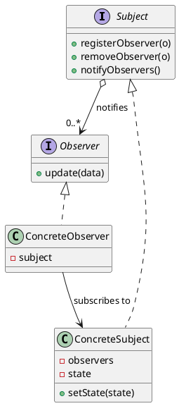

# Definition

## The "**formal**" definition

> The Observer Pattern defines a one-to-many dependency between objects so that when one object changes state, all of its dependents are notified and updated automatically.

## What it actually means

Suppose you have a waitperson at a restaurant holding an important meeting. This server will make the arrangements and synchronize all the entities (including guests and other wait-people). You can tell them to add something (like a drink) to your bill, and the waitperson will track all the information from all the entities across the restaurant. The observer pattern does the same thing. It keeps track of the data needed globally across the program.d


## The meaning of "loose coupling"

When two objects are loosely coupled, they can interact but they have little-to-no knowledge of one another.

## How can loose coupling help us?

Loosely coupled designs allow us to build flexible object oriented systems that can handle change because they minimize the inter-dependency between objects.

# Structure



# Practical Examples

- The **event listeners** in a web app follow this pattern.

# Example

A news agency (the subject) and subscribers (the observers). The agency knows
only the observer interface, so subscribers can come and go at runtime.

=== "Java"

    ```java
    import java.util.ArrayList;
    import java.util.List;

    public interface Observer {
        void update(String news);
    }

    public class EmailSubscriber implements Observer {
        private final String name;

        public EmailSubscriber(String name) {
            this.name = name;
        }

        @Override
        public void update(String news) {
            System.out.println("Email to " + name + ": " + news);
        }
    }

    public class SmsSubscriber implements Observer {
        private final String phoneNumber;

        public SmsSubscriber(String phoneNumber) {
            this.phoneNumber = phoneNumber;
        }

        @Override
        public void update(String news) {
            System.out.println("SMS to " + phoneNumber + ": " + news);
        }
    }

    public interface Subject {
        void attach(Observer o);
        void detach(Observer o);
        void notifyObservers();
    }

    public class NewsAgency implements Subject {
        private final List<Observer> observers = new ArrayList<>();
        private String latestNews;

        public void setNews(String news) {
            this.latestNews = news;
            notifyObservers();
        }

        @Override
        public void attach(Observer o) {
            observers.add(o);
        }

        @Override
        public void detach(Observer o) {
            observers.remove(o);
        }

        @Override
        public void notifyObservers() {
            for (Observer o : observers) {
                o.update(latestNews);
            }
        }
    }

    public class Main {
        public static void main(String[] args) {
            NewsAgency agency = new NewsAgency();
            agency.attach(new EmailSubscriber("Alice"));
            agency.attach(new SmsSubscriber("+1555"));

            agency.setNews("Design patterns still relevant");
        }
    }
    ```

=== "C#"

    ```csharp
    public class EmailSubscriber
    {
        private readonly string _name;

        public EmailSubscriber(string name) => _name = name;

        public void Update(string news) => Console.WriteLine($"Email to {_name}: {news}");
    }

    public class SmsSubscriber
    {
        private readonly string _phoneNumber;

        public SmsSubscriber(string phoneNumber) => _phoneNumber = phoneNumber;

        public void Update(string news) =>
            Console.WriteLine($"SMS to {_phoneNumber}: {news}");
    }

    public class NewsAgency
    {
        // An event is the built-in observer list: += attaches, -= detaches.
        public event Action<string>? NewsPublished;

        public void SetNews(string news) => NewsPublished?.Invoke(news);
    }

    var agency = new NewsAgency();
    agency.NewsPublished += new EmailSubscriber("Alice").Update;
    agency.NewsPublished += new SmsSubscriber("+1555").Update;

    agency.SetNews("Design patterns still relevant");
    ```

=== "C++"

    ```cpp
    #include <functional>
    #include <iostream>
    #include <string>
    #include <vector>

    class Observer {
    public:
        virtual ~Observer() = default;
        virtual void update(const std::string& news) = 0;
    };

    class EmailSubscriber : public Observer {
    public:
        explicit EmailSubscriber(std::string name) : name_(std::move(name)) {}

        void update(const std::string& news) override {
            std::cout << "Email to " << name_ << ": " << news << '\n';
        }

    private:
        std::string name_;
    };

    class SmsSubscriber : public Observer {
    public:
        explicit SmsSubscriber(std::string number) : number_(std::move(number)) {}

        void update(const std::string& news) override {
            std::cout << "SMS to " << number_ << ": " << news << '\n';
        }

    private:
        std::string number_;
    };

    class NewsAgency {
    public:
        // Non-owning: observers must outlive the subject.
        void attach(Observer* observer) { observers_.push_back(observer); }

        void detach(Observer* observer) {
            std::erase(observers_, observer);
        }

        void setNews(const std::string& news) {
            for (Observer* observer : observers_) observer->update(news);
        }

    private:
        std::vector<Observer*> observers_;
    };

    int main() {
        EmailSubscriber alice("Alice");
        SmsSubscriber sms("+1555");

        NewsAgency agency;
        agency.attach(&alice);
        agency.attach(&sms);

        agency.setNews("Design patterns still relevant");
    }
    ```

=== "Python"

    ```python
    from typing import Callable

    Observer = Callable[[str], None]


    class EmailSubscriber:
        def __init__(self, name: str) -> None:
            self.name = name

        def __call__(self, news: str) -> None:
            print(f"Email to {self.name}: {news}")


    class SmsSubscriber:
        def __init__(self, phone_number: str) -> None:
            self.phone_number = phone_number

        def __call__(self, news: str) -> None:
            print(f"SMS to {self.phone_number}: {news}")


    class NewsAgency:
        def __init__(self) -> None:
            self._observers: list[Observer] = []

        def attach(self, observer: Observer) -> None:
            self._observers.append(observer)

        def detach(self, observer: Observer) -> None:
            self._observers.remove(observer)

        def set_news(self, news: str) -> None:
            for observer in self._observers:
                observer(news)


    agency = NewsAgency()
    agency.attach(EmailSubscriber("Alice"))
    agency.attach(SmsSubscriber("+1555"))

    agency.set_news("Design patterns still relevant")
    ```

=== "Rust"

    ```rust
    trait Observer {
        fn update(&self, news: &str);
    }

    struct EmailSubscriber {
        name: String,
    }

    struct SmsSubscriber {
        phone_number: String,
    }

    impl Observer for EmailSubscriber {
        fn update(&self, news: &str) {
            println!("Email to {}: {news}", self.name);
        }
    }

    impl Observer for SmsSubscriber {
        fn update(&self, news: &str) {
            println!("SMS to {}: {news}", self.phone_number);
        }
    }

    #[derive(Default)]
    struct NewsAgency {
        observers: Vec<Box<dyn Observer>>,
    }

    impl NewsAgency {
        fn attach(&mut self, observer: Box<dyn Observer>) {
            self.observers.push(observer);
        }

        fn set_news(&self, news: &str) {
            for observer in &self.observers {
                observer.update(news);
            }
        }
    }

    fn main() {
        let mut agency = NewsAgency::default();
        agency.attach(Box::new(EmailSubscriber { name: "Alice".into() }));
        agency.attach(Box::new(SmsSubscriber { phone_number: "+1555".into() }));

        agency.set_news("Design patterns still relevant");
    }
    ```

=== "TypeScript"

    ```typescript
    type Observer = (news: string) => void;

    class EmailSubscriber {
      constructor(private readonly name: string) {}

      update = (news: string): void => {
        console.log(`Email to ${this.name}: ${news}`);
      };
    }

    class SmsSubscriber {
      constructor(private readonly phoneNumber: string) {}

      update = (news: string): void => {
        console.log(`SMS to ${this.phoneNumber}: ${news}`);
      };
    }

    class NewsAgency {
      private readonly observers = new Set<Observer>();

      attach(observer: Observer): void {
        this.observers.add(observer);
      }

      detach(observer: Observer): void {
        this.observers.delete(observer);
      }

      setNews(news: string): void {
        for (const observer of this.observers) observer(news);
      }
    }

    const agency = new NewsAgency();
    agency.attach(new EmailSubscriber("Alice").update);
    agency.attach(new SmsSubscriber("+1555").update);

    agency.setNews("Design patterns still relevant");
    ```

## Check Your Understanding

<quiz>
What relationship does the Observer Pattern define?

- [x] A one-to-many dependency, where every observer is notified when the subject's state changes
> Correct. The subject knows only the observer interface, so observers can be added or removed at runtime.
- [ ] A one-to-one bridge between an abstraction and its implementation
- [ ] A chain in which only the first willing handler responds
- [ ] A hub through which all colleagues communicate
</quiz>
