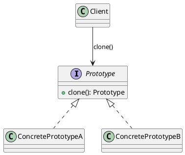

## Definition

The Prototype Pattern specifies the kinds of objects to create using a prototypical instance, and creates new objects by **copying** that prototype.

- Instead of `new ExpensiveThing(...)`, you say `existingThing.clone()`.
- The client copies objects without knowing their concrete classes.

## When to Use?

- Creating an object is expensive (a database round-trip, heavy parsing, a network call) but copying one is cheap.
- You need many objects that differ only slightly from a known configuration.
- The set of concrete classes is decided at runtime and you would rather not maintain a factory for each.

## Use-case Examples (Real-world Applications)

- Copy/paste of shapes in a graphics editor
- Pre-configured document or project templates
- Game engines spawning enemies from a loaded "archetype"

## Structure



## Example

```java
public interface Shape extends Cloneable {
    Shape copy();
    void draw();
}
```

```java
public class Circle implements Shape {
    private int x;
    private int y;
    private int radius;
    private String color;

    public Circle(int x, int y, int radius, String color) {
        this.x = x;
        this.y = y;
        this.radius = radius;
        this.color = color;
    }

    // Copy constructor: the safest place to define what "a copy" means.
    private Circle(Circle other) {
        this(other.x, other.y, other.radius, other.color);
    }

    @Override
    public Shape copy() {
        return new Circle(this);
    }

    public void moveTo(int x, int y) {
        this.x = x;
        this.y = y;
    }

    @Override
    public void draw() {
        System.out.println(color + " circle r=" + radius + " at (" + x + ", " + y + ")");
    }
}
```

```java
public class Main {
    public static void main(String[] args) {
        Circle template = new Circle(0, 0, 10, "red");

        Shape copy = template.copy();
        ((Circle) copy).moveTo(50, 50);

        template.draw(); // red circle r=10 at (0, 0)
        copy.draw();     // red circle r=10 at (50, 50)
    }
}
```

## Shallow vs. deep copy

This is the whole difficulty of the pattern:

- A **shallow copy** copies field values; reference fields still point at the *same* nested objects, so mutating one copy affects the other.
- A **deep copy** recursively copies the nested objects too.

Java's `Object.clone()` is shallow. If your object holds mutable collections or other mutable objects, copy them explicitly:

```java
private Order(Order other) {
    this.id = other.id;
    this.items = new ArrayList<>(other.items); // new list, not the same reference
}
```
