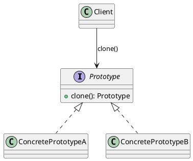

## Definition

The Prototype Pattern specifies the kinds of objects to create using a prototypical instance, and creates new objects by **copying** that prototype.

- Instead of `new ExpensiveThing(...)`, you say `existingThing.clone()`.
- The client copies objects without knowing their concrete classes.

## When to Use?

- Creating an object is expensive (a database round-trip, heavy parsing, a network call) but copying one is cheap.
- You need many objects that differ only slightly from a known configuration.
- The set of concrete classes is decided at runtime and you would rather not maintain a factory for each.

## Use-case Examples (Real-world Applications)

- Copy/paste of shapes in a graphics editor
- Pre-configured document or project templates
- Game engines spawning enemies from a loaded "archetype"

## Structure



## Example

A shape that copies itself. The client clones a configured instance instead of
knowing which concrete class it is holding.

=== "Java"

    ```java
    public interface Shape {
        Shape copy();
        void draw();
    }

    public class Circle implements Shape {
        private int x;
        private int y;
        private final int radius;
        private final String color;

        public Circle(int x, int y, int radius, String color) {
            this.x = x;
            this.y = y;
            this.radius = radius;
            this.color = color;
        }

        // Copy constructor: the safest place to define what "a copy" means.
        private Circle(Circle other) {
            this(other.x, other.y, other.radius, other.color);
        }

        @Override
        public Shape copy() {
            return new Circle(this);
        }

        public void moveTo(int x, int y) {
            this.x = x;
            this.y = y;
        }

        @Override
        public void draw() {
            System.out.println(color + " circle r=" + radius + " at (" + x + ", " + y + ")");
        }
    }

    public class Main {
        public static void main(String[] args) {
            Circle template = new Circle(0, 0, 10, "red");

            Circle copy = (Circle) template.copy();
            copy.moveTo(50, 50);

            template.draw(); // red circle r=10 at (0, 0)
            copy.draw();     // red circle r=10 at (50, 50)
        }
    }
    ```

=== "C#"

    ```csharp
    public interface IShape
    {
        IShape Copy();
        void Draw();
    }

    public class Circle : IShape
    {
        private int _x;
        private int _y;
        private readonly int _radius;
        private readonly string _color;

        public Circle(int x, int y, int radius, string color) =>
            (_x, _y, _radius, _color) = (x, y, radius, color);

        // Copy constructor: the safest place to define what "a copy" means.
        private Circle(Circle other)
            : this(other._x, other._y, other._radius, other._color) { }

        public IShape Copy() => new Circle(this);

        public void MoveTo(int x, int y) => (_x, _y) = (x, y);

        public void Draw() =>
            Console.WriteLine($"{_color} circle r={_radius} at ({_x}, {_y})");
    }

    var template = new Circle(0, 0, 10, "red");

    var copy = (Circle)template.Copy();
    copy.MoveTo(50, 50);

    template.Draw(); // red circle r=10 at (0, 0)
    copy.Draw();     // red circle r=10 at (50, 50)
    ```

=== "C++"

    ```cpp
    #include <iostream>
    #include <memory>
    #include <string>

    class Shape {
    public:
        virtual ~Shape() = default;
        virtual std::unique_ptr<Shape> copy() const = 0;
        virtual void draw() const = 0;
    };

    class Circle : public Shape {
    public:
        Circle(int x, int y, int radius, std::string color)
            : x_(x), y_(y), radius_(radius), color_(std::move(color)) {}

        // The compiler-generated copy constructor is the prototype here.
        std::unique_ptr<Shape> copy() const override {
            return std::make_unique<Circle>(*this);
        }

        void moveTo(int x, int y) {
            x_ = x;
            y_ = y;
        }

        void draw() const override {
            std::cout << color_ << " circle r=" << radius_ << " at (" << x_ << ", "
                      << y_ << ")\n";
        }

    private:
        int x_;
        int y_;
        int radius_;
        std::string color_;
    };

    int main() {
        Circle prototype(0, 0, 10, "red");

        auto copy = prototype.copy();
        static_cast<Circle*>(copy.get())->moveTo(50, 50);

        prototype.draw(); // red circle r=10 at (0, 0)
        copy->draw();     // red circle r=10 at (50, 50)
    }
    ```

=== "Python"

    ```python
    import copy
    from dataclasses import dataclass


    @dataclass
    class Circle:
        x: int
        y: int
        radius: int
        color: str

        # copy.deepcopy is the built-in prototype operation.
        def copy(self) -> "Circle":
            return copy.deepcopy(self)

        def move_to(self, x: int, y: int) -> None:
            self.x, self.y = x, y

        def draw(self) -> None:
            print(f"{self.color} circle r={self.radius} at ({self.x}, {self.y})")


    template = Circle(0, 0, 10, "red")

    clone = template.copy()
    clone.move_to(50, 50)

    template.draw()  # red circle r=10 at (0, 0)
    clone.draw()     # red circle r=10 at (50, 50)
    ```

=== "Rust"

    ```rust
    // Clone is the language's prototype trait; deriving it copies every field.
    #[derive(Clone)]
    struct Circle {
        x: i32,
        y: i32,
        radius: i32,
        color: String,
    }

    impl Circle {
        fn move_to(&mut self, x: i32, y: i32) {
            self.x = x;
            self.y = y;
        }

        fn draw(&self) {
            println!(
                "{} circle r={} at ({}, {})",
                self.color, self.radius, self.x, self.y
            );
        }
    }

    fn main() {
        let template = Circle { x: 0, y: 0, radius: 10, color: "red".into() };

        let mut copy = template.clone();
        copy.move_to(50, 50);

        template.draw(); // red circle r=10 at (0, 0)
        copy.draw();     // red circle r=10 at (50, 50)
    }
    ```

=== "TypeScript"

    ```typescript
    interface Shape {
      copy(): Shape;
      draw(): void;
    }

    class Circle implements Shape {
      constructor(
        private x: number,
        private y: number,
        private readonly radius: number,
        private readonly color: string,
      ) {}

      copy(): Circle {
        return new Circle(this.x, this.y, this.radius, this.color);
      }

      moveTo(x: number, y: number): void {
        this.x = x;
        this.y = y;
      }

      draw(): void {
        console.log(`${this.color} circle r=${this.radius} at (${this.x}, ${this.y})`);
      }
    }

    const template = new Circle(0, 0, 10, "red");

    const copy = template.copy();
    copy.moveTo(50, 50);

    template.draw(); // red circle r=10 at (0, 0)
    copy.draw();     // red circle r=10 at (50, 50)
    ```

## Shallow vs. deep copy

This is the whole difficulty of the pattern:

- A **shallow copy** copies field values; reference fields still point at the *same* nested objects, so mutating one copy affects the other.
- A **deep copy** recursively copies the nested objects too.

Java's `Object.clone()` is shallow. If your object holds mutable collections or other mutable objects, copy them explicitly:

```java
private Order(Order other) {
    this.id = other.id;
    this.items = new ArrayList<>(other.items); // new list, not the same reference
}
```

## Check Your Understanding

<quiz>
How does the Prototype Pattern create new objects?

- [ ] By calling a static factory method for each concrete type
- [x] By cloning an existing instance that already carries the desired configuration
> Correct. Cloning avoids re-running expensive setup and works without knowing the object's concrete class.
- [ ] By reusing one shared instance across the whole application
- [ ] By wrapping the object in a proxy that builds it lazily
</quiz>
