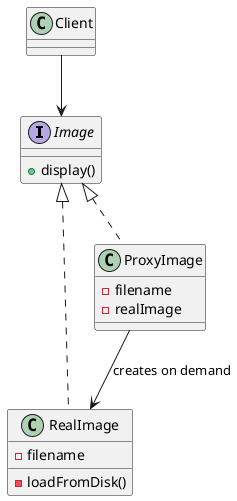

## Definition

The Proxy Pattern provides a surrogate or placeholder for another object to control access to it.

The proxy implements the **same interface** as the real object, so the client cannot tell the difference, which is exactly what lets the proxy add lazy loading, caching, access control or logging without touching either side.

## Kinds of proxy

| Kind | What it adds |
|---|---|
| **Virtual** | Creates the expensive real object only on first use |
| **Protection** | Checks permissions before forwarding the call |
| **Remote** | Represents an object living in another process or machine |
| **Caching** | Stores results and serves repeats without hitting the real object |
| **Logging / smart reference** | Counts references, logs calls, opens transactions |

## When to Use?

- The real object is expensive to create and often never used.
- Access must be checked, throttled, logged or cached, and you do not want that logic inside the real object.
- The real object lives somewhere else and the network details should stay hidden.

## Use-case Examples (Real-world Applications)

- Hibernate/JPA lazy-loaded entities
- Spring AOP proxies adding `@Transactional` and `@Cacheable`
- RPC/gRPC client stubs

## Structure



## Example, a virtual proxy

The proxy implements the same interface as the real image and defers the
expensive load until the first `display()`.

=== "Java"

    ```java
    public interface Image {
        void display();
    }

    public class RealImage implements Image {
        private final String filename;

        public RealImage(String filename) {
            this.filename = filename;
            loadFromDisk(); // the expensive part
        }

        private void loadFromDisk() {
            System.out.println("Loading " + filename + " from disk");
        }

        @Override
        public void display() {
            System.out.println("Displaying " + filename);
        }
    }

    public class ProxyImage implements Image {
        private final String filename;
        private RealImage realImage;

        public ProxyImage(String filename) {
            this.filename = filename;
        }

        @Override
        public void display() {
            if (realImage == null) {
                realImage = new RealImage(filename); // deferred until actually needed
            }
            realImage.display();
        }
    }

    public class Main {
        public static void main(String[] args) {
            Image image = new ProxyImage("photo.png"); // nothing read yet

            image.display(); // Loading photo.png from disk / Displaying photo.png
            image.display(); // Displaying photo.png  (already loaded)
        }
    }
    ```

=== "C#"

    ```csharp
    public interface IImage
    {
        void Display();
    }

    public class RealImage : IImage
    {
        private readonly string _filename;

        public RealImage(string filename)
        {
            _filename = filename;
            Console.WriteLine($"Loading {filename} from disk"); // the expensive part
        }

        public void Display() => Console.WriteLine($"Displaying {_filename}");
    }

    public class ProxyImage : IImage
    {
        private readonly Lazy<RealImage> _real;

        // Lazy<T> defers construction until .Value is first read.
        public ProxyImage(string filename) => _real = new(() => new RealImage(filename));

        public void Display() => _real.Value.Display();
    }

    IImage image = new ProxyImage("photo.png"); // nothing read yet

    image.Display(); // Loading photo.png from disk / Displaying photo.png
    image.Display(); // Displaying photo.png  (already loaded)
    ```

=== "C++"

    ```cpp
    #include <iostream>
    #include <memory>
    #include <string>

    class Image {
    public:
        virtual ~Image() = default;
        virtual void display() = 0;
    };

    class RealImage : public Image {
    public:
        explicit RealImage(std::string filename) : filename_(std::move(filename)) {
            std::cout << "Loading " << filename_ << " from disk\n"; // expensive
        }

        void display() override {
            std::cout << "Displaying " << filename_ << '\n';
        }

    private:
        std::string filename_;
    };

    class ProxyImage : public Image {
    public:
        explicit ProxyImage(std::string filename) : filename_(std::move(filename)) {}

        void display() override {
            if (!real_) {
                real_ = std::make_unique<RealImage>(filename_); // deferred
            }
            real_->display();
        }

    private:
        std::string filename_;
        std::unique_ptr<RealImage> real_;
    };

    int main() {
        ProxyImage image("photo.png"); // nothing read yet

        image.display(); // Loading photo.png from disk / Displaying photo.png
        image.display(); // Displaying photo.png  (already loaded)
    }
    ```

=== "Python"

    ```python
    from typing import Protocol


    class Image(Protocol):
        def display(self) -> None: ...


    class RealImage:
        def __init__(self, filename: str) -> None:
            self._filename = filename
            print(f"Loading {filename} from disk")  # the expensive part

        def display(self) -> None:
            print(f"Displaying {self._filename}")


    class ProxyImage:
        def __init__(self, filename: str) -> None:
            self._filename = filename
            self._real: RealImage | None = None

        def display(self) -> None:
            if self._real is None:
                self._real = RealImage(self._filename)  # deferred until needed
            self._real.display()


    image: Image = ProxyImage("photo.png")  # nothing read yet

    image.display()  # Loading photo.png from disk / Displaying photo.png
    image.display()  # Displaying photo.png  (already loaded)
    ```

=== "Rust"

    ```rust
    use std::cell::OnceCell;

    trait Image {
        fn display(&self);
    }

    struct RealImage {
        filename: String,
    }

    impl RealImage {
        fn new(filename: &str) -> Self {
            println!("Loading {filename} from disk"); // the expensive part
            Self { filename: filename.to_string() }
        }
    }

    impl Image for RealImage {
        fn display(&self) {
            println!("Displaying {}", self.filename);
        }
    }

    struct ProxyImage {
        filename: String,
        // OnceCell gives interior mutability for a one-time initialization,
        // so display() can stay &self.
        real: OnceCell<RealImage>,
    }

    impl Image for ProxyImage {
        fn display(&self) {
            self.real
                .get_or_init(|| RealImage::new(&self.filename))
                .display();
        }
    }

    fn main() {
        let image = ProxyImage {
            filename: "photo.png".into(),
            real: OnceCell::new(),
        }; // nothing read yet

        image.display(); // Loading photo.png from disk / Displaying photo.png
        image.display(); // Displaying photo.png  (already loaded)
    }
    ```

=== "TypeScript"

    ```typescript
    interface Image {
      display(): void;
    }

    class RealImage implements Image {
      constructor(private readonly filename: string) {
        console.log(`Loading ${filename} from disk`); // the expensive part
      }

      display(): void {
        console.log(`Displaying ${this.filename}`);
      }
    }

    class ProxyImage implements Image {
      private real?: RealImage;

      constructor(private readonly filename: string) {}

      display(): void {
        this.real ??= new RealImage(this.filename); // deferred until needed
        this.real.display();
      }
    }

    const image: Image = new ProxyImage("photo.png"); // nothing read yet

    image.display(); // Loading photo.png from disk / Displaying photo.png
    image.display(); // Displaying photo.png  (already loaded)
    ```

## Proxy vs. Decorator

Same shape, different intent: a decorator **adds behaviour** the client asked for and can be stacked freely; a proxy **controls access** to the subject and usually manages its life-cycle. If the wrapper decides *whether* the call reaches the real object, it is a proxy.

## Check Your Understanding

<quiz>
What is a Proxy used for?

- [x] To stand in for another object and control access to it — lazy loading, caching, access checks, or remote calls
> Correct. The proxy implements the same interface as the real subject, so clients cannot tell the difference.
- [ ] To combine several incompatible interfaces into one
- [ ] To let an object notify its dependents when it changes
- [ ] To encapsulate a request as an object
</quiz>
