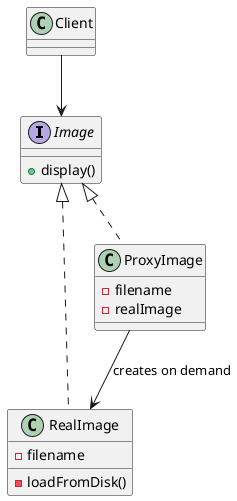

## Definition

The Proxy Pattern provides a surrogate or placeholder for another object to control access to it.

The proxy implements the **same interface** as the real object, so the client cannot tell the difference, which is exactly what lets the proxy add lazy loading, caching, access control or logging without touching either side.

## Kinds of proxy

| Kind | What it adds |
|---|---|
| **Virtual** | Creates the expensive real object only on first use |
| **Protection** | Checks permissions before forwarding the call |
| **Remote** | Represents an object living in another process or machine |
| **Caching** | Stores results and serves repeats without hitting the real object |
| **Logging / smart reference** | Counts references, logs calls, opens transactions |

## When to Use?

- The real object is expensive to create and often never used.
- Access must be checked, throttled, logged or cached, and you do not want that logic inside the real object.
- The real object lives somewhere else and the network details should stay hidden.

## Use-case Examples (Real-world Applications)

- Hibernate/JPA lazy-loaded entities
- Spring AOP proxies adding `@Transactional` and `@Cacheable`
- RPC/gRPC client stubs

## Structure



## Example, a virtual proxy

```java
public interface Image {
    void display();
}
```

```java
public class RealImage implements Image {
    private final String filename;

    public RealImage(String filename) {
        this.filename = filename;
        loadFromDisk(); // the expensive part
    }

    private void loadFromDisk() {
        System.out.println("Loading " + filename + " from disk");
    }

    @Override
    public void display() {
        System.out.println("Displaying " + filename);
    }
}
```

```java
public class ProxyImage implements Image {
    private final String filename;
    private RealImage realImage;

    public ProxyImage(String filename) {
        this.filename = filename;
    }

    @Override
    public void display() {
        if (realImage == null) {
            realImage = new RealImage(filename); // deferred until actually needed
        }
        realImage.display();
    }
}
```

```java
public class Main {
    public static void main(String[] args) {
        Image image = new ProxyImage("photo.png"); // nothing read yet

        image.display(); // Loading photo.png from disk / Displaying photo.png
        image.display(); // Displaying photo.png  (already loaded)
    }
}
```

## Proxy vs. Decorator

Same shape, different intent: a decorator **adds behaviour** the client asked for and can be stacked freely; a proxy **controls access** to the subject and usually manages its life-cycle. If the wrapper decides *whether* the call reaches the real object, it is a proxy.

## Check Your Understanding

<quiz>
What is a Proxy used for?

- [x] To stand in for another object and control access to it — lazy loading, caching, access checks, or remote calls
> Correct. The proxy implements the same interface as the real subject, so clients cannot tell the difference.
- [ ] To combine several incompatible interfaces into one
- [ ] To let an object notify its dependents when it changes
- [ ] To encapsulate a request as an object
</quiz>
