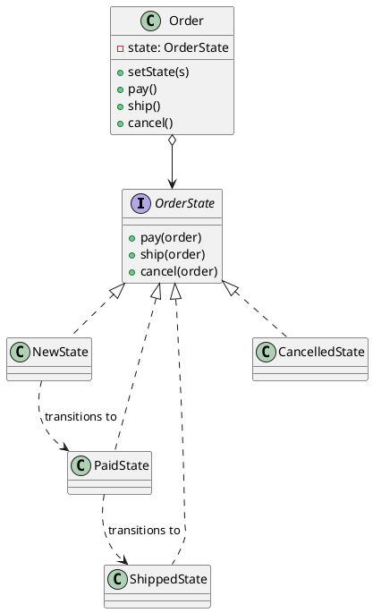
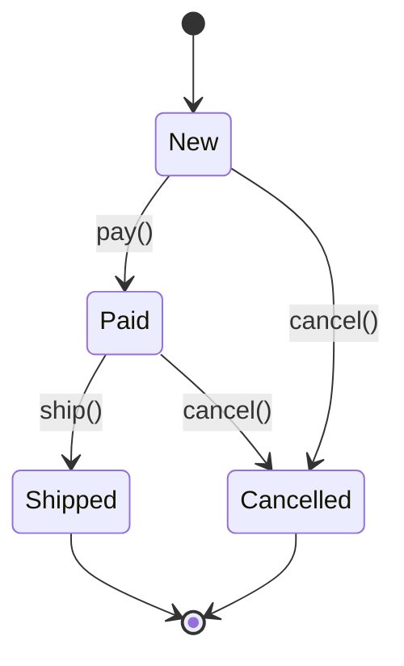

## Definition

The State Pattern allows an object to alter its behaviour when its internal state changes. The object will appear to change its class.

- Each state becomes a class; the context delegates every request to its current state object.
- The giant `switch (this.state)` that appears in every method disappears.

## When to Use?

- An object behaves differently depending on a state, and the conditionals for it are duplicated across many methods.
- The set of states and legal transitions is a real part of the domain (order life-cycle, document workflow, connection status).
- You want illegal transitions to be impossible rather than merely unlikely.

## Use-case Examples (Real-world Applications)

- Order status: `New → Paid → Shipped → Delivered`, with `Cancelled` reachable only from some of them
- TCP connections: `Closed`, `Listening`, `Established`
- Media players, vending machines, document approval workflows

## Structure



The state machine itself:



## Example

```java
public interface OrderState {
    default void pay(Order order) {
        throw new IllegalStateException("Cannot pay in state " + getClass().getSimpleName());
    }

    default void ship(Order order) {
        throw new IllegalStateException("Cannot ship in state " + getClass().getSimpleName());
    }

    default void cancel(Order order) {
        throw new IllegalStateException("Cannot cancel in state " + getClass().getSimpleName());
    }
}
```

Each state implements only the transitions it actually allows:

```java
public class NewState implements OrderState {
    @Override
    public void pay(Order order) {
        System.out.println("Payment received");
        order.setState(new PaidState());
    }

    @Override
    public void cancel(Order order) {
        order.setState(new CancelledState());
    }
}

public class PaidState implements OrderState {
    @Override
    public void ship(Order order) {
        System.out.println("Order handed to the carrier");
        order.setState(new ShippedState());
    }

    @Override
    public void cancel(Order order) {
        System.out.println("Refunding the customer");
        order.setState(new CancelledState());
    }
}

public class ShippedState implements OrderState {}
public class CancelledState implements OrderState {}
```

The context stays thin:

```java
public class Order {
    private OrderState state = new NewState();

    void setState(OrderState state) {
        this.state = state;
    }

    public void pay() {
        state.pay(this);
    }

    public void ship() {
        state.ship(this);
    }

    public void cancel() {
        state.cancel(this);
    }
}
```

```java
public class Main {
    public static void main(String[] args) {
        Order order = new Order();
        order.pay();    // Payment received
        order.ship();   // Order handed to the carrier
        order.cancel(); // IllegalStateException: Cannot cancel in state ShippedState
    }
}
```

Notice what the last line buys you: shipping an unpaid order or cancelling a delivered one is not a bug you have to remember to guard against, there is simply no method to call.
