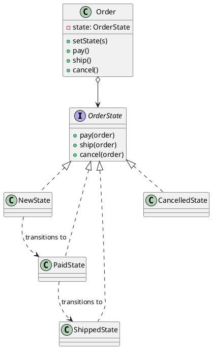
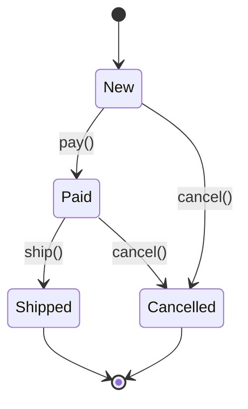

## Definition

The State Pattern allows an object to alter its behaviour when its internal state changes. The object will appear to change its class.

- Each state becomes a class; the context delegates every request to its current state object.
- The giant `switch (this.state)` that appears in every method disappears.

## When to Use?

- An object behaves differently depending on a state, and the conditionals for it are duplicated across many methods.
- The set of states and legal transitions is a real part of the domain (order life-cycle, document workflow, connection status).
- You want illegal transitions to be impossible rather than merely unlikely.

## Use-case Examples (Real-world Applications)

- Order status: `New → Paid → Shipped → Delivered`, with `Cancelled` reachable only from some of them
- TCP connections: `Closed`, `Listening`, `Established`
- Media players, vending machines, document approval workflows

## Structure



The state machine itself:



## Example

An order life-cycle. Each state implements only the transitions it allows, and
the context stays thin: it just forwards to the current state.

=== "Java"

    ```java
    public interface OrderState {
        default void pay(Order order) {
            throw new IllegalStateException("Cannot pay in state " + getClass().getSimpleName());
        }

        default void ship(Order order) {
            throw new IllegalStateException("Cannot ship in state " + getClass().getSimpleName());
        }

        default void cancel(Order order) {
            throw new IllegalStateException("Cannot cancel in state " + getClass().getSimpleName());
        }
    }

    public class NewState implements OrderState {
        @Override
        public void pay(Order order) {
            System.out.println("Payment received");
            order.setState(new PaidState());
        }

        @Override
        public void cancel(Order order) {
            order.setState(new CancelledState());
        }
    }

    public class PaidState implements OrderState {
        @Override
        public void ship(Order order) {
            System.out.println("Order handed to the carrier");
            order.setState(new ShippedState());
        }

        @Override
        public void cancel(Order order) {
            System.out.println("Refunding the customer");
            order.setState(new CancelledState());
        }
    }

    public class ShippedState implements OrderState {}
    public class CancelledState implements OrderState {}

    public class Order {
        private OrderState state = new NewState();

        void setState(OrderState state) {
            this.state = state;
        }

        public void pay() {
            state.pay(this);
        }

        public void ship() {
            state.ship(this);
        }

        public void cancel() {
            state.cancel(this);
        }
    }

    public class Main {
        public static void main(String[] args) {
            Order order = new Order();
            order.pay();    // Payment received
            order.ship();   // Order handed to the carrier
            order.cancel(); // IllegalStateException: Cannot cancel in state ShippedState
        }
    }
    ```

=== "C#"

    ```csharp
    public interface IOrderState
    {
        void Pay(Order order) =>
            throw new InvalidOperationException($"Cannot pay in state {GetType().Name}");

        void Ship(Order order) =>
            throw new InvalidOperationException($"Cannot ship in state {GetType().Name}");

        void Cancel(Order order) =>
            throw new InvalidOperationException($"Cannot cancel in state {GetType().Name}");
    }

    public class NewState : IOrderState
    {
        public void Pay(Order order)
        {
            Console.WriteLine("Payment received");
            order.SetState(new PaidState());
        }

        public void Cancel(Order order) => order.SetState(new CancelledState());
    }

    public class PaidState : IOrderState
    {
        public void Ship(Order order)
        {
            Console.WriteLine("Order handed to the carrier");
            order.SetState(new ShippedState());
        }

        public void Cancel(Order order)
        {
            Console.WriteLine("Refunding the customer");
            order.SetState(new CancelledState());
        }
    }

    public class ShippedState : IOrderState { }
    public class CancelledState : IOrderState { }

    public class Order
    {
        private IOrderState _state = new NewState();

        internal void SetState(IOrderState state) => _state = state;

        public void Pay() => _state.Pay(this);
        public void Ship() => _state.Ship(this);
        public void Cancel() => _state.Cancel(this);
    }

    var order = new Order();
    order.Pay();    // Payment received
    order.Ship();   // Order handed to the carrier
    order.Cancel(); // InvalidOperationException
    ```

=== "C++"

    ```cpp
    #include <iostream>
    #include <memory>
    #include <stdexcept>
    #include <string>

    class Order;

    class OrderState {
    public:
        virtual ~OrderState() = default;
        virtual std::string name() const = 0;

        virtual void pay(Order&) { reject("pay"); }
        virtual void ship(Order&) { reject("ship"); }
        virtual void cancel(Order&) { reject("cancel"); }

    protected:
        [[noreturn]] void reject(const std::string& action) const {
            throw std::logic_error("Cannot " + action + " in state " + name());
        }
    };

    class Order {
    public:
        Order();

        void setState(std::unique_ptr<OrderState> state) {
            state_ = std::move(state);
        }

        void pay() { state_->pay(*this); }
        void ship() { state_->ship(*this); }
        void cancel() { state_->cancel(*this); }

    private:
        std::unique_ptr<OrderState> state_;
    };

    class CancelledState : public OrderState {
    public:
        std::string name() const override { return "Cancelled"; }
    };

    class ShippedState : public OrderState {
    public:
        std::string name() const override { return "Shipped"; }
    };

    class PaidState : public OrderState {
    public:
        std::string name() const override { return "Paid"; }

        void ship(Order& order) override {
            std::cout << "Order handed to the carrier\n";
            order.setState(std::make_unique<ShippedState>());
        }

        void cancel(Order& order) override {
            std::cout << "Refunding the customer\n";
            order.setState(std::make_unique<CancelledState>());
        }
    };

    class NewState : public OrderState {
    public:
        std::string name() const override { return "New"; }

        void pay(Order& order) override {
            std::cout << "Payment received\n";
            order.setState(std::make_unique<PaidState>());
        }

        void cancel(Order& order) override {
            order.setState(std::make_unique<CancelledState>());
        }
    };

    Order::Order() : state_(std::make_unique<NewState>()) {}

    int main() {
        Order order;
        order.pay();    // Payment received
        order.ship();   // Order handed to the carrier
        order.cancel(); // throws: Cannot cancel in state Shipped
    }
    ```

=== "Python"

    ```python
    from abc import ABC


    class OrderState(ABC):
        def pay(self, order: "Order") -> None:
            raise RuntimeError(f"Cannot pay in state {type(self).__name__}")

        def ship(self, order: "Order") -> None:
            raise RuntimeError(f"Cannot ship in state {type(self).__name__}")

        def cancel(self, order: "Order") -> None:
            raise RuntimeError(f"Cannot cancel in state {type(self).__name__}")


    class NewState(OrderState):
        def pay(self, order: "Order") -> None:
            print("Payment received")
            order.state = PaidState()

        def cancel(self, order: "Order") -> None:
            order.state = CancelledState()


    class PaidState(OrderState):
        def ship(self, order: "Order") -> None:
            print("Order handed to the carrier")
            order.state = ShippedState()

        def cancel(self, order: "Order") -> None:
            print("Refunding the customer")
            order.state = CancelledState()


    class ShippedState(OrderState): ...


    class CancelledState(OrderState): ...


    class Order:
        def __init__(self) -> None:
            self.state: OrderState = NewState()

        def pay(self) -> None:
            self.state.pay(self)

        def ship(self) -> None:
            self.state.ship(self)

        def cancel(self) -> None:
            self.state.cancel(self)


    order = Order()
    order.pay()   # Payment received
    order.ship()  # Order handed to the carrier
    order.cancel()  # RuntimeError: Cannot cancel in state ShippedState
    ```

=== "Rust"

    ```rust
    // Returning the next state instead of mutating the context keeps every
    // transition explicit, and the compiler checks the match is exhaustive.
    #[derive(Debug)]
    enum Order {
        New,
        Paid,
        Shipped,
        Cancelled,
    }

    impl Order {
        fn pay(self) -> Result<Self, String> {
            match self {
                Order::New => {
                    println!("Payment received");
                    Ok(Order::Paid)
                }
                other => Err(format!("Cannot pay in state {other:?}")),
            }
        }

        fn ship(self) -> Result<Self, String> {
            match self {
                Order::Paid => {
                    println!("Order handed to the carrier");
                    Ok(Order::Shipped)
                }
                other => Err(format!("Cannot ship in state {other:?}")),
            }
        }

        fn cancel(self) -> Result<Self, String> {
            match self {
                Order::New => Ok(Order::Cancelled),
                Order::Paid => {
                    println!("Refunding the customer");
                    Ok(Order::Cancelled)
                }
                other => Err(format!("Cannot cancel in state {other:?}")),
            }
        }
    }

    fn main() {
        let order = Order::New.pay().unwrap().ship().unwrap();
        println!("{:?}", order.cancel()); // Err("Cannot cancel in state Shipped")
    }
    ```

=== "TypeScript"

    ```typescript
    interface OrderState {
      pay?(order: Order): void;
      ship?(order: Order): void;
      cancel?(order: Order): void;
      readonly name: string;
    }

    class NewState implements OrderState {
      readonly name = "New";

      pay(order: Order): void {
        console.log("Payment received");
        order.setState(new PaidState());
      }

      cancel(order: Order): void {
        order.setState(new CancelledState());
      }
    }

    class PaidState implements OrderState {
      readonly name = "Paid";

      ship(order: Order): void {
        console.log("Order handed to the carrier");
        order.setState(new ShippedState());
      }

      cancel(order: Order): void {
        console.log("Refunding the customer");
        order.setState(new CancelledState());
      }
    }

    class ShippedState implements OrderState {
      readonly name = "Shipped";
    }

    class CancelledState implements OrderState {
      readonly name = "Cancelled";
    }

    class Order {
      private state: OrderState = new NewState();

      setState(state: OrderState): void {
        this.state = state;
      }

      private run(action: "pay" | "ship" | "cancel"): void {
        const step = this.state[action];
        if (!step) throw new Error(`Cannot ${action} in state ${this.state.name}`);
        step.call(this.state, this);
      }

      pay(): void {
        this.run("pay");
      }

      ship(): void {
        this.run("ship");
      }

      cancel(): void {
        this.run("cancel");
      }
    }

    const order = new Order();
    order.pay();    // Payment received
    order.ship();   // Order handed to the carrier
    order.cancel(); // Error: Cannot cancel in state Shipped
    ```

Notice what the last line buys you: shipping an unpaid order or cancelling a delivered one is not a bug you have to remember to guard against, the transition simply does not exist.

Notice what the last line buys you: shipping an unpaid order or cancelling a delivered one is not a bug you have to remember to guard against, there is simply no method to call.

## Check Your Understanding

<quiz>
What does the State Pattern replace?

- [ ] A long constructor parameter list
- [x] Large conditionals on a state field, by giving each state its own class
> Correct. The context delegates to its current state object, and transitions are just a swap of that object.
- [ ] Direct instantiation of concrete classes
- [ ] Duplicate traversal code across collections
</quiz>
