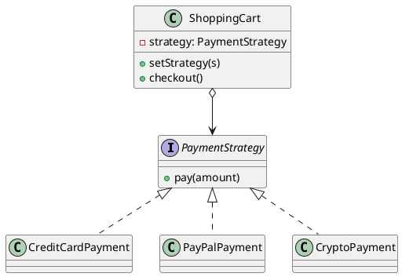

## Definition

The Strategy Pattern defines a family of algorithms, encapsulates each one, and makes them interchangeable. Strategy lets the algorithm vary independently from the clients that use it.

- It is the pattern behind the design principle *"favour composition over inheritance"*.
- A growing `if/else` or `switch` over "which way should I do this?" is the smell Strategy removes.

## When to Use?

- Several variants of an algorithm exist and the choice is made at runtime.
- You keep adding branches to a conditional that selects behaviour.
- You want the algorithm testable in isolation from the object that uses it.

## Use-case Examples (Real-world Applications)

- Sorting with a supplied `Comparator`
- Pricing and discount rules, tax calculation per country
- Route planning (car, bike, walking) in a maps application
- Compression: the same archiver writing ZIP, GZIP or nothing at all

## Structure



## Example

```java
public interface PaymentStrategy {
    void pay(double amount);
}
```

```java
public class CreditCardPayment implements PaymentStrategy {
    private final String cardNumber;

    public CreditCardPayment(String cardNumber) {
        this.cardNumber = cardNumber;
    }

    @Override
    public void pay(double amount) {
        System.out.println("Paid $" + amount + " with card ending "
                + cardNumber.substring(cardNumber.length() - 4));
    }
}

public class PayPalPayment implements PaymentStrategy {
    private final String email;

    public PayPalPayment(String email) {
        this.email = email;
    }

    @Override
    public void pay(double amount) {
        System.out.println("Paid $" + amount + " via PayPal account " + email);
    }
}
```

The context delegates instead of deciding:

```java
public class ShoppingCart {
    private PaymentStrategy strategy;
    private double total;

    public void add(double price) {
        total += price;
    }

    public void setPaymentStrategy(PaymentStrategy strategy) {
        this.strategy = strategy;
    }

    public void checkout() {
        if (strategy == null) {
            throw new IllegalStateException("No payment method selected");
        }
        strategy.pay(total);
        total = 0;
    }
}
```

```java
public class Main {
    public static void main(String[] args) {
        ShoppingCart cart = new ShoppingCart();
        cart.add(19.99);
        cart.add(5.01);

        cart.setPaymentStrategy(new PayPalPayment("user@example.com"));
        cart.checkout(); // Paid $25.0 via PayPal account user@example.com
    }
}
```

## In modern Java

When a strategy has a single method, a lambda often replaces the whole class hierarchy:

```java
cart.setPaymentStrategy(amount -> System.out.println("Paid $" + amount + " in cash"));
```

The pattern is unchanged, only the syntax got shorter. Keep named classes when the strategy carries state or deserves its own tests.

## Strategy vs. State

Both hold a reference to an interchangeable object. In Strategy the **client** picks the behaviour and the strategies do not know about each other; in the [State Pattern](State%20Pattern.md) the objects themselves decide the next transition.

## Check Your Understanding

<quiz>
What is the key idea behind the Strategy Pattern?

- [x] A family of interchangeable algorithms, each in its own class, selected at runtime
> Correct. The context depends on the strategy interface, so a new algorithm is a new class rather than another branch in a conditional.
- [ ] One object per state of the context
- [ ] A shared instance reused across the application
- [ ] A wrapper that adds behaviour around an existing object
</quiz>
