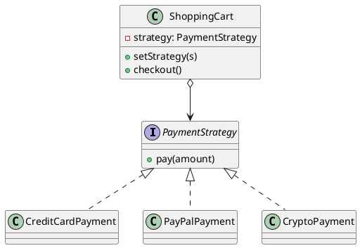

## Definition

The Strategy Pattern defines a family of algorithms, encapsulates each one, and makes them interchangeable. Strategy lets the algorithm vary independently from the clients that use it.

- It is the pattern behind the design principle *"favour composition over inheritance"*.
- A growing `if/else` or `switch` over "which way should I do this?" is the smell Strategy removes.

## When to Use?

- Several variants of an algorithm exist and the choice is made at runtime.
- You keep adding branches to a conditional that selects behaviour.
- You want the algorithm testable in isolation from the object that uses it.

## Use-case Examples (Real-world Applications)

- Sorting with a supplied `Comparator`
- Pricing and discount rules, tax calculation per country
- Route planning (car, bike, walking) in a maps application
- Compression: the same archiver writing ZIP, GZIP or nothing at all

## Structure



## Example

A shopping cart that delegates payment instead of branching on the payment type.

=== "Java"

    ```java
    public interface PaymentStrategy {
        void pay(double amount);
    }

    public class CreditCardPayment implements PaymentStrategy {
        private final String cardNumber;

        public CreditCardPayment(String cardNumber) {
            this.cardNumber = cardNumber;
        }

        @Override
        public void pay(double amount) {
            System.out.println("Paid $" + amount + " with card ending "
                    + cardNumber.substring(cardNumber.length() - 4));
        }
    }

    public class PayPalPayment implements PaymentStrategy {
        private final String email;

        public PayPalPayment(String email) {
            this.email = email;
        }

        @Override
        public void pay(double amount) {
            System.out.println("Paid $" + amount + " via PayPal account " + email);
        }
    }

    // The context delegates instead of deciding.
    public class ShoppingCart {
        private PaymentStrategy strategy;
        private double total;

        public void add(double price) {
            total += price;
        }

        public void setPaymentStrategy(PaymentStrategy strategy) {
            this.strategy = strategy;
        }

        public void checkout() {
            if (strategy == null) {
                throw new IllegalStateException("No payment method selected");
            }
            strategy.pay(total);
            total = 0;
        }
    }

    public class Main {
        public static void main(String[] args) {
            ShoppingCart cart = new ShoppingCart();
            cart.add(19.99);
            cart.add(5.01);

            cart.setPaymentStrategy(new PayPalPayment("user@example.com"));
            cart.checkout(); // Paid $25.0 via PayPal account user@example.com
        }
    }
    ```

=== "C#"

    ```csharp
    public interface IPaymentStrategy
    {
        void Pay(decimal amount);
    }

    public class CreditCardPayment : IPaymentStrategy
    {
        private readonly string _cardNumber;

        public CreditCardPayment(string cardNumber) => _cardNumber = cardNumber;

        public void Pay(decimal amount) =>
            Console.WriteLine($"Paid ${amount} with card ending {_cardNumber[^4..]}");
    }

    public class PayPalPayment : IPaymentStrategy
    {
        private readonly string _email;

        public PayPalPayment(string email) => _email = email;

        public void Pay(decimal amount) =>
            Console.WriteLine($"Paid ${amount} via PayPal account {_email}");
    }

    // The context delegates instead of deciding.
    public class ShoppingCart
    {
        private IPaymentStrategy? _strategy;
        private decimal _total;

        public void Add(decimal price) => _total += price;

        public void SetPaymentStrategy(IPaymentStrategy strategy) => _strategy = strategy;

        public void Checkout()
        {
            if (_strategy is null)
                throw new InvalidOperationException("No payment method selected");

            _strategy.Pay(_total);
            _total = 0;
        }
    }

    var cart = new ShoppingCart();
    cart.Add(19.99m);
    cart.Add(5.01m);

    cart.SetPaymentStrategy(new PayPalPayment("user@example.com"));
    cart.Checkout(); // Paid $25.00 via PayPal account user@example.com
    ```

=== "C++"

    ```cpp
    #include <functional>
    #include <iostream>
    #include <stdexcept>
    #include <string>

    // std::function is the lightest strategy holder when the interface is
    // a single operation.
    using PaymentStrategy = std::function<void(double)>;

    PaymentStrategy creditCard(std::string cardNumber) {
        return [card = std::move(cardNumber)](double amount) {
            std::cout << "Paid $" << amount << " with card ending "
                      << card.substr(card.size() - 4) << '\n';
        };
    }

    PaymentStrategy payPal(std::string email) {
        return [email = std::move(email)](double amount) {
            std::cout << "Paid $" << amount << " via PayPal account " << email << '\n';
        };
    }

    // The context delegates instead of deciding.
    class ShoppingCart {
    public:
        void add(double price) { total_ += price; }

        void setPaymentStrategy(PaymentStrategy strategy) {
            strategy_ = std::move(strategy);
        }

        void checkout() {
            if (!strategy_) throw std::logic_error("No payment method selected");
            strategy_(total_);
            total_ = 0;
        }

    private:
        PaymentStrategy strategy_;
        double total_ = 0;
    };

    int main() {
        ShoppingCart cart;
        cart.add(19.99);
        cart.add(5.01);

        cart.setPaymentStrategy(payPal("user@example.com"));
        cart.checkout(); // Paid $25 via PayPal account user@example.com
    }
    ```

=== "Python"

    ```python
    from typing import Callable, Protocol


    class PaymentStrategy(Protocol):
        def __call__(self, amount: float) -> None: ...


    def credit_card(card_number: str) -> PaymentStrategy:
        def pay(amount: float) -> None:
            print(f"Paid ${amount} with card ending {card_number[-4:]}")

        return pay


    def paypal(email: str) -> PaymentStrategy:
        def pay(amount: float) -> None:
            print(f"Paid ${amount} via PayPal account {email}")

        return pay


    # The context delegates instead of deciding.
    class ShoppingCart:
        def __init__(self) -> None:
            self._strategy: PaymentStrategy | None = None
            self._total = 0.0

        def add(self, price: float) -> None:
            self._total += price

        def set_payment_strategy(self, strategy: PaymentStrategy) -> None:
            self._strategy = strategy

        def checkout(self) -> None:
            if self._strategy is None:
                raise RuntimeError("No payment method selected")
            self._strategy(self._total)
            self._total = 0.0


    cart = ShoppingCart()
    cart.add(19.99)
    cart.add(5.01)

    cart.set_payment_strategy(paypal("user@example.com"))
    cart.checkout()  # Paid $25.0 via PayPal account user@example.com
    ```

=== "Rust"

    ```rust
    trait PaymentStrategy {
        fn pay(&self, amount: f64);
    }

    struct CreditCardPayment {
        card_number: String,
    }

    struct PayPalPayment {
        email: String,
    }

    impl PaymentStrategy for CreditCardPayment {
        fn pay(&self, amount: f64) {
            let last4 = &self.card_number[self.card_number.len() - 4..];
            println!("Paid ${amount} with card ending {last4}");
        }
    }

    impl PaymentStrategy for PayPalPayment {
        fn pay(&self, amount: f64) {
            println!("Paid ${amount} via PayPal account {}", self.email);
        }
    }

    // The context delegates instead of deciding.
    #[derive(Default)]
    struct ShoppingCart {
        strategy: Option<Box<dyn PaymentStrategy>>,
        total: f64,
    }

    impl ShoppingCart {
        fn add(&mut self, price: f64) {
            self.total += price;
        }

        fn set_payment_strategy(&mut self, strategy: Box<dyn PaymentStrategy>) {
            self.strategy = Some(strategy);
        }

        fn checkout(&mut self) -> Result<(), String> {
            let strategy = self
                .strategy
                .as_ref()
                .ok_or("No payment method selected")?;
            strategy.pay(self.total);
            self.total = 0.0;
            Ok(())
        }
    }

    fn main() {
        let mut cart = ShoppingCart::default();
        cart.add(19.99);
        cart.add(5.01);

        cart.set_payment_strategy(Box::new(PayPalPayment {
            email: "user@example.com".into(),
        }));
        cart.checkout().unwrap();
    }
    ```

=== "TypeScript"

    ```typescript
    interface PaymentStrategy {
      pay(amount: number): void;
    }

    class CreditCardPayment implements PaymentStrategy {
      constructor(private readonly cardNumber: string) {}

      pay(amount: number): void {
        console.log(`Paid $${amount} with card ending ${this.cardNumber.slice(-4)}`);
      }
    }

    class PayPalPayment implements PaymentStrategy {
      constructor(private readonly email: string) {}

      pay(amount: number): void {
        console.log(`Paid $${amount} via PayPal account ${this.email}`);
      }
    }

    // The context delegates instead of deciding.
    class ShoppingCart {
      private strategy?: PaymentStrategy;
      private total = 0;

      add(price: number): void {
        this.total += price;
      }

      setPaymentStrategy(strategy: PaymentStrategy): void {
        this.strategy = strategy;
      }

      checkout(): void {
        if (!this.strategy) throw new Error("No payment method selected");
        this.strategy.pay(this.total);
        this.total = 0;
      }
    }

    const cart = new ShoppingCart();
    cart.add(19.99);
    cart.add(5.01);

    cart.setPaymentStrategy(new PayPalPayment("user@example.com"));
    cart.checkout(); // Paid $25 via PayPal account user@example.com
    ```

## In modern Java

When a strategy has a single method, a lambda often replaces the whole class hierarchy:

```java
cart.setPaymentStrategy(amount -> System.out.println("Paid $" + amount + " in cash"));
```

The pattern is unchanged, only the syntax got shorter. Keep named classes when the strategy carries state or deserves its own tests.

## Strategy vs. State

Both hold a reference to an interchangeable object. In Strategy the **client** picks the behaviour and the strategies do not know about each other; in the [State Pattern](State%20Pattern.md) the objects themselves decide the next transition.

## Check Your Understanding

<quiz>
What is the key idea behind the Strategy Pattern?

- [x] A family of interchangeable algorithms, each in its own class, selected at runtime
> Correct. The context depends on the strategy interface, so a new algorithm is a new class rather than another branch in a conditional.
- [ ] One object per state of the context
- [ ] A shared instance reused across the application
- [ ] A wrapper that adds behaviour around an existing object
</quiz>
