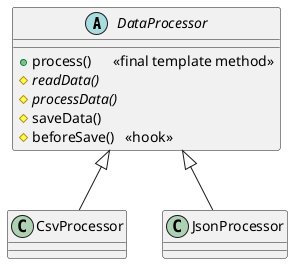

## Definition

The Template Method Pattern defines the skeleton of an algorithm in a method, deferring some steps to subclasses. Template Method lets subclasses redefine certain steps of an algorithm without changing the algorithm's structure.

- The base class owns the **order**; subclasses own the **details**.
- This is the *Hollywood Principle*: "don't call us, we'll call you", the framework calls your step, not the other way round.

## When to Use?

- Several classes carry out the same sequence of steps, differing only in a few of them.
- You are copy-pasting a method and changing two lines in the middle.
- You want to lock down the order of steps so subclasses cannot break the invariant.

## Use-case Examples (Real-world Applications)

- Data importers: open → parse → validate → save → close, where only *parse* differs per format
- Test frameworks with `setUp()` / `tearDown()` hooks
- Servlet's `service()` dispatching to `doGet()` / `doPost()`
- Build pipelines and any "lifecycle" API

## Structure



## Example

A data-import pipeline: the base class fixes the order of the steps, subclasses
fill in the format-specific ones, and `beforeSave` is an optional hook.

=== "Java"

    ```java
    public abstract class DataProcessor {

        // The template method: final, so subclasses cannot reorder the steps.
        public final void process(String path) {
            String raw = readData(path);
            String result = processData(raw);
            beforeSave(result);
            saveData(result);
        }

        protected abstract String readData(String path);

        protected abstract String processData(String raw);

        // A default step subclasses usually keep.
        protected void saveData(String data) {
            System.out.println("Saving to the database: " + data);
        }

        // A hook: optional, does nothing unless overridden.
        protected void beforeSave(String data) {
        }
    }

    public class CsvProcessor extends DataProcessor {
        @Override
        protected String readData(String path) {
            System.out.println("Reading CSV from " + path);
            return "a,b,c";
        }

        @Override
        protected String processData(String raw) {
            return String.join(" | ", raw.split(","));
        }
    }

    public class JsonProcessor extends DataProcessor {
        @Override
        protected String readData(String path) {
            System.out.println("Reading JSON from " + path);
            return "{\"a\":1}";
        }

        @Override
        protected String processData(String raw) {
            return raw.replace("\"", "");
        }

        @Override
        protected void beforeSave(String data) {
            System.out.println("Validating JSON output");
        }
    }

    public class Main {
        public static void main(String[] args) {
            new CsvProcessor().process("data.csv");
            new JsonProcessor().process("data.json");
        }
    }
    ```

=== "C#"

    ```csharp
    public abstract class DataProcessor
    {
        // Not virtual: subclasses cannot reorder the steps.
        public void Process(string path)
        {
            var raw = ReadData(path);
            var result = ProcessData(raw);
            BeforeSave(result);
            SaveData(result);
        }

        protected abstract string ReadData(string path);

        protected abstract string ProcessData(string raw);

        // A default step subclasses usually keep.
        protected virtual void SaveData(string data) =>
            Console.WriteLine($"Saving to the database: {data}");

        // A hook: optional, does nothing unless overridden.
        protected virtual void BeforeSave(string data) { }
    }

    public class CsvProcessor : DataProcessor
    {
        protected override string ReadData(string path)
        {
            Console.WriteLine($"Reading CSV from {path}");
            return "a,b,c";
        }

        protected override string ProcessData(string raw) =>
            string.Join(" | ", raw.Split(','));
    }

    public class JsonProcessor : DataProcessor
    {
        protected override string ReadData(string path)
        {
            Console.WriteLine($"Reading JSON from {path}");
            return "{\"a\":1}";
        }

        protected override string ProcessData(string raw) => raw.Replace("\"", "");

        protected override void BeforeSave(string data) =>
            Console.WriteLine("Validating JSON output");
    }

    new CsvProcessor().Process("data.csv");
    new JsonProcessor().Process("data.json");
    ```

=== "C++"

    ```cpp
    #include <iostream>
    #include <sstream>
    #include <string>

    class DataProcessor {
    public:
        virtual ~DataProcessor() = default;

        // Non-virtual public interface: the order of steps is fixed here.
        void process(const std::string& path) {
            const std::string raw = readData(path);
            const std::string result = processData(raw);
            beforeSave(result);
            saveData(result);
        }

    protected:
        virtual std::string readData(const std::string& path) = 0;
        virtual std::string processData(const std::string& raw) = 0;

        // A default step subclasses usually keep.
        virtual void saveData(const std::string& data) {
            std::cout << "Saving to the database: " << data << '\n';
        }

        // A hook: optional, does nothing unless overridden.
        virtual void beforeSave(const std::string&) {}
    };

    class CsvProcessor : public DataProcessor {
    protected:
        std::string readData(const std::string& path) override {
            std::cout << "Reading CSV from " << path << '\n';
            return "a,b,c";
        }

        std::string processData(const std::string& raw) override {
            std::string out;
            std::istringstream stream(raw);
            for (std::string field; std::getline(stream, field, ',');) {
                if (!out.empty()) out += " | ";
                out += field;
            }
            return out;
        }
    };

    class JsonProcessor : public DataProcessor {
    protected:
        std::string readData(const std::string& path) override {
            std::cout << "Reading JSON from " << path << '\n';
            return R"({"a":1})";
        }

        std::string processData(const std::string& raw) override {
            std::string out;
            for (char c : raw) {
                if (c != '"') out += c;
            }
            return out;
        }

        void beforeSave(const std::string&) override {
            std::cout << "Validating JSON output\n";
        }
    };

    int main() {
        CsvProcessor().process("data.csv");
        JsonProcessor().process("data.json");
    }
    ```

=== "Python"

    ```python
    from abc import ABC, abstractmethod


    class DataProcessor(ABC):
        # The template method: subclasses override steps, not this.
        def process(self, path: str) -> None:
            raw = self.read_data(path)
            result = self.process_data(raw)
            self.before_save(result)
            self.save_data(result)

        @abstractmethod
        def read_data(self, path: str) -> str: ...

        @abstractmethod
        def process_data(self, raw: str) -> str: ...

        # A default step subclasses usually keep.
        def save_data(self, data: str) -> None:
            print(f"Saving to the database: {data}")

        # A hook: optional, does nothing unless overridden.
        def before_save(self, data: str) -> None:
            pass


    class CsvProcessor(DataProcessor):
        def read_data(self, path: str) -> str:
            print(f"Reading CSV from {path}")
            return "a,b,c"

        def process_data(self, raw: str) -> str:
            return " | ".join(raw.split(","))


    class JsonProcessor(DataProcessor):
        def read_data(self, path: str) -> str:
            print(f"Reading JSON from {path}")
            return '{"a":1}'

        def process_data(self, raw: str) -> str:
            return raw.replace('"', "")

        def before_save(self, data: str) -> None:
            print("Validating JSON output")


    CsvProcessor().process("data.csv")
    JsonProcessor().process("data.json")
    ```

=== "Rust"

    ```rust
    // Rust has no inheritance, so the template method is a provided method on
    // the trait and the varying steps are the required ones.
    trait DataProcessor {
        fn read_data(&self, path: &str) -> String;
        fn process_data(&self, raw: &str) -> String;

        // A default step implementors usually keep.
        fn save_data(&self, data: &str) {
            println!("Saving to the database: {data}");
        }

        // A hook: optional, does nothing unless overridden.
        fn before_save(&self, _data: &str) {}

        // The template method: implementors do not override this.
        fn process(&self, path: &str) {
            let raw = self.read_data(path);
            let result = self.process_data(&raw);
            self.before_save(&result);
            self.save_data(&result);
        }
    }

    struct CsvProcessor;
    struct JsonProcessor;

    impl DataProcessor for CsvProcessor {
        fn read_data(&self, path: &str) -> String {
            println!("Reading CSV from {path}");
            "a,b,c".to_string()
        }

        fn process_data(&self, raw: &str) -> String {
            raw.split(',').collect::<Vec<_>>().join(" | ")
        }
    }

    impl DataProcessor for JsonProcessor {
        fn read_data(&self, path: &str) -> String {
            println!("Reading JSON from {path}");
            r#"{"a":1}"#.to_string()
        }

        fn process_data(&self, raw: &str) -> String {
            raw.replace('"', "")
        }

        fn before_save(&self, _data: &str) {
            println!("Validating JSON output");
        }
    }

    fn main() {
        CsvProcessor.process("data.csv");
        JsonProcessor.process("data.json");
    }
    ```

=== "TypeScript"

    ```typescript
    abstract class DataProcessor {
      // The template method: subclasses override steps, not this.
      process(path: string): void {
        const raw = this.readData(path);
        const result = this.processData(raw);
        this.beforeSave(result);
        this.saveData(result);
      }

      protected abstract readData(path: string): string;

      protected abstract processData(raw: string): string;

      // A default step subclasses usually keep.
      protected saveData(data: string): void {
        console.log(`Saving to the database: ${data}`);
      }

      // A hook: optional, does nothing unless overridden.
      protected beforeSave(data: string): void {}
    }

    class CsvProcessor extends DataProcessor {
      protected readData(path: string): string {
        console.log(`Reading CSV from ${path}`);
        return "a,b,c";
      }

      protected processData(raw: string): string {
        return raw.split(",").join(" | ");
      }
    }

    class JsonProcessor extends DataProcessor {
      protected readData(path: string): string {
        console.log(`Reading JSON from ${path}`);
        return '{"a":1}';
      }

      protected processData(raw: string): string {
        return raw.replaceAll('"', "");
      }

      protected beforeSave(data: string): void {
        console.log("Validating JSON output");
      }
    }

    new CsvProcessor().process("data.csv");
    new JsonProcessor().process("data.json");
    ```

## Template Method vs. Strategy

They solve the same problem with different tools:

| | Template Method | Strategy |
|---|---|---|
| Mechanism | Inheritance | Composition |
| Varies | A few steps inside a fixed algorithm | The whole algorithm |
| Bound | At compile time | At runtime, swappable |

Prefer [Strategy](Strategy%20Pattern.md) when the variation must change while the program runs, or when subclassing would force you into an awkward hierarchy.

## Check Your Understanding

<quiz>
What does a Template Method define?

- [x] The skeleton of an algorithm in a base class, leaving specific steps to subclasses
> Correct. The order of the steps is fixed in the base class; subclasses override only the steps that differ.
- [ ] A separate object for each algorithm, chosen at runtime
- [ ] A single interface over several subsystems
- [ ] A clone of a configured prototype object
</quiz>
