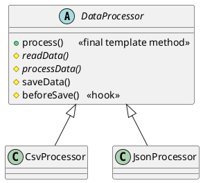

## Definition

The Template Method Pattern defines the skeleton of an algorithm in a method, deferring some steps to subclasses. Template Method lets subclasses redefine certain steps of an algorithm without changing the algorithm's structure.

- The base class owns the **order**; subclasses own the **details**.
- This is the *Hollywood Principle*: "don't call us, we'll call you", the framework calls your step, not the other way round.

## When to Use?

- Several classes carry out the same sequence of steps, differing only in a few of them.
- You are copy-pasting a method and changing two lines in the middle.
- You want to lock down the order of steps so subclasses cannot break the invariant.

## Use-case Examples (Real-world Applications)

- Data importers: open → parse → validate → save → close, where only *parse* differs per format
- Test frameworks with `setUp()` / `tearDown()` hooks
- Servlet's `service()` dispatching to `doGet()` / `doPost()`
- Build pipelines and any "lifecycle" API

## Structure



## Example

```java
public abstract class DataProcessor {

    // The template method: final, so subclasses cannot reorder the steps.
    public final void process(String path) {
        String raw = readData(path);
        String result = processData(raw);
        beforeSave(result);
        saveData(result);
    }

    protected abstract String readData(String path);

    protected abstract String processData(String raw);

    // A default step subclasses usually keep.
    protected void saveData(String data) {
        System.out.println("Saving to the database: " + data);
    }

    // A hook: optional, does nothing unless overridden.
    protected void beforeSave(String data) {
    }
}
```

```java
public class CsvProcessor extends DataProcessor {
    @Override
    protected String readData(String path) {
        System.out.println("Reading CSV from " + path);
        return "a,b,c";
    }

    @Override
    protected String processData(String raw) {
        return String.join(" | ", raw.split(","));
    }
}

public class JsonProcessor extends DataProcessor {
    @Override
    protected String readData(String path) {
        System.out.println("Reading JSON from " + path);
        return "{\"a\":1}";
    }

    @Override
    protected String processData(String raw) {
        return raw.replace("\"", "");
    }

    @Override
    protected void beforeSave(String data) {
        System.out.println("Validating JSON output");
    }
}
```

```java
public class Main {
    public static void main(String[] args) {
        new CsvProcessor().process("data.csv");
        new JsonProcessor().process("data.json");
    }
}
```

## Template Method vs. Strategy

They solve the same problem with different tools:

| | Template Method | Strategy |
|---|---|---|
| Mechanism | Inheritance | Composition |
| Varies | A few steps inside a fixed algorithm | The whole algorithm |
| Bound | At compile time | At runtime, swappable |

Prefer [Strategy](Strategy%20Pattern.md) when the variation must change while the program runs, or when subclassing would force you into an awkward hierarchy.
