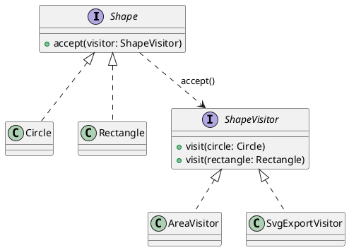

## Definition

The Visitor Pattern represents an operation to be performed on the elements of an object structure. Visitor lets you define a new operation without changing the classes of the elements on which it operates.

- It moves behaviour *out* of a class hierarchy and into a separate visitor class.
- It works through **double dispatch**: `element.accept(visitor)` then `visitor.visit(this)`, the second call resolves the concrete element type.

## When to Use?

- A stable class hierarchy needs a growing set of unrelated operations (export, validate, price, render, optimize).
- Those operations would otherwise pollute the element classes with concerns they should not know about.
- You need to accumulate state across a whole structure while traversing it.

## Use-case Examples (Real-world Applications)

- Compilers walking an AST: type checking, optimization and code generation are three visitors over one tree
- Exporting a shape/document model to SVG, PDF and JSON
- Static analysis tools

## Structure



## Example

The elements know only how to accept a visitor:

```java
public interface Shape {
    void accept(ShapeVisitor visitor);
}

public class Circle implements Shape {
    public final double radius;

    public Circle(double radius) {
        this.radius = radius;
    }

    @Override
    public void accept(ShapeVisitor visitor) {
        visitor.visit(this); // "this" is statically a Circle here, double dispatch
    }
}

public class Rectangle implements Shape {
    public final double width;
    public final double height;

    public Rectangle(double width, double height) {
        this.width = width;
        this.height = height;
    }

    @Override
    public void accept(ShapeVisitor visitor) {
        visitor.visit(this);
    }
}
```

One visitor per operation:

```java
public interface ShapeVisitor {
    void visit(Circle circle);
    void visit(Rectangle rectangle);
}

public class AreaVisitor implements ShapeVisitor {
    private double total;

    public void visit(Circle circle) {
        total += Math.PI * circle.radius * circle.radius;
    }

    public void visit(Rectangle rectangle) {
        total += rectangle.width * rectangle.height;
    }

    public double getTotal() {
        return total;
    }
}

public class SvgExportVisitor implements ShapeVisitor {
    public void visit(Circle circle) {
        System.out.println("<circle r=\"" + circle.radius + "\"/>");
    }

    public void visit(Rectangle rectangle) {
        System.out.println("<rect width=\"" + rectangle.width
                + "\" height=\"" + rectangle.height + "\"/>");
    }
}
```

```java
import java.util.List;

public class Main {
    public static void main(String[] args) {
        List<Shape> shapes = List.of(new Circle(1), new Rectangle(2, 3));

        AreaVisitor area = new AreaVisitor();
        shapes.forEach(shape -> shape.accept(area));
        System.out.println(area.getTotal()); // 9.14159...

        SvgExportVisitor svg = new SvgExportVisitor();
        shapes.forEach(shape -> shape.accept(svg));
    }
}
```

Adding a `PerimeterVisitor` touches no existing class. Adding a `Triangle` touches **every** visitor, that is the trade the pattern makes, and the reason it only pays off when the element hierarchy is stable.

## In modern Java

Sealed interfaces with pattern-matching `switch` give the same "operations outside the hierarchy" benefit with far less ceremony, and the compiler catches the missing case:

```java
sealed interface Shape permits Circle, Rectangle {}

static double area(Shape shape) {
    return switch (shape) {
        case Circle c -> Math.PI * c.radius() * c.radius();
        case Rectangle r -> r.width() * r.height();
    };
}
```

Reach for classic Visitor when the language lacks exhaustive pattern matching, or when the traversal itself is complex enough to deserve its own object.
