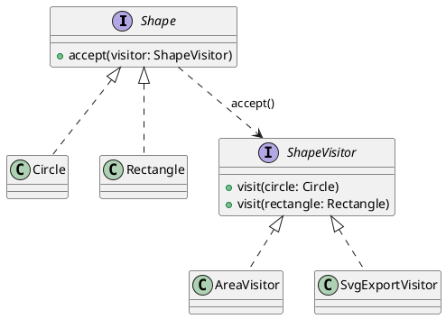

## Definition

The Visitor Pattern represents an operation to be performed on the elements of an object structure. Visitor lets you define a new operation without changing the classes of the elements on which it operates.

- It moves behaviour *out* of a class hierarchy and into a separate visitor class.
- It works through **double dispatch**: `element.accept(visitor)` then `visitor.visit(this)`, the second call resolves the concrete element type.

## When to Use?

- A stable class hierarchy needs a growing set of unrelated operations (export, validate, price, render, optimize).
- Those operations would otherwise pollute the element classes with concerns they should not know about.
- You need to accumulate state across a whole structure while traversing it.

## Use-case Examples (Real-world Applications)

- Compilers walking an AST: type checking, optimization and code generation are three visitors over one tree
- Exporting a shape/document model to SVG, PDF and JSON
- Static analysis tools

## Structure



## Example

The elements know only how to accept a visitor; each operation is one visitor.

=== "Java"

    ```java
    import java.util.List;

    public interface Shape {
        void accept(ShapeVisitor visitor);
    }

    public class Circle implements Shape {
        public final double radius;

        public Circle(double radius) {
            this.radius = radius;
        }

        @Override
        public void accept(ShapeVisitor visitor) {
            visitor.visit(this); // "this" is statically a Circle here, double dispatch
        }
    }

    public class Rectangle implements Shape {
        public final double width;
        public final double height;

        public Rectangle(double width, double height) {
            this.width = width;
            this.height = height;
        }

        @Override
        public void accept(ShapeVisitor visitor) {
            visitor.visit(this);
        }
    }

    public interface ShapeVisitor {
        void visit(Circle circle);
        void visit(Rectangle rectangle);
    }

    public class AreaVisitor implements ShapeVisitor {
        private double total;

        public void visit(Circle circle) {
            total += Math.PI * circle.radius * circle.radius;
        }

        public void visit(Rectangle rectangle) {
            total += rectangle.width * rectangle.height;
        }

        public double getTotal() {
            return total;
        }
    }

    public class SvgExportVisitor implements ShapeVisitor {
        public void visit(Circle circle) {
            System.out.println("<circle r=\"" + circle.radius + "\"/>");
        }

        public void visit(Rectangle rectangle) {
            System.out.println("<rect width=\"" + rectangle.width
                    + "\" height=\"" + rectangle.height + "\"/>");
        }
    }

    public class Main {
        public static void main(String[] args) {
            List<Shape> shapes = List.of(new Circle(1), new Rectangle(2, 3));

            AreaVisitor area = new AreaVisitor();
            shapes.forEach(shape -> shape.accept(area));
            System.out.println(area.getTotal()); // 9.14159...

            SvgExportVisitor svg = new SvgExportVisitor();
            shapes.forEach(shape -> shape.accept(svg));
        }
    }
    ```

=== "C#"

    ```csharp
    public interface IShape
    {
        void Accept(IShapeVisitor visitor);
    }

    public class Circle : IShape
    {
        public Circle(double radius) => Radius = radius;

        public double Radius { get; }

        // "this" is statically a Circle here, double dispatch.
        public void Accept(IShapeVisitor visitor) => visitor.Visit(this);
    }

    public class Rectangle : IShape
    {
        public Rectangle(double width, double height) => (Width, Height) = (width, height);

        public double Width { get; }
        public double Height { get; }

        public void Accept(IShapeVisitor visitor) => visitor.Visit(this);
    }

    public interface IShapeVisitor
    {
        void Visit(Circle circle);
        void Visit(Rectangle rectangle);
    }

    public class AreaVisitor : IShapeVisitor
    {
        public double Total { get; private set; }

        public void Visit(Circle circle) => Total += Math.PI * circle.Radius * circle.Radius;

        public void Visit(Rectangle rectangle) => Total += rectangle.Width * rectangle.Height;
    }

    public class SvgExportVisitor : IShapeVisitor
    {
        public void Visit(Circle circle) => Console.WriteLine($"<circle r=\"{circle.Radius}\"/>");

        public void Visit(Rectangle rectangle) =>
            Console.WriteLine($"<rect width=\"{rectangle.Width}\" height=\"{rectangle.Height}\"/>");
    }

    var shapes = new List<IShape> { new Circle(1), new Rectangle(2, 3) };

    var area = new AreaVisitor();
    shapes.ForEach(shape => shape.Accept(area));
    Console.WriteLine(area.Total); // 9.14159...

    var svg = new SvgExportVisitor();
    shapes.ForEach(shape => shape.Accept(svg));
    ```

=== "C++"

    ```cpp
    #include <iostream>
    #include <memory>
    #include <numbers>
    #include <vector>

    class Circle;
    class Rectangle;

    class ShapeVisitor {
    public:
        virtual ~ShapeVisitor() = default;
        virtual void visit(const Circle& circle) = 0;
        virtual void visit(const Rectangle& rectangle) = 0;
    };

    class Shape {
    public:
        virtual ~Shape() = default;
        virtual void accept(ShapeVisitor& visitor) const = 0;
    };

    class Circle : public Shape {
    public:
        explicit Circle(double radius) : radius(radius) {}

        double radius;

        // *this is statically a Circle here, double dispatch.
        void accept(ShapeVisitor& visitor) const override { visitor.visit(*this); }
    };

    class Rectangle : public Shape {
    public:
        Rectangle(double width, double height) : width(width), height(height) {}

        double width;
        double height;

        void accept(ShapeVisitor& visitor) const override { visitor.visit(*this); }
    };

    class AreaVisitor : public ShapeVisitor {
    public:
        void visit(const Circle& circle) override {
            total += std::numbers::pi * circle.radius * circle.radius;
        }

        void visit(const Rectangle& rectangle) override {
            total += rectangle.width * rectangle.height;
        }

        double total = 0;
    };

    class SvgExportVisitor : public ShapeVisitor {
    public:
        void visit(const Circle& circle) override {
            std::cout << "<circle r=\"" << circle.radius << "\"/>\n";
        }

        void visit(const Rectangle& rectangle) override {
            std::cout << "<rect width=\"" << rectangle.width << "\" height=\""
                      << rectangle.height << "\"/>\n";
        }
    };

    int main() {
        std::vector<std::unique_ptr<Shape>> shapes;
        shapes.push_back(std::make_unique<Circle>(1));
        shapes.push_back(std::make_unique<Rectangle>(2, 3));

        AreaVisitor area;
        for (const auto& shape : shapes) shape->accept(area);
        std::cout << area.total << '\n'; // 9.14159...

        SvgExportVisitor svg;
        for (const auto& shape : shapes) shape->accept(svg);
    }
    ```

=== "Python"

    ```python
    import math
    from abc import ABC, abstractmethod


    class ShapeVisitor(ABC):
        @abstractmethod
        def visit_circle(self, circle: "Circle") -> None: ...

        @abstractmethod
        def visit_rectangle(self, rectangle: "Rectangle") -> None: ...


    class Shape(ABC):
        @abstractmethod
        def accept(self, visitor: ShapeVisitor) -> None: ...


    class Circle(Shape):
        def __init__(self, radius: float) -> None:
            self.radius = radius

        # Python has no overloading, so the method name carries the type.
        def accept(self, visitor: ShapeVisitor) -> None:
            visitor.visit_circle(self)


    class Rectangle(Shape):
        def __init__(self, width: float, height: float) -> None:
            self.width = width
            self.height = height

        def accept(self, visitor: ShapeVisitor) -> None:
            visitor.visit_rectangle(self)


    class AreaVisitor(ShapeVisitor):
        def __init__(self) -> None:
            self.total = 0.0

        def visit_circle(self, circle: Circle) -> None:
            self.total += math.pi * circle.radius**2

        def visit_rectangle(self, rectangle: Rectangle) -> None:
            self.total += rectangle.width * rectangle.height


    class SvgExportVisitor(ShapeVisitor):
        def visit_circle(self, circle: Circle) -> None:
            print(f'<circle r="{circle.radius}"/>')

        def visit_rectangle(self, rectangle: Rectangle) -> None:
            print(f'<rect width="{rectangle.width}" height="{rectangle.height}"/>')


    shapes: list[Shape] = [Circle(1), Rectangle(2, 3)]

    area = AreaVisitor()
    for shape in shapes:
        shape.accept(area)
    print(area.total)  # 9.14159...

    svg = SvgExportVisitor()
    for shape in shapes:
        shape.accept(svg)
    ```

=== "Rust"

    ```rust
    use std::f64::consts::PI;

    struct Circle {
        radius: f64,
    }

    struct Rectangle {
        width: f64,
        height: f64,
    }

    trait ShapeVisitor {
        fn visit_circle(&mut self, circle: &Circle);
        fn visit_rectangle(&mut self, rectangle: &Rectangle);
    }

    trait Shape {
        fn accept(&self, visitor: &mut dyn ShapeVisitor);
    }

    impl Shape for Circle {
        fn accept(&self, visitor: &mut dyn ShapeVisitor) {
            visitor.visit_circle(self); // self is statically a Circle here
        }
    }

    impl Shape for Rectangle {
        fn accept(&self, visitor: &mut dyn ShapeVisitor) {
            visitor.visit_rectangle(self);
        }
    }

    #[derive(Default)]
    struct AreaVisitor {
        total: f64,
    }

    impl ShapeVisitor for AreaVisitor {
        fn visit_circle(&mut self, circle: &Circle) {
            self.total += PI * circle.radius * circle.radius;
        }

        fn visit_rectangle(&mut self, rectangle: &Rectangle) {
            self.total += rectangle.width * rectangle.height;
        }
    }

    struct SvgExportVisitor;

    impl ShapeVisitor for SvgExportVisitor {
        fn visit_circle(&mut self, circle: &Circle) {
            println!("<circle r=\"{}\"/>", circle.radius);
        }

        fn visit_rectangle(&mut self, rectangle: &Rectangle) {
            println!(
                "<rect width=\"{}\" height=\"{}\"/>",
                rectangle.width, rectangle.height
            );
        }
    }

    fn main() {
        let shapes: Vec<Box<dyn Shape>> =
            vec![Box::new(Circle { radius: 1.0 }), Box::new(Rectangle { width: 2.0, height: 3.0 })];

        let mut area = AreaVisitor::default();
        for shape in &shapes {
            shape.accept(&mut area);
        }
        println!("{}", area.total); // 9.14159...

        let mut svg = SvgExportVisitor;
        for shape in &shapes {
            shape.accept(&mut svg);
        }
    }
    ```

=== "TypeScript"

    ```typescript
    interface ShapeVisitor {
      visitCircle(circle: Circle): void;
      visitRectangle(rectangle: Rectangle): void;
    }

    interface Shape {
      accept(visitor: ShapeVisitor): void;
    }

    class Circle implements Shape {
      constructor(readonly radius: number) {}

      // No overloading in TypeScript, so the method name carries the type.
      accept(visitor: ShapeVisitor): void {
        visitor.visitCircle(this);
      }
    }

    class Rectangle implements Shape {
      constructor(
        readonly width: number,
        readonly height: number,
      ) {}

      accept(visitor: ShapeVisitor): void {
        visitor.visitRectangle(this);
      }
    }

    class AreaVisitor implements ShapeVisitor {
      total = 0;

      visitCircle(circle: Circle): void {
        this.total += Math.PI * circle.radius ** 2;
      }

      visitRectangle(rectangle: Rectangle): void {
        this.total += rectangle.width * rectangle.height;
      }
    }

    class SvgExportVisitor implements ShapeVisitor {
      visitCircle(circle: Circle): void {
        console.log(`<circle r="${circle.radius}"/>`);
      }

      visitRectangle(rectangle: Rectangle): void {
        console.log(`<rect width="${rectangle.width}" height="${rectangle.height}"/>`);
      }
    }

    const shapes: Shape[] = [new Circle(1), new Rectangle(2, 3)];

    const area = new AreaVisitor();
    shapes.forEach((shape) => shape.accept(area));
    console.log(area.total); // 9.14159...

    const svg = new SvgExportVisitor();
    shapes.forEach((shape) => shape.accept(svg));
    ```

Adding a `PerimeterVisitor` touches no existing class. Adding a `Triangle` touches **every** visitor, that is the trade the pattern makes, and the reason it only pays off when the element hierarchy is stable.

Adding a `PerimeterVisitor` touches no existing class. Adding a `Triangle` touches **every** visitor, that is the trade the pattern makes, and the reason it only pays off when the element hierarchy is stable.

## In modern Java

Sealed interfaces with pattern-matching `switch` give the same "operations outside the hierarchy" benefit with far less ceremony, and the compiler catches the missing case:

```java
sealed interface Shape permits Circle, Rectangle {}

static double area(Shape shape) {
    return switch (shape) {
        case Circle c -> Math.PI * c.radius() * c.radius();
        case Rectangle r -> r.width() * r.height();
    };
}
```

Reach for classic Visitor when the language lacks exhaustive pattern matching, or when the traversal itself is complex enough to deserve its own object.

## Check Your Understanding

<quiz>
Why would you use the Visitor Pattern?

- [x] To add new operations over an object structure without modifying the classes in it
> Correct. The operation moves into a visitor, and each element accepts it, the trade-off is that adding a new element type means touching every visitor.
- [ ] To traverse a collection without exposing its representation
- [ ] To restore an object to an earlier state
- [ ] To control access to an expensive object
</quiz>
