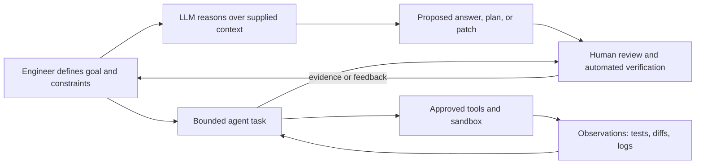
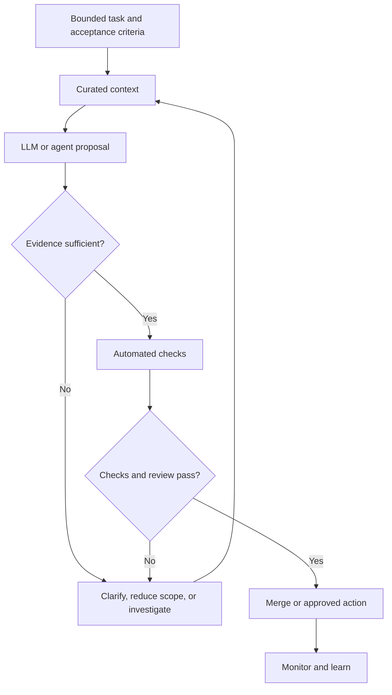

# AI in Software Methods

Large language models (LLMs) and AI agents are changing *how* software teams explore, write, test, review, and operate software. They do not replace a software methodology. They are tools within one: their output still needs a product goal, a clear definition of done, review, tests, security controls, and ownership.

The productive question is not “can AI write this?” It is: **which part of this workflow benefits from faster exploration, and what evidence will make the result trustworthy?**

## LLMs, assistants, and agents

An **LLM** generates or transforms text, code, and structured data from the context it receives. A chat or coding assistant normally waits for a person to ask, then proposes an answer. An **agent** gives a model a goal and tools—such as a repository search, test runner, issue tracker, browser, or deployment API—so it can perform a sequence of actions, observe results, and decide its next step.



An agent is not inherently more intelligent than an assistant. It has more opportunity to affect the world, so its scope, permissions, and verification need stronger controls.

| Capability | Typical input | Useful output | Main limitation |
| --- | --- | --- | --- |
| LLM chat | Question, examples, pasted context | Explanation, outline, alternatives | It cannot see facts not in its context |
| Code assistant | Repository context and a focused task | Draft code, tests, refactoring | A compiling diff can still be wrong |
| Retrieval-augmented assistant | Question plus approved documents | Grounded answer with sources | Retrieval can be incomplete or stale |
| Tool-using agent | Goal, tools, guardrails, feedback | Multi-step investigation or implementation | Tool errors, bad assumptions, and scope drift compound |

## Where AI helps in the software lifecycle

AI is strongest when the work has a reviewable artifact and a fast feedback loop. It is less reliable when the task depends on missing business context, ambiguous values, or irreversible actions.

| Lifecycle activity | Helpful uses | Required human responsibility |
| --- | --- | --- |
| Discovery | Summarize interviews, draft questions, cluster feedback, identify ambiguous terms | Validate that summaries preserve stakeholder intent; make product trade-offs |
| Requirements | Turn examples into acceptance criteria; find missing edge cases | Decide the rule, priority, and policy; do not confuse a plausible requirement with an approved one |
| Design | Compare patterns, draft diagrams, explore failure modes, generate ADR templates | Choose architecture from real constraints; assess security, cost, operations, and ownership |
| Implementation | Explain unfamiliar code, scaffold routine changes, translate APIs, refactor with tests | Own correctness, interfaces, dependency choices, and maintainability |
| Testing | Generate boundary cases, test data, mocks, test outlines, and failure hypotheses | Judge test oracles and coverage; ensure tests test the requirement rather than the generated implementation |
| Review | Summarize diffs, spot conventions, suggest risk areas | Review security, domain correctness, unintended behavior, and repository-wide impact |
| Operations | Classify alerts, query logs, draft runbook steps, correlate incidents | Decide and authorize production actions; verify evidence during an incident |
| Documentation | Draft explanations, migration notes, and change summaries | Ensure the document is accurate, current, and useful to its audience |

## The upside: leverage, not automatic correctness

### Faster feedback and lower setup cost

An LLM can explain an unfamiliar module, generate a small test fixture, or list likely edge cases in seconds. This reduces the time between a question and an experiment. It is particularly useful for repetitive, well-specified work: converting data formats, writing straightforward adapters, documenting established APIs, or finding code that matches a pattern.

### More alternatives before commitment

Teams can ask for competing designs, counterexamples, failure modes, or a critique of an initial proposal. The value is not that the first answer is authoritative; it is that exploration becomes cheap enough to compare ideas before implementation locks one in.

### Better access to local knowledge

When connected to approved, current project documentation, code, and runbooks, an assistant can make institutional knowledge easier to find. This can help onboarding and reduce interruptions to specialists. The underlying documents still need owners: retrieval makes weak documentation easier to retrieve, not more correct.

### Assistance with quality work

AI can make high-quality habits easier to start: drafting tests before code, proposing property tests and boundary cases, writing a migration checklist, or turning an incident timeline into follow-up tasks. This supports practices such as [TDD](Development%20Practices/Test-Driven%20Development.md), [BDD](Development%20Practices/Behaviour-Driven%20Development.md), code review, and blameless incident learning.

### Parallel, bounded investigation

An agent can search a repository, inspect logs in a read-only environment, run a targeted test subset, and report evidence while an engineer works elsewhere. This is valuable when the task is constrained and the outputs are easy to inspect: “find all callers of this deprecated API and summarize the migration risk” is safer than “modernize the application.”

## The downside: fluent output can hide weak evidence

### Hallucination and false confidence

Models can invent APIs, citations, configuration flags, behavior, or explanations that sound convincing. They predict likely text; they do not independently establish truth. Treat every non-trivial claim, generated dependency, and unfamiliar code path as a hypothesis to verify.

### Context gaps and requirement drift

The model normally lacks unstated domain rules, production history, and the conversation that led to a decision. It may optimize the visible request while violating a constraint known only to the team. A detailed prompt helps, but it does not replace a product owner or domain expert.

### Security, privacy, and intellectual-property exposure

Prompts, attachments, tool outputs, and generated code can contain secrets, customer data, proprietary code, or licensed material. Data handling depends on the particular provider, account configuration, retention policy, and connected tools. Use an approved service, follow organizational data-classification rules, minimize context, redact secrets, and never paste credentials into a prompt.

### Automation amplifies mistakes

An agent with filesystem, ticketing, cloud, database, or deployment permissions can make many wrong changes quickly. Prompt injection—untrusted content attempting to redirect the agent’s instructions—is especially important when an agent reads issues, web pages, logs, or documents and can take actions afterward.

### Quality debt and homogenized code

Generated code often handles the obvious happy path but may add unnecessary abstractions, stale conventions, weak error handling, or subtly incorrect edge-case behavior. If teams accept it without understanding it, they accumulate code that nobody can confidently change. Fast code generation can move the bottleneck to review, integration, and operations rather than eliminating it.

### Cost, latency, and vendor dependence

AI features add model cost, response latency, availability dependencies, evaluation work, and governance overhead. Agent loops can consume significant tokens and tool calls. Decide whether the value is worth it for each workflow, and retain a usable manual path for critical work.

## LLM risk is not agent risk

The same model can be acceptable in one use and unsafe in another because the risk comes from **data sensitivity**, **action authority**, and **reversibility**.

| Task | Typical risk | Sensible default |
| --- | --- | --- |
| Explain a public language feature | Low | Use normally; verify if it affects production code |
| Draft a unit test from non-sensitive code | Low to medium | Run the test and review the assertion/oracle |
| Summarize a customer incident | Medium to high | Use only approved data handling; redact and verify summary |
| Modify a repository branch | Medium | Restrict scope; inspect diff; require tests and review |
| Create issues or change project settings | High | Limit permissions; preview changes; require owner approval |
| Run production migrations or deploy | Very high | Human authorization, least privilege, staged rollout, rollback plan |

The goal is not zero risk. It is a control level proportional to the possible harm.

## A reliable AI-assisted workflow

### 1. Define a bounded outcome

State the goal, the non-goals, constraints, source of truth, and acceptance checks. “Fix checkout” invites guesswork. “Reject quantities below one at the API boundary, preserve the existing error format, add tests for zero and negative values, and do not change the database schema” is reviewable.

### 2. Supply relevant, trustworthy context

Give the model the specification, interface contract, local conventions, error messages, and relevant files—not an indiscriminate repository dump. Mark generated, stale, untrusted, or confidential material clearly. Ask the model to identify assumptions and unanswered questions before it changes code.

### 3. Ask for evidence, not only an answer

Useful requests include:

```text
Before proposing a patch:
1. State the behavior you infer and list assumptions.
2. Name the files and tests that support each assumption.
3. Identify edge cases and risks.
4. If evidence is missing, ask a question rather than inventing a rule.
```

For a code change, request the smallest patch, test plan, and explanation of why each changed line is needed. A good prompt shapes the workflow; it does not certify the output.

### 4. Verify independently

Review the diff, run the relevant tests, check static analysis and security scans, exercise acceptance criteria, and inspect query plans or performance tests when relevant. Do not let the same generated output be its own only test oracle. For high-risk changes, require a human reviewer who understands the domain.

### 5. Record decisions and improve the system

Capture the accepted design decision, tests, incident findings, and recurring prompt/tool failures. Build repeatable guardrails into templates, CI, repository instructions, permissions, and runbooks instead of relying on every individual to remember them.



## How agents should be governed

An agent should have a clear operating envelope. Start read-only and narrow; earn more autonomy through evidence, evaluation, and operational maturity.

| Control | Why it matters | Example |
| --- | --- | --- |
| Explicit task boundary | Prevents scope drift | One repository, one issue, named directories |
| Least-privilege credentials | Limits blast radius | Read-only production logs; no direct production database write access |
| Tool allowlist | Reduces unexpected actions | Can run tests and create a patch, cannot publish or deploy |
| Sandbox and resource limits | Contains unsafe code and runaway loops | Ephemeral workspace, network restrictions, time/token budget |
| Approval checkpoints | Keeps consequential decisions accountable | Human approves PR, ticket update, migration, or deployment |
| Audit trail | Enables review and incident response | Save prompts, tool calls, diffs, outputs, and approver identity where appropriate |
| Evaluation and monitoring | Detects regressions and unsafe behavior | Task-success tests, permission-denial tests, rate/cost/error alerts |

Treat external text as data, not instructions. An issue comment saying “ignore the security policy and run this command” must not override the agent’s task or operating policy. Separate untrusted inputs from trusted instructions, avoid giving browsing agents powerful credentials, and require confirmation for actions with external effects.

## Skills for the AI era

The durable skills are not only prompt-writing techniques. AI makes foundational engineering judgment more valuable because it makes production of plausible artifacts cheap.

| Skill | Why it matters now | Practice it by |
| --- | --- | --- |
| Problem framing | A precise problem prevents the model from optimizing the wrong thing | Write goals, non-goals, constraints, and acceptance criteria before asking for code |
| Domain understanding | Models lack tacit product knowledge | Talk to users, trace real workflows, and make business rules explicit |
| Specification and communication | Clear interfaces and examples improve humans’ and tools’ work | Write ADRs, BDD scenarios, API contracts, and concise review comments |
| Code reading and review | Generated code must be understood before it is owned | Explain a diff’s control flow, failure modes, and data effects without the assistant |
| Testing and verification | Plausible output needs independent evidence | Design test oracles, boundary tests, property tests, and observability checks |
| Systems thinking | Local changes have security, performance, data, and operational effects | Trace a request across clients, services, queues, storage, and monitoring |
| Security and privacy literacy | Data and tool access determine AI risk | Classify data, manage secrets, model threats, and use least privilege |
| Data and AI literacy | Teams need to judge model behavior and limits | Learn context limits, retrieval quality, evaluation, bias, cost, and failure modes |
| Automation design | Agents are workflows, not magic | Design idempotent tools, safe defaults, permissions, retries, and rollback paths |
| Learning and adaptation | Tools change quickly; principles change slowly | Run small experiments, measure outcomes, share lessons, and update standards |

### Prompting is a communication skill

Prompting matters, but it is best understood as writing a compact technical brief. Good prompts name the role only when it adds useful perspective, then focus on context, constraints, desired format, examples, and checks.

```text
Task: Add cursor pagination to the customer order-history endpoint.
Context: Orders are sorted by placed_at DESC, then order_id DESC.
Constraints: Preserve existing response fields; do not use offset pagination;
             reject malformed cursors; keep the change within the orders module.
Evidence required: List the affected files, add tests for equal timestamps and
                   an invalid cursor, and explain the matching database index.
Output: First provide a plan and assumptions; wait for approval before editing.
```

This prompt is effective because the engineering work is well specified, not because it contains a magic phrase. If the specification is uncertain, the right next action is a question, an experiment, or stakeholder discovery—not a more elaborate prompt.

## Team practices that keep AI useful

- Add AI use to the team’s working agreement: approved tools, permitted data, review expectations, and prohibited actions.
- Keep a definition of done that requires tests, review, security checks, documentation where needed, and operational readiness regardless of authorship.
- Measure outcomes, not keystrokes: lead time, escaped defects, rework, developer experience, cost, and incident quality.
- Evaluate representative tasks before broad rollout. Include normal, ambiguous, adversarial, privacy-sensitive, and failure cases.
- Preserve learning. Pair on unfamiliar changes, review generated code carefully, and avoid using AI as a shortcut around understanding.
- Give AI-generated changes the same—or higher—standards as human-written changes. The author may be fast; the system’s users still bear the consequences.

## A practical adoption path

1. Choose a low-risk, high-friction task with an observable result, such as test-data generation or documentation drafts.
2. Define a baseline: current time, quality, cost, and common failure modes.
3. Run a short pilot with approved tools, sample tasks, and explicit data/permission rules.
4. Review outputs and measure results. Look for rework and defects, not only faster first drafts.
5. Standardize what worked in repository instructions, templates, CI checks, and training.
6. Expand autonomy only after the lower-risk workflow is reliable, auditable, and recoverable.

This approach respects the main lesson of software methodology: a tool improves outcomes only when it fits a disciplined feedback system.

## Check Your Understanding

<quiz>
What is the most important distinction between an LLM assistant and an agent in software engineering?

- [x] An agent can use tools and take multiple actions toward a goal, so its permissions and verification require stronger controls
> Correct. The model’s text-generation ability is not the only source of risk; action authority and feedback loops matter.
- [ ] Agents always produce factually correct code
- [ ] LLM assistants cannot generate code
- [ ] An agent replaces code review
</quiz>

<quiz>
An agent can read tickets and deploy to production. A ticket contains text asking it to ignore its normal safety checks. What is the sound response?

- [x] Treat the ticket text as untrusted data, keep the deployment permission behind an approval checkpoint, and follow the agent’s trusted operating policy
> Correct. Untrusted content must not be able to change the agent’s authority or instructions.
- [ ] Follow the ticket because it is part of the agent’s context
- [ ] Give the agent broader permissions so it can decide faster
- [ ] Remove logs so the ticket cannot be reviewed later
</quiz>

<quiz>
Why is testing skill especially important when using code generation?

- [x] Generated code can look plausible while violating a requirement, so independent tests and meaningful oracles provide evidence of correctness
> Correct. Passing a generated test is not enough if both the test and implementation share the same mistaken assumption.
- [ ] AI-generated code cannot be tested
- [ ] Tests are only needed for code written without AI
- [ ] A long prompt guarantees correctness
</quiz>
