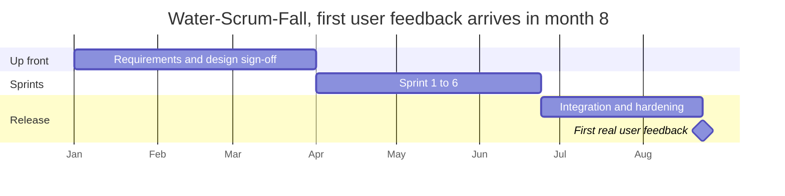

# Agile Anti-patterns

Most failed agile adoptions do not reject the [principles](Agile%20Principles.md), they
keep the ceremonies and quietly drop the feedback loops. The label survives, the
agility does not.

## Cargo cult agile

The team performs every event correctly and changes nothing about how it works.
Stand-ups happen, the board is updated, and requirements still arrive fully specified
from outside. Ceremony without inspection and adaptation is cost with no benefit.

**Tell:** ask what changed as a result of the last three Retrospectives. If the answer
is nothing, the process is decorative.

## Water-Scrum-Fall

A long requirements phase up front and a long release or hardening phase at the end,
with Sprints in the middle. The team is agile only during the part of the process that
was never the bottleneck.

**Tell:** the first Increment reaches a real user months after the project starts.

### What Water-Scrum-Fall looks like on a calendar

The Sprints are real, and the feedback loop is still eight months long, so the team
gets the cost of the ceremonies without the benefit.

## Scrum as a delivery mechanism for fixed scope

Fixed scope, fixed date, fixed budget, and Sprints used as progress reporting. Because
nothing can flex, the only variable left is quality, and it is silently spent.

**Tell:** every Sprint ends with unfinished work rolled forward, and the release date
never moves.

## Velocity as a target

Covered in [Estimation and Velocity](Estimation%20and%20Velocity.md). A velocity target
inflates estimates, and a velocity comparison between teams rewards whoever inflates
fastest.

## The Scrum Master as project manager

Assigning tasks, chasing status, reporting individual progress upward. This removes
self-organization, which is where most of the adaptive capacity lives.

## Proxy product owner

A Product Owner with no authority to say no, who relays decisions from a committee.
Every question takes days, and priority is decided by whoever escalated most recently.

## No technical practices

Scrum prescribes no engineering practices, so teams that add none find that after a
year they cannot deliver a Done Increment in two weeks. The codebase, not the process,
becomes the constraint. This is the gap
[XP](../Extreme%20Programming/index.md) exists to fill.

## Summary

| Anti-pattern | What broke | Fix |
|---|---|---|
| Cargo cult agile | Adaptation | Make Retrospective outcomes real Sprint Backlog items |
| Water-Scrum-Fall | Feedback latency | Ship a thin end-to-end slice early |
| Fixed everything | Scope flexibility | Make the trade-off explicit with [MoSCoW](../DSDM/MoSCoW.md) |
| Velocity target | Transparency | Forecast with ranges, never targets |
| Scrum Master as PM | Self-organization | Team pulls work, Scrum Master removes impediments |
| Proxy Product Owner | Decision speed | One accountable person who can say no |
| No technical practices | Sustainable pace | Adopt TDD, CI and refactoring |

## Check Your Understanding

<quiz>
A project fixes scope, date and budget, then runs two-week Sprints. What flexes?

- [ ] Scope, through backlog re-ordering
- [x] Quality, because it is the only remaining variable, and it degrades invisibly
> Correct. Something always gives. When the three visible constraints are locked, the invisible one absorbs the pressure.
- [ ] The Sprint length, which grows as the deadline nears
- [ ] Nothing, this is standard Scrum
</quiz>

<quiz>
Which question best exposes cargo cult agile?

- [ ] How long are your Sprints?
- [ ] Do you hold a Daily Scrum every day?
- [ ] How many story points did you complete last Sprint?
- [x] What changed as a result of your last three Retrospectives?
> Correct. Every other question tests whether the ceremonies exist. Only this one tests whether inspection actually leads to adaptation.
</quiz>
