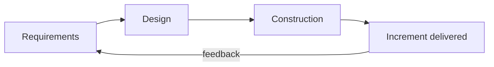

# The Definition of Agility

## What is agility?

Agility is a property of a **team and its process**, not of a tool or a ceremony. A
team is agile when it can:

- Respond to change effectively, meaning rapidly *and* adaptively.
- Communicate effectively among all stakeholders.
- Draw the customer onto the team, rather than treating them as an external party.
- Organize itself so that it controls the work performed.
- Yield to new information instead of defending an obsolete plan.
- Deliver software rapidly and incrementally.

## So an agile process ...

- is driven by customer descriptions of what is required (scenarios).
- recognizes that plans are short-lived.
- develops software iteratively, with a heavy emphasis on construction activities.
- delivers multiple software increments.
- adapts as changes occur.

## The cost-of-change argument

Agility is a bet about economics. In a plan-driven process the cost of a change grows
steeply the later it arrives, because the change must ripple through requirements,
design, code and test artifacts that were finished long ago. Short increments,
automated tests and continuous integration flatten that curve, which is what makes
"welcome changing requirements" affordable rather than reckless.

The feedback edge is the whole point. Without it, short iterations are just a
plan-driven process with more meetings.

## Agility is not

- **Speed.** A team that ships wrong software quickly is fast, not agile.
- **Absence of process.** Scrum and XP are highly disciplined.
- **Absence of design.** Principle 9 asks for *continuous* attention to design.

## Check Your Understanding

<quiz>
Why does an agile process treat plans as short-lived?

- [ ] Because writing plans is a waste of time
- [ ] Because the customer is not allowed to see the plan
- [ ] Because estimates are always accurate in short cycles
- [x] Because new information arrives with every increment, and a plan built on stale assumptions misdirects the work
> Correct. Plans are revised on feedback rather than defended, and the increment is what validates the assumptions.
</quiz>

<quiz>
A team ships every two weeks but never collects feedback on what it shipped. Is it agile?

- [x] No, short iterations without a feedback loop are just a plan-driven process in smaller pieces
> Correct. Agility comes from *adapting* to what each increment reveals, not from the cadence itself.
- [ ] Yes, frequent delivery is the definition of agility
- [ ] Yes, as long as they hold daily stand-ups
- [ ] No, because two weeks is too long for a Sprint
</quiz>
