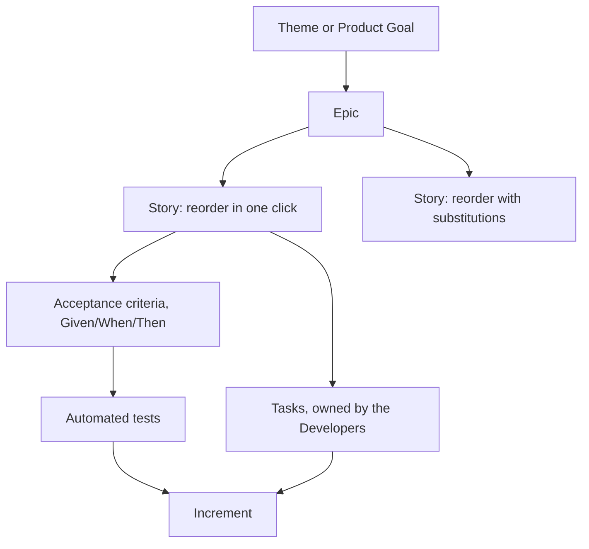

# User Stories

A **user story** is a short description of a feature told from the perspective of the
person who wants it. It is deliberately not a specification. It is a **placeholder for
a conversation**, which is what makes it compatible with short feedback loops.

## The template

```text
As a <type of user>, I want <some goal>, so that <some reason>.
```

The third clause is the one that matters and the one most often dropped. Without the
*so that*, nobody can tell whether a cheaper solution would have satisfied the need.

```text
As a returning customer,
I want to reorder a previous purchase in one click,
so that I do not have to search for items I already know I want.
```

## The three Cs

| C | Meaning |
|---|---|
| **Card** | The story is small enough to fit on an index card, which caps its size |
| **Conversation** | The details are worked out by talking, not by writing them all down |
| **Confirmation** | Acceptance criteria state how everyone will agree it works |

## INVEST

A checklist for whether a story is workable:

- **I**ndependent: can be built without waiting on another story.
- **N**egotiable: describes a need, not a prescribed implementation.
- **V**aluable: valuable to a user or customer, not only to the team.
- **E**stimable: the team understands it well enough to size it.
- **S**mall: fits comfortably inside one iteration.
- **T**estable: there is an objective way to tell when it works.

## Acceptance criteria

Usually written in Given/When/Then form, which maps directly onto automated tests:

```gherkin
Given a customer with at least one past order
When they select "reorder" on that order
Then a cart is created with the same items, quantities and options
And out-of-stock items are flagged before checkout
```

## Where a story sits



Note where the detail appears. The story stays a placeholder for a conversation, and
the precision lives in the acceptance criteria and the tests they become.

## Splitting stories

When a story is too big, split it by **behavior**, never by technical layer. "Build
the database schema" is not a story, because it delivers nothing on its own.

| Split by | Example |
|---|---|
| Workflow steps | Checkout as guest, then checkout with saved address |
| Business rules | Flat-rate shipping first, then regional rules |
| Happy path first | Reorder when everything is in stock, then handle substitutions |
| Data variations | Domestic addresses first, then international |

## Where stories fall short

Stories are poor at capturing cross-cutting quality requirements such as latency
budgets, compliance rules or security constraints. Those belong in the
[Definition of Done](../Scrum/Definition%20of%20Done.md) or a separate constraints
document, not squeezed into an "As a hacker, I want ..." story.

## Check Your Understanding

<quiz>
Why does the "so that" clause matter most in a user story?

- [ ] It tells the developer which component to modify
- [ ] It is required for the story to be estimable
- [x] It states the underlying need, which is what lets the team propose a cheaper or better solution than the one requested
> Correct. Without the reason, a story silently becomes a specification and the team loses the negotiable part of INVEST.
- [ ] It identifies which stakeholder signs off the work
</quiz>

<quiz>
Which of these is a valid way to split a large story?

- [ ] Split into "build the API" and "build the UI"
- [ ] Split into "write the code" and "write the tests"
- [ ] Split into "design the schema" and "implement the queries"
- [x] Split into "checkout as a guest" and "checkout with a saved address"
> Correct. Splitting by behavior keeps each piece independently valuable, while splitting by technical layer produces pieces that deliver nothing alone.
</quiz>
