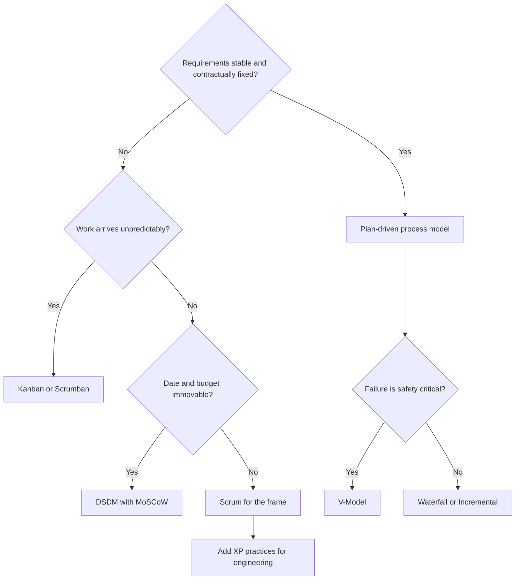

# Choosing a Methodology

There is no best methodology, only a fit between how a team works and the risks the
work carries. Pick by looking at four things: **how volatile the requirements are, how
costly failure is, how available the customer is, and how much the organization can
actually change.**

## A decision path

The diagram is a starting point, not a verdict. Most real teams end up with a hybrid,
and that is normal rather than a failure of discipline.

## By situation

| Situation | Reasonable choice | Why |
|---|---|---|
| Product team, evolving requirements | [Scrum](Scrum/index.md) plus [XP](Extreme%20Programming/index.md) practices | Cadence and feedback, with the engineering discipline to sustain it |
| Support, operations, incident response | [Kanban](Kanban/index.md) | Continuous arrival, no useful Sprint boundary |
| Fixed date, negotiable scope | [DSDM](DSDM/index.md) | MoSCoW makes the trade-off explicit and enforceable |
| Safety-critical or regulated | [V-Model](../Process%20Models/V-Model.md), with agile practices inside phases | Verification evidence is a deliverable, not overhead |
| Startup searching for product-market fit | Kanban plus continuous delivery | Learning speed dominates predictability |
| Large multi-team product | [LeSS or SAFe](Scaling%20Agile.md) | Cross-team dependencies need explicit handling |
| Fixed-price contract with a specified scope | Plan-driven, with iterative delivery inside | The contract already fixed what agile would flex |

## Questions worth asking before choosing

1. **What is the dominant risk?** Wrong requirements point to short feedback loops.
   Technical or safety risk points to verification and up-front design.
2. **How fast can we get feedback from a real user?** If it is months, no methodology
   will make the team agile, so fix the delivery pipeline first.
3. **Can the customer be available?** XP and DSDM assume yes and degrade badly if not.
4. **What can the organization actually change?** Kanban starts from the current
   process for exactly this reason, and it is often the only adoption that survives.
5. **What is already failing?** Adopt the practice that addresses that, not the whole
   framework.

## Hybrids are the norm

Surveys consistently find that most teams describe themselves as running a hybrid.
Common and sensible combinations:

- Scrum cadence with XP engineering practices, which is the most common effective pair.
- Scrum with Kanban WIP limits, once interruptions are frequent, which is Scrumban.
- Agile delivery inside a plan-driven governance wrapper, common in regulated
  organizations and workable as long as the wrapper does not force a specification
  phase in front of every increment.

The failure mode is not hybridizing. It is keeping the ceremonies of one method while
dropping the feedback loop that made it work, which is
[cargo cult agile](Agile/Agile%20Anti-patterns.md).

## Check Your Understanding

<quiz>
A team can only get feedback from real users every six months because releases are manual and risky. What should they change first?

- [ ] Adopt Scrum with two-week Sprints
- [ ] Introduce story points and velocity tracking
- [x] Fix the delivery pipeline, since no methodology creates agility when the feedback loop is six months long
> Correct. Sprints inside a six-month release cycle produce ceremony without the adaptation that gives it value.
- [ ] Adopt SAFe to coordinate the release
</quiz>

<quiz>
Which factor most strongly favors DSDM over Scrum?

- [ ] The team is small and co-located
- [ ] The codebase needs heavy refactoring
- [x] The date and budget are immovable, so scope must be the variable and the trade-off needs formal governance
> Correct. Both are agile, but DSDM's MoSCoW budgets and named roles exist specifically to defend a fixed date.
- [ ] Requirements are completely stable
</quiz>

<quiz>
A regulated organization wants agile delivery inside a plan-driven governance wrapper. Is this workable?

- [x] Yes, as long as the wrapper does not force a full specification phase in front of every increment
> Correct. Governance and short feedback loops can coexist. What kills the benefit is reintroducing a big up-front requirements phase per increment.
- [ ] No, agile and governance are fundamentally incompatible
- [ ] Yes, but only if the Definition of Done is relaxed
- [ ] No, unless the whole organization adopts SAFe first
</quiz>
