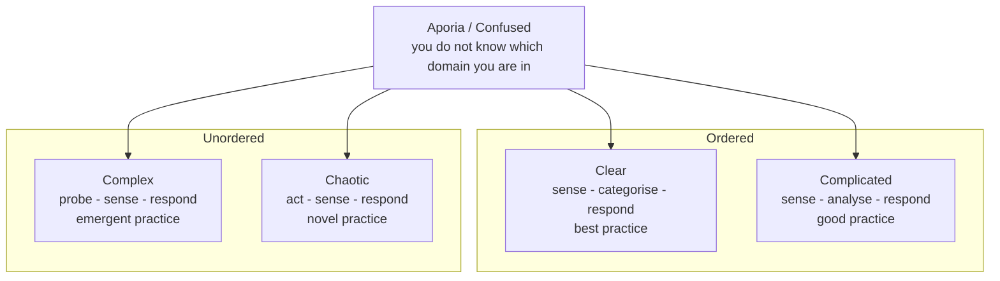

# Cynefin Framework

Cynefin (pronounced *kuh-NEV-in*, Welsh for "habitat") is a sense-making framework
created by Dave Snowden in 1999. It sorts a situation into one of five domains by
asking how the relationship between cause and effect behaves, and each domain implies
a different way of deciding and acting.

It is not a categorisation model where you sort work into fixed boxes. It is a
sense-making model: you look at the situation first, decide which domain it lives in,
and derive the response from that. The same project can hold work in several domains
at once, and work moves between domains as it is understood.

Its use in software is mostly diagnostic. Before arguing about Scrum versus Waterfall,
Cynefin asks a prior question: is this problem the kind that a plan can even describe?
That makes it a natural companion to [Choosing a Methodology](Choosing%20a%20Methodology.md).

## The Five Domains

### 1. Clear

Formerly called *Simple* and then *Obvious*. Cause and effect are obvious to everyone,
the problem is well understood, and a known correct answer exists.

- **Response**: sense, categorise, respond.
- **Practice**: best practice, because one demonstrably correct way exists.
- **Software examples**: applying a security patch, provisioning a standard
  environment, a documented release checklist.
- **Do**: automate it, write the runbook, stop spending human judgement on it.

### 2. Complicated

Cause and effect are related, but the link is not obvious and takes expertise to see.
There is a right answer, possibly several good ones, and an expert can find it by
analysis before acting.

- **Response**: sense, analyse, respond.
- **Practice**: good practice, plural, because experts legitimately disagree.
- **Software examples**: tuning a slow query, designing a schema for a known domain,
  sizing infrastructure for a known load profile.
- **Do**: bring in expertise, allow analysis time, but timebox it.

### 3. Complex

Cause and effect are only clear in retrospect. The system reacts to your intervention,
so no amount of up-front analysis produces a reliable answer. You learn what works by
running safe-to-fail experiments.

- **Response**: probe, sense, respond.
- **Practice**: emergent practice, discovered rather than chosen.
- **Software examples**: a new product with unvalidated user needs, a large legacy
  migration, changing how an organisation works.
- **Do**: run small reversible experiments in parallel, amplify what works, damp what
  does not, and keep feedback loops short. This is the domain agile methods were built for.

### 4. Chaotic

No discernible relationship between cause and effect, and the situation is
deteriorating while you deliberate. Analysis is a luxury you do not have.

- **Response**: act, sense, respond.
- **Practice**: novel practice, whatever restores enough order to think.
- **Software examples**: a live production outage, an active security breach, a data
  corruption spreading through downstream systems.
- **Do**: act to stabilise first, then move the situation into complex or complicated
  and solve it properly there. Never plan to live here.

### 5. Aporia (Confused)

The centre of the model, where you do not yet know which domain applies. Renamed from
*Disorder* to *Confused* to *Aporia*. It is the most common starting point and the most
dangerous, because people default to whichever domain matches their own comfort:
managers treat everything as complicated and demand estimates, engineers treat
everything as clear and skip discovery.

- **Do**: break the situation into parts and place each part in a domain before choosing
  a response.

## Why It Matters for Software Methodology

| Domain | Fitting approach | Estimation | Failure mode when misjudged |
| --- | --- | --- | --- |
| Clear | Checklists, automation, standards | Accurate | Complacency, treating a changed situation as still routine |
| Complicated | Plan-driven models, up-front design, expert review | Reasonable with ranges | Analysis paralysis, expert blind spots |
| Complex | Iterative and agile, small increments, experiments | Unreliable, forecast by empirical velocity | Demanding a fixed plan for work nobody can predict |
| Chaotic | Incident command, one decisive owner | Meaningless | Convening a meeting while the system burns |
| Aporia | Split the work, then re-place each piece | Not yet | Defaulting to the domain you personally prefer |

The most common and expensive mistake in software is treating complex work as
complicated: writing a detailed specification and a fixed plan for a product whose
requirements can only be discovered by building and showing it. The result is a plan
that is precise, auditable, and wrong.

The mirror mistake is treating complicated work as complex: running discovery
iterations on a problem where a competent expert already knows the answer, which
wastes months rediscovering it.

## The Clear-to-Chaotic Cliff

The boundary between Clear and Chaotic is drawn as a cliff rather than a line. Systems
that are heavily optimised for a known best practice become brittle: when the
assumptions behind that practice quietly stop holding, the failure is not a gentle
drift into complicated, it is a fall straight into chaos.

A deployment pipeline nobody has questioned for two years is the standard software
version. It is Clear right up to the moment it is Chaotic.

## Limits

- Domain placement is a judgement call, and two competent people can place the same
  work differently. The value is in the conversation the disagreement forces.
- It tells you the class of response, not which methodology to run. It narrows the
  choice rather than making it.
- It is easy to use as a label ("that's complex") to end a discussion instead of a lens
  to open one.

<quiz>
A team is asked for a fixed scope, fixed date plan for a brand new product whose users have never been interviewed. In Cynefin terms, what is going wrong?

- [ ] The work is chaotic and needs an incident response
> Nothing is deteriorating. Chaotic means the situation is actively degrading while you deliberate.
- [x] Complex work is being treated as complicated, so a detailed plan is demanded for something only discoverable by building and showing it
> Correct. This is the most common and most expensive Cynefin misjudgement in software.
- [ ] The work is clear and simply needs a better checklist
> Unvalidated user needs mean no known correct answer exists, so no checklist can encode one.
- [ ] The framework does not apply to planning decisions
> Diagnosing which domain the work lives in is exactly what Cynefin is for, and it precedes the planning decision.
</quiz>

<quiz>
Production is down and the cause is unknown while customer impact grows. Which response sequence fits?

- [ ] Sense, analyse, respond
> That is the Complicated response, and it assumes you have the time to analyse before acting. Here you do not.
- [ ] Probe, sense, respond
> Safe-to-fail experiments belong to Complex, where the situation is stable enough to run them in parallel.
- [x] Act, sense, respond, then move the problem into a calmer domain and fix the root cause there
> Correct. In Chaotic you act to restore enough order to think, then do the real diagnosis outside the crisis.
- [ ] Sense, categorise, respond
> That is the Clear response, which requires a known correct answer for a recognised category. The cause is unknown.
</quiz>
