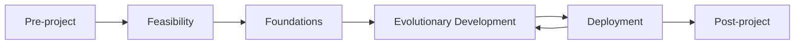

# DSDM Phases and Roles

[DSDM](index.md) is the most formally governed of the agile methodologies. It
prescribes a lifecycle and a named role for every decision, which is why it survives in
regulated and contract-driven environments where lighter methods struggle.

## The lifecycle

| Phase | Purpose | Output |
|---|---|---|
| Pre-project | Confirm the idea is worth investigating | Terms of reference |
| Feasibility | Is this viable technically and commercially? | Outline plan and business case |
| Foundations | Agree scope at a high level, plus architecture and delivery approach | Baselined high-level requirements |
| Evolutionary Development | Build in timeboxes, iterating with users | Working, tested solution increments |
| Deployment | Release into use, then loop back for the next increment | Deployed increment and review |
| Post-project | Did we get the expected benefits? | Benefits assessment |

Foundations is the distinctive phase. It is a deliberately short, up-front step that
baselines **requirements at a high level only**, which is how DSDM keeps a fixed date
without pretending detailed requirements are knowable early.

## Timeboxes

Evolutionary Development runs as a series of timeboxes, typically two to four weeks,
each structured as Investigation, Refinement, Consolidation, with a formal review at
the end. Scope inside a timebox is managed with [MoSCoW](MoSCoW.md).

## The roles

| Category | Role | Responsibility |
|---|---|---|
| Business | Business Sponsor | Owns the business case and the budget, the final escalation point |
| Business | Business Visionary | Holds the vision, interprets business needs |
| Business | Business Ambassador | Day-to-day user voice inside the team |
| Business | Business Advisor | Subject-matter input, often a real end user |
| Management | Project Manager | High-level planning and governance, not task assignment |
| Management | Technical Coordinator | Architectural coherence and technical governance |
| Delivery | Team Leader | Facilitates the team, close to a Scrum Master |
| Delivery | Solution Developer | Builds the solution |
| Delivery | Solution Tester | Tests throughout, not at the end |
| Support | Workshop Facilitator, DSDM Coach | Facilitation and method guidance |

The Business Ambassador is the role that carries most of DSDM's agility. It is a real
user embedded in the team, equivalent to XP's on-site customer, and the method assumes
their availability rather than hoping for it.

## DSDM compared to Scrum

| | DSDM | [Scrum](../Scrum/index.md) |
|---|---|---|
| Up-front work | Feasibility and Foundations phases | None prescribed |
| Roles | Around ten, spanning business and delivery | Three |
| Governance | Explicit, documented products | Left to the organization |
| Scope control | MoSCoW with an enforced budget | Ordered Product Backlog |
| Best fit | Regulated, contractual, multi-stakeholder programmes | Product teams |

## Check Your Understanding

<quiz>
What is the purpose of the Foundations phase?

- [ ] To produce a complete, detailed requirements specification before development
- [x] To baseline scope at a high level along with architecture and delivery approach, so a fixed date is credible without pretending details are knowable early
> Correct. High-level baselining is the compromise that lets DSDM fix time and cost while leaving detail to emerge in the timeboxes.
- [ ] To assign every role to a named individual
- [ ] To build the first working increment
</quiz>

<quiz>
Which DSDM role most closely corresponds to XP's on-site customer?

- [ ] Business Sponsor
- [ ] Project Manager
- [x] Business Ambassador
> Correct. The Business Ambassador is embedded in the team day to day and answers business questions as they arise.
- [ ] Technical Coordinator
</quiz>
