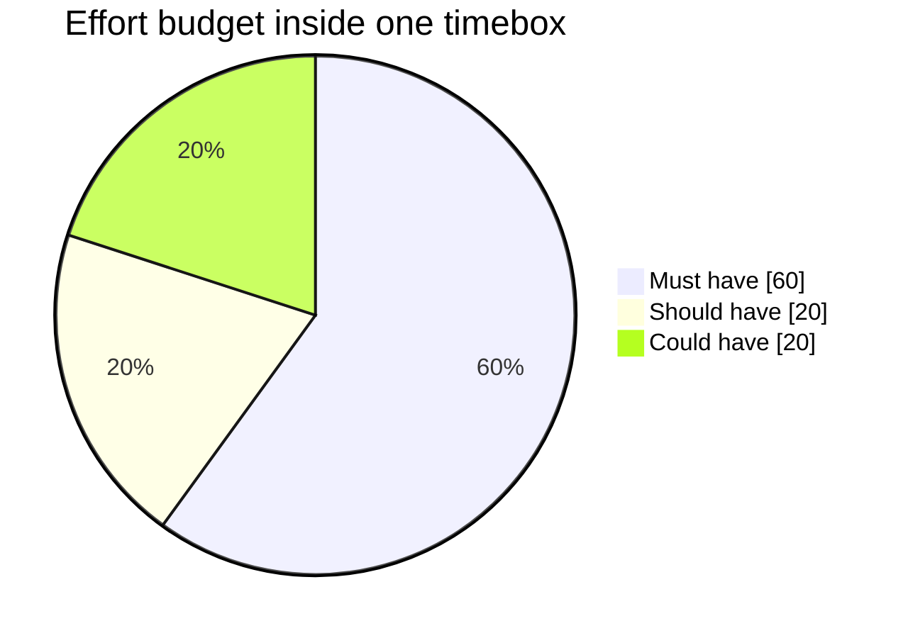

# MoSCoW Prioritization

**MoSCoW** is [DSDM's](index.md) prioritization technique, and the part of DSDM most
widely adopted outside it. It exists to answer one question honestly: **if we run out
of time, what actually gets dropped?**

## The four categories

| Category | Test | Effort budget |
|---|---|---|
| **M**ust have | The delivery is useless, unsafe or illegal without it | up to 60% |
| **S**hould have | Painful to omit, but there is a workaround | about 20% |
| **C**ould have | Nice, and the first thing dropped when time runs short | about 20% |
| **W**on't have this time | Explicitly agreed to be out of scope for this timebox | 0% |

The `o`s are filler to make the word pronounceable.

## The Must have test

A Must have is not "important". It is: *what happens if we ship without it on the
delivery date?* If the honest answer is anything other than "we cannot ship", it is a
Should have.

Useful challenges when a stakeholder insists everything is a Must:

- Is there a manual workaround, even an ugly one, for the first release?
- Does the delivery break a law or a contract without it?
- Would we genuinely cancel the release rather than ship without it?

## Why the 60% cap matters

If Must haves consume 100% of the timebox, there is nothing left to drop, so any
estimation error moves the date. Keeping Musts at or below 60% of effort leaves
Should and Could haves as the contingency that absorbs the surprises. That contingency
is exactly what makes a fixed date credible instead of aspirational.

```text
Timebox capacity      ####################  100%
Must haves            ############           60%
Should haves          ####                   20%   <- contingency
Could haves           ####                   20%   <- dropped first
```

## The effort budget



The Should and Could slices are not leftovers, they are the contingency. Any timebox
whose Must slice approaches the whole circle has a date that depends on nothing going
wrong.

## Won't have is a real decision

The fourth category is often skipped, which is a mistake. Writing something down as
"won't have this time" ends the recurring argument, records that it was considered,
and leaves the door open for a later timebox. Silence gets re-litigated every week.

## MoSCoW outside DSDM

It is useful anywhere scope must flex against a fixed date, including release planning
in [Scrum](../Scrum/index.md), where it complements the ordered Product Backlog by
recording *why* an item is where it is. The failure mode is the same everywhere: if
nobody enforces the budget, everything drifts up to Must and the technique tells you
nothing.

## Check Your Understanding

<quiz>
Stakeholders label 95% of the backlog "Must have". What has gone wrong?

- [ ] Nothing, if the deadline is genuinely fixed
- [ ] The team estimated the items too generously
- [x] There is no contingency left, so any estimation error moves the date, and the prioritization now carries no information
> Correct. MoSCoW only works when the Must haves are capped, since the lower categories are what absorb surprises.
- [ ] The Won't have category should be removed
</quiz>

<quiz>
Which question best tests whether an item is truly a Must have?

- [ ] Is this item valuable to the customer?
- [ ] Did an executive request it?
- [ ] Is it technically difficult to add later?
- [x] Would we genuinely cancel the release rather than ship without it?
> Correct. Must have is about viability of the delivery, not about importance or effort, both of which almost everything scores highly on.
</quiz>
