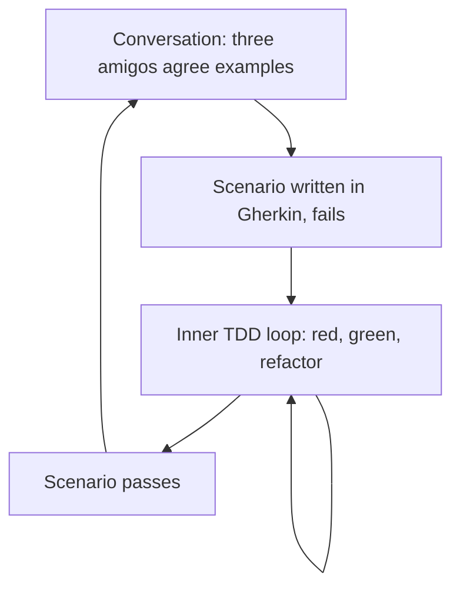

# Behaviour-Driven Development (BDD)

**Behaviour-Driven Development** grew out of teaching
[TDD](Test-Driven%20Development.md), from the observation that most of the confusion
was vocabulary. Developers argued about what a "unit" was and what to test, while the
harder problem sat upstream: the team was building the wrong thing correctly.

BDD moves the conversation before the code, and keeps the result executable. Its unit
of work is a **concrete example of a business rule**, written in language the business
actually uses.

## The three amigos

An example is agreed by three perspectives, ideally in a 30-minute conversation per
story rather than a document handover.

| Role | Question they bring |
|---|---|
| Business, product owner or analyst | What is the rule, and why does it matter? |
| Development | Can we build it, and what does it touch? |
| Testing | How could this go wrong, and what are the edge cases? |

The output is examples, not consensus prose. The conversation is the point; the written
scenarios are its receipt.

## Given, When, Then

Scenarios are written in **Gherkin**, a structured plain-language format:

```gherkin
Feature: Cart discount

  Scenario: Order above the discount threshold
    Given a cart containing items worth 120
    When the customer checks out
    Then the total is 108
    And the discount line reads "10% off"

  Scenario: Order exactly at the threshold
    Given a cart containing items worth 100
    When the customer checks out
    Then the total is 100
```

- **Given** is the starting state, in the past tense.
- **When** is the single action being described.
- **Then** is the observable outcome, never an internal detail.

One `When` per scenario. Two actions means two scenarios, or a scenario that is really
describing a procedure rather than a rule.

Each step is bound to code by a **step definition**, so the scenario runs as a test:

```python
@given("a cart containing items worth {amount:d}")
def _(context, amount):
    context.cart = Cart.worth(amount)

@when("the customer checks out")
def _(context):
    context.receipt = context.cart.checkout()

@then("the total is {expected:d}")
def _(context, expected):
    assert context.receipt.total == expected
```

## How it fits with TDD



The BDD scenario is the outer loop and stays red for hours. TDD is the inner loop and
turns green every few minutes. They are the same idea at two altitudes: outside-in from
user-visible behaviour, then unit by unit.

## Declarative, not imperative

The most common way to ruin a scenario is to write the user interface into it:

```gherkin
# Imperative, brittle: breaks when the login form changes
When I visit "/login"
And I fill in "email" with "a@b.com"
And I click "Submit"
```

```gherkin
# Declarative, survives redesigns
When the customer signs in
```

Keep the UI mechanics in the step definitions. The scenario describes *what*, the step
definition owns *how*.

## What it gives you

- **Shared language.** One vocabulary, written down in one place, that both the business
  and the compiler read.
- **Living documentation.** The specification cannot rot, because the build fails when
  it stops matching the system.
- **Defects found before code.** Most of the value comes from the conversation
  surfacing disagreement, not from the automation.

## Where it goes wrong

- **Gherkin without the conversation.** A developer writing scenarios alone after the
  fact gets all the syntax overhead and none of the shared understanding. This is the
  dominant failure mode.
- **Scenario as UI script.** See above. Brittle, and unreadable to the business.
- **Everything in Gherkin.** Scenarios are expensive. Use them for business rules, and
  use plain [unit tests](Test-Driven%20Development.md) for algorithms, edge cases and
  error handling.
- **Business never reads them.** If nobody outside the team looks at the feature files,
  they are slow unit tests wearing a costume, and plain tests would be cheaper.

## Check Your Understanding

<quiz>
Where does most of BDD's value come from?

- [ ] From the Gherkin syntax being readable
- [ ] From replacing unit tests with scenarios
- [x] From the conversation in which business, development and testing agree on concrete examples before the code exists
> Correct. The feature files are the record of that conversation. Writing them alone afterwards keeps the cost and drops the benefit.
- [ ] From measuring scenario coverage
</quiz>

<quiz>
Which scenario step is written well?

- [ ] `When I click the button with id "checkout-btn"`
- [x] `When the customer checks out`
> Correct. Declarative steps describe intent and survive UI changes, while the mechanics live in the step definition.
- [ ] `When the CheckoutService.process() method is called`
- [ ] `When I fill in the form and submit it and wait 2 seconds`
</quiz>

<quiz>
How do BDD scenarios and TDD tests relate in an outside-in workflow?

- [ ] Scenarios replace unit tests entirely
- [x] The scenario is the outer loop that stays red for hours, while TDD cycles inside it turn green every few minutes
> Correct. Same discipline at two altitudes: user-visible behaviour outside, units inside.
- [ ] Unit tests are written first, then scenarios are generated from them
- [ ] They are alternatives, and a team must pick one
</quiz>
