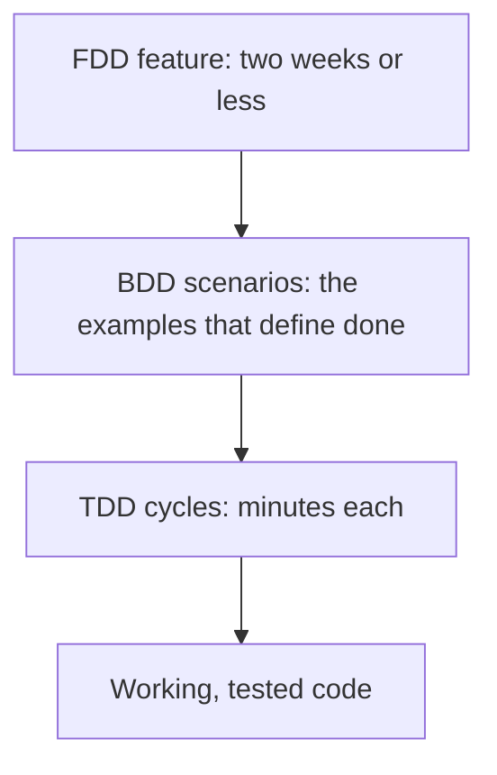

# Development Practices

A [methodology](../index.md) decides who meets when. A **development practice** decides
how the code gets written inside that. The three practices here all put a *description
of the desired behaviour* before the implementation, and they differ mainly in who
writes that description and how big it is.

| Practice | Unit of work | Written by | Artifact left behind |
|---|---|---|---|
| [TDD](Test-Driven%20Development.md) | One behaviour of one unit, minutes | The developer | A fast unit test suite |
| [BDD](Behaviour-Driven%20Development.md) | One example of a user-visible rule, hours | Developer, tester and business together | Executable scenarios in shared language |
| [FDD](Feature-Driven%20Development.md) | One client-valued feature, up to two weeks | The chief programmer, from a domain model | A feature list and a tracked domain model |

They are not alternatives that exclude each other. A common combination is FDD-style
feature planning at the top, BDD scenarios per feature, and TDD inside each scenario.

## Which problem each one solves

- **"We break things when we change them."** The gap is regression safety, so start with
  [TDD](Test-Driven%20Development.md).
- **"We built exactly what was asked and it was the wrong thing."** The gap is shared
  understanding, so start with [BDD](Behaviour-Driven%20Development.md).
- **"Nobody can say what percentage of the product is done."** The gap is visible
  progress on a large codebase, so look at
  [FDD](Feature-Driven%20Development.md).

TDD and refactoring are also two of the twelve
[XP practices](../Extreme%20Programming/XP%20Practices.md), and the
[Definition of Done](../Scrum/Definition%20of%20Done.md) is where a Scrum team usually
makes these practices mandatory rather than optional.

## Check Your Understanding

<quiz>
What do TDD, BDD and FDD have in common?

- [ ] All three require a Scrum Master
- [x] All three write a description of the wanted behaviour before writing the implementation
> Correct. They differ in the size of that description and in who writes it, not in the ordering.
- [ ] All three forbid up-front design
- [ ] All three replace manual testing entirely
</quiz>

<quiz>
A team ships what was requested, but stakeholders keep saying it is not what they meant. Which practice targets that problem most directly?

- [ ] TDD, because more unit tests catch misunderstandings
- [x] BDD, because it forces business, development and testing to agree on concrete examples before the code exists
> Correct. TDD verifies that the code does what the developer intended, which does not help if the intent itself was wrong.
- [ ] FDD, because a domain model prevents misunderstandings
- [ ] None, this is a hiring problem
</quiz>
