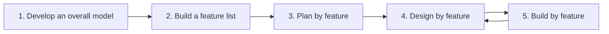

# Feature-Driven Development (FDD)

**Feature-Driven Development** was used on a large Singapore banking project in 1997 and
described by Jeff De Luca and Peter Coad. It is the agile method for people who have a
big system, a big team, and a manager asking what percentage is done.

Its answer: keep an explicit domain model, cut the system into tiny **client-valued
features**, and report progress as the count of features completed. That makes it the
most plan-friendly of the agile methods, and the one that scales to large teams with
the least modification.

## A feature

A feature is a small, client-valued function, named to a fixed template:

```
<action> the <result> <by|for|of|to> a(n) <object>
```

- *Calculate the total of a sale*
- *Validate the password of a user*
- *Assess the credit risk for an applicant*

Each must be buildable in **two weeks or less**. Anything larger is not a feature, it is
a feature set, and must be split. This size rule is what makes the progress number
meaningful: with features averaging a few days, "62% of 300 features complete" is
measured, not estimated.

## The five processes



| # | Process | Output | Frequency |
|---|---|---|---|
| 1 | Develop an overall model | A domain object model, breadth first, shallow | Once, then refined |
| 2 | Build a feature list | Features grouped into feature sets and subject areas | Once, then extended |
| 3 | Plan by feature | Ownership and a schedule by feature set | Once, then revised |
| 4 | Design by feature | Sequence diagrams and class updates for a small batch | Per iteration |
| 5 | Build by feature | Code, unit tests, inspection, promotion to build | Per iteration |

The first three are up-front and take days, not months. Steps 4 and 5 are the iteration,
and they repeat every two weeks or less on a small batch of features.

## Roles

| Role | Responsibility |
|---|---|
| **Chief architect** | Owns the overall model and its integrity |
| **Chief programmer** | Leads a feature team, picks the batch, runs design by feature |
| **Class owner** | Owns a specific class, and makes every change to it |
| **Feature team** | Temporary group of class owners, assembled per feature, dissolved after |
| **Domain expert** | Supplies the knowledge the model encodes |

**Class ownership** is FDD's most distinctive and most contested choice. It is the
direct opposite of XP's collective code ownership.

| | FDD, class ownership | XP, collective ownership |
|---|---|---|
| Who edits a class | Its owner only | Anyone |
| Strength | Conceptual integrity, a clear expert per area | No waiting on a person, no knowledge silos |
| Weakness | The owner becomes a bottleneck, and leaving is expensive | Needs strong [TDD](Test-Driven%20Development.md) and CI to stay safe |

Feature teams soften the bottleneck: a feature that touches five classes temporarily
pulls together those five owners, so the class expert is still in the room.

## Reporting progress

Each feature moves through six milestones with fixed weights, so a partially built
feature has a defined percentage rather than the usual "90% done" fiction:

| Milestone | Weight |
|---|---|
| Domain walkthrough | 1% |
| Design | 40% |
| Design inspection | 3% |
| Code | 45% |
| Code inspection | 10% |
| Promote to build | 1% |

Roll those up across hundreds of features and the burn-up chart is credible without
story points or velocity guessing.

## When FDD fits

- Large teams, tens to hundreds of developers, where XP's practices do not obviously
  scale.
- Domains stable enough that an up-front model survives, such as banking, insurance and
  logistics.
- Organizations that require documented design and formal progress reporting.

It fits badly where requirements are genuinely unknown up front, because the model and
the feature list both assume the problem can be enumerated first. In
[Cynefin](../Cynefin%20Framework.md) terms, FDD is a *complicated*-domain method, while
[Scrum](../Scrum/index.md) and [XP](../Extreme%20Programming/index.md) target the
*complex* domain.

## Check Your Understanding

<quiz>
Why does FDD insist that a feature take two weeks or less?

- [ ] To fit inside a Scrum Sprint
- [x] Because features are the unit of progress reporting, and small uniform units make the completion percentage measured rather than guessed
> Correct. Counting hundreds of small completed features gives a credible number, which is FDD's main selling point to large organizations.
- [ ] Because longer features cannot be unit tested
- [ ] Because class owners can only work for two weeks at a time
</quiz>

<quiz>
How does FDD's class ownership differ from XP's collective ownership, and what is its cost?

- [ ] They are the same practice under different names
- [x] FDD assigns each class a single owner, which protects conceptual integrity but makes that owner a bottleneck and a departure risk
> Correct. Feature teams reduce the bottleneck by pulling the relevant owners together per feature.
- [ ] FDD forbids anyone from editing classes after the design phase
- [ ] XP requires class owners, while FDD does not
</quiz>

<quiz>
A startup is exploring a market where nobody yet knows which features will matter. Is FDD a good fit?

- [ ] Yes, the up-front model will clarify the market
- [x] No, because FDD assumes the feature list can be enumerated up front, which suits complicated domains rather than genuinely exploratory ones
> Correct. That is Scrum or XP territory. FDD earns its keep on large teams in stable domains.
- [ ] Yes, because features take two weeks or less
- [ ] It does not matter, since all agile methods behave identically here
</quiz>
